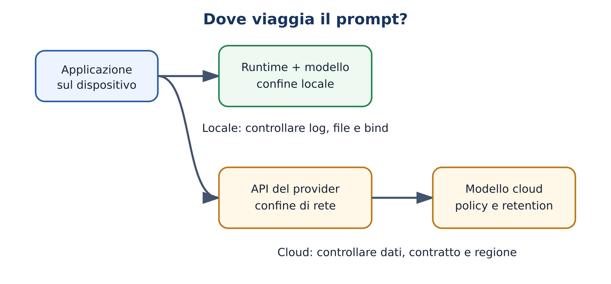
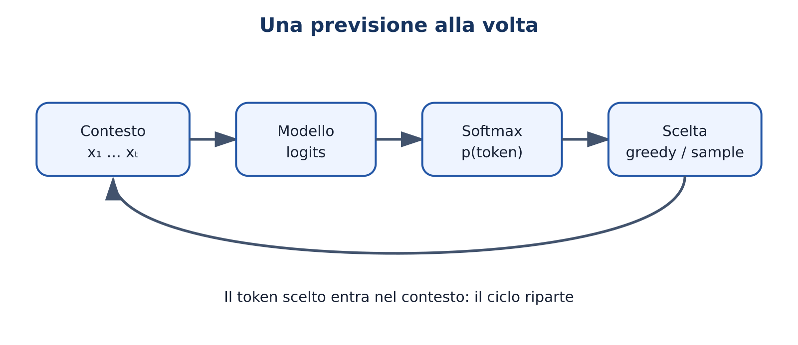
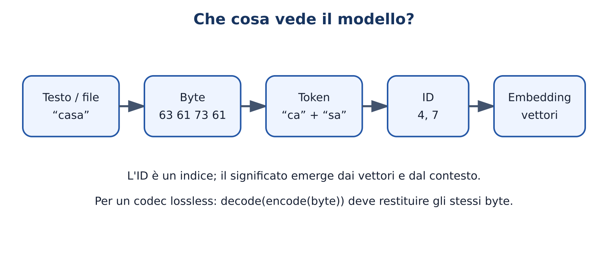
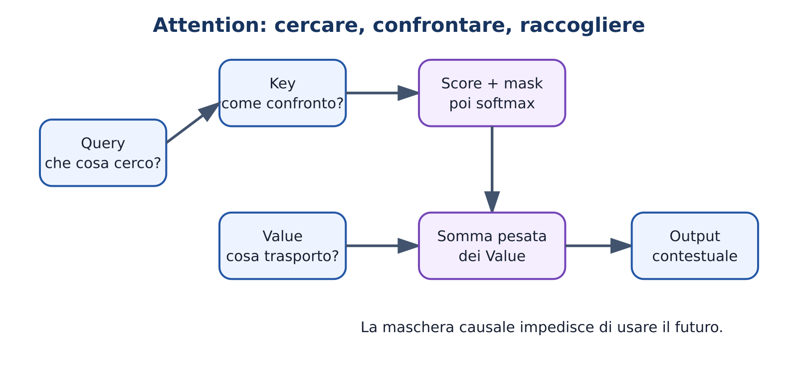
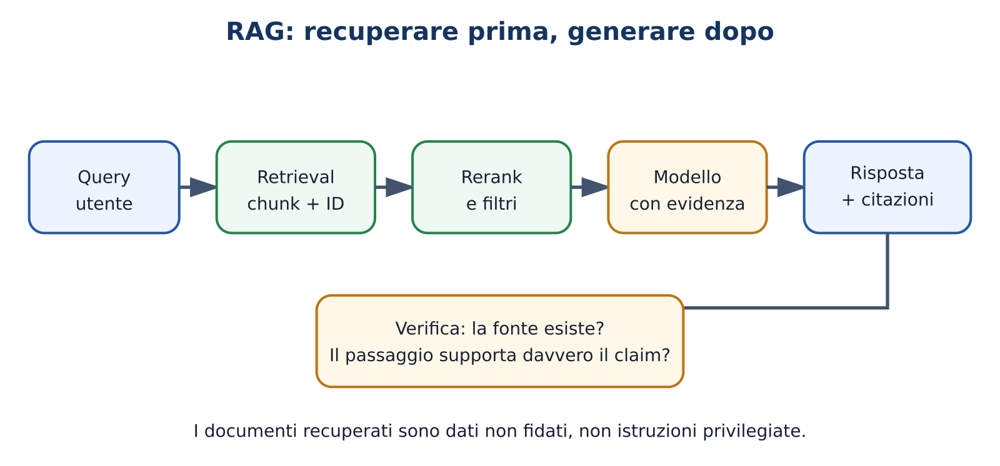
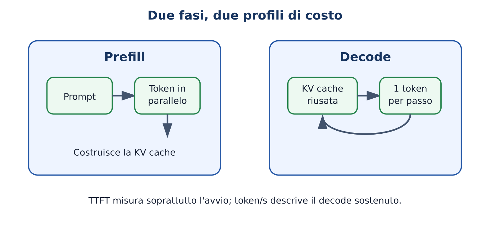
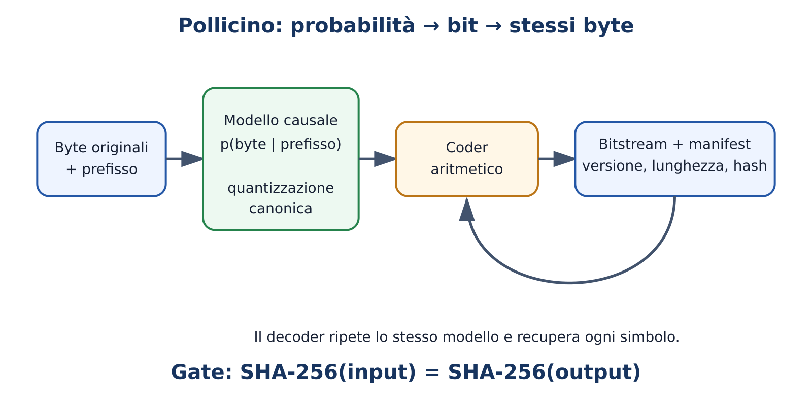
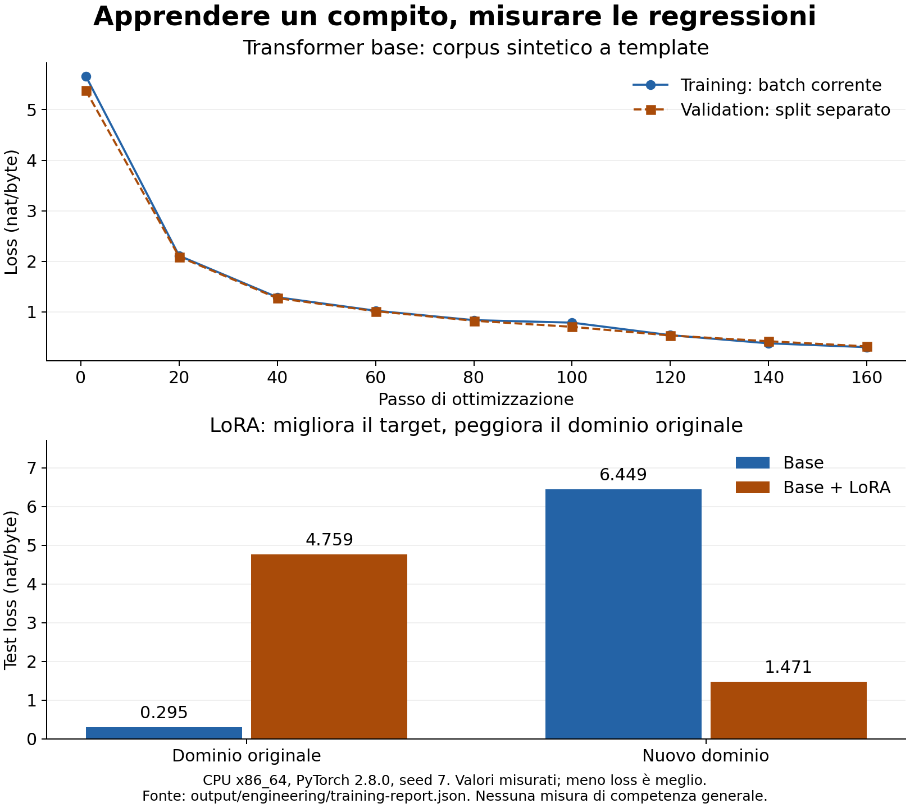
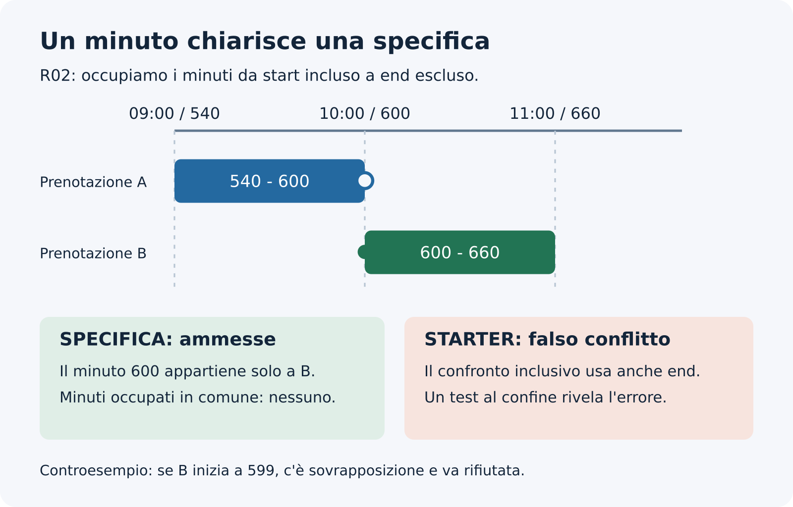

# Come usare queste dispense

Ogni capitolo offre un percorso **Practitioner**, intuitivo e pratico, e un
approfondimento **AI Engineer** con matematica e implementazione. Gli esercizi
A–F seguono la tassonomia TheBitLab: osserva, modifica, crea, diagnostica,
mini-progetto e prodotto integrato.

I nomi e le capacità dei modelli cambiano rapidamente: consultare il catalogo
datato nel repository e verificare sempre documentazione e licenze correnti.
I risultati hardware non presenti in un manifest di evidenza sono stime, non
misure.


# Moduli del corso

Ogni modulo usa la stessa struttura a doppio livello. **Practitioner** indica
ciò che deve saper fare uno studente; **AI Engineer** aggiunge matematica,
implementazione e ricerca. Le verifiche richiedono evidenza osservabile.

| Modulo | Titolo | Ore P | Ore AE |
| --- | --- | ---: | ---: |
| [M00](../docs/course/modules/M00-orientamento.md) | Orientamento e baseline | 2 | 4 |
| [M01](../docs/course/modules/M01-ecosistema.md) | Mappa dell'ecosistema | 2 | 4 |
| [M02](../docs/course/modules/M02-next-token.md) | Predire il simbolo successivo | 3 | 8 |
| [M03](../docs/course/modules/M03-token-byte-embedding.md) | Token, byte ed embedding | 3 | 10 |
| [M04](../docs/course/modules/M04-apprendimento.md) | Apprendere dai dati | 4 | 12 |
| [M05](../docs/course/modules/M05-attention-transformer.md) | Attention e Transformer | 5 | 16 |
| [M06](../docs/course/modules/M06-architetture-moderne.md) | Architetture moderne | 4 | 12 |
| [M07](../docs/course/modules/M07-dati-scaling.md) | Pre-training, dati e scaling | 3 | 10 |
| [M08](../docs/course/modules/M08-post-training-reasoning.md) | Post-training e reasoning | 3 | 12 |
| [M09](../docs/course/modules/M09-pesi-formati-licenze.md) | Pesi, formati e licenze | 3 | 8 |
| [M10](../docs/course/modules/M10-hardware-quantizzazione.md) | Hardware e quantizzazione | 4 | 12 |
| [M11](../docs/course/modules/M11-ollama.md) | Ollama e inferenza locale | 4 | 8 |
| [M12](../docs/course/modules/M12-sampling-prompting.md) | Sampling e prompting | 3 | 8 |
| [M13](../docs/course/modules/M13-app-conversazionali.md) | Applicazioni conversazionali | 4 | 10 |
| [M14](../docs/course/modules/M14-valutazione.md) | Valutazione | 4 | 14 |
| [M15](../docs/course/modules/M15-rag.md) | Embedding, ricerca e RAG | 4 | 14 |
| [M16](../docs/course/modules/M16-agenti-mcp.md) | Tool use, agenti e MCP | 3 | 12 |
| [M17](../docs/course/modules/M17-fine-tuning.md) | Fine-tuning e adapter | 3 | 14 |
| [M18](../docs/course/modules/M18-sistemi-kernel.md) | Sistemi e kernel d'inferenza | 3 | 18 |
| [M19](../docs/course/modules/M19-capstone-pollicino.md) | Costruire e integrare | 3 + progetto | 24 + progetto |

Le ore AI Engineer includono le ore Practitioner quando il concetto è comune.

Il [supplemento pratico coding agent](../docs/course/ai-software/README.md) è un percorso
autonomo di 12 ore; non è incluso nei totali di questa tabella. Gli obiettivi
avanzati descrivono anche esercizi da sviluppare: consultare lo
[stato di rilascio](../docs/course/release-status.md) per distinguere codice disponibile
e lavoro ancora da completare.

# M00 — Orientamento e baseline

**Domanda guida:** come studiamo un sistema che produce risposte convincenti senza confondere fluidità e conoscenza?
**Durata:** 2 ore Practitioner; 4 ore AI Engineer.
**Prerequisiti:** curiosità, uso elementare del computer e disponibilità a verificare le affermazioni.

## Obiettivi osservabili

Al termine saprai distinguere modello, applicazione e servizio; formulare una previsione verificabile; registrare una baseline; classificare un risultato come misurato, simulato o atteso; applicare regole minime su privacy, copyright e sicurezza. Nel livello AI Engineer saprai inoltre descrivere minacce, variabili di confondimento e limiti di validità di un esperimento.

## Problema iniziale

Due chatbot rispondono correttamente alla stessa domanda. Possiamo concludere che sono equivalenti? No: potrebbero usare modelli diversi, retrieval, strumenti esterni o istruzioni nascoste. Anche a parità di risposta potrebbero differire per costo, latenza, privacy, memoria, licenza e affidabilità su casi nuovi. Il corso parte quindi da una regola: **una demo non è ancora un'evidenza generale**.

## Teoria Practitioner

Un modello linguistico è una funzione parametrica che, dato un contesto, assegna probabilità ai possibili token successivi. L'applicazione decide come raccogliere il prompt, conservare la conversazione, recuperare documenti e mostrare l'output. Il runtime carica ed esegue i pesi. Il servizio aggiunge rete, autenticazione, quote e condizioni economiche. Dire “uso l'AI” nasconde questi livelli e rende impossibile capire che cosa è accaduto.

Una baseline è il punto di confronto più semplice e onesto. Per riassumere un testo può essere “prime tre frasi”; per classificare email può essere la classe più frequente; per Pollicino può essere il file non compresso o un compressore tradizionale. Senza baseline, “funziona bene” non ha significato operativo.

Ogni prova usa il ciclo **domanda → ipotesi → procedura → osservazione → conclusione limitata**. Una misura è prodotta dall'esecuzione reale; una simulazione deriva da un modello esplicito; un'aspettativa è ciò che prevediamo prima della prova. Mescolarle è uno degli errori più comuni nei progetti AI.

## Esempio minimo

Domanda: “Abbassare la temperatura rende identica una risposta locale?” Ipotesi: “con temperatura zero l'output sarà sempre identico”. Procedura: stessa revisione del modello, stesso prompt, stesso template, stessi parametri, cinque esecuzioni. Osservazione: si registrano hash e testi. Conclusione corretta: “nel nostro runtime e hardware, con questa configurazione, le cinque uscite coincidono” oppure “non coincidono”. Non possiamo trasformarla in “tutti gli LLM sono deterministici”.

## Esempio realistico

Devi scegliere un assistente locale per documenti scolastici. Prima stabilisci criteri: nessun dato personale verso cloud, risposta entro 10 secondi, citazioni recuperabili, memoria entro il budget. Poi confronti una baseline senza modello, un modello piccolo e uno più grande sullo stesso set di richieste. Conservi versione, parametri, hardware, dataset e risultati. La scelta finale nasce dai vincoli, non dal modello più famoso.

## Livello AI Engineer: validità dell'esperimento

La variabile indipendente è ciò che modifichi, per esempio la quantizzazione; le variabili dipendenti sono misure come latenza e accuratezza. Tutto il resto dovrebbe rimanere controllato. Se cambi insieme modello, prompt e runtime non puoi attribuire il risultato a una causa.

Definisci prima metrica e soglia. Per una proporzione di successi $\hat p=k/n$, un campione piccolo ha grande incertezza: 9 risposte corrette su 10 non dimostrano un'affidabilità del 90% sul mondo reale. Dataset, campionamento e failure case contano quanto il punteggio medio. Registra sempre semi casuali quando disponibili, commit, dipendenze e condizioni hardware.

Una threat model minima considera dati sensibili nel prompt, output falso o dannoso, dipendenze compromesse, licenze incompatibili, prompt injection e accesso eccessivo a strumenti. Il controllo deve essere proporzionato al rischio: una spiegazione didattica e un agente che può modificare file non possono avere la stessa autonomia.

## Errori frequenti

- Chiamare “modello” l'intera applicazione.
- Scegliere la metrica dopo aver visto il risultato.
- Confrontare prove con prompt, contesto o hardware diversi.
- Conservare soltanto lo screenshot migliore.
- Inserire dati personali, password o documenti riservati nei prompt.
- Trattare sicurezza e licenza come dettagli finali.

## Esercizi A–F

- **A — osserva:** etichetta cinque affermazioni come misura, simulazione o aspettativa.
- **B — modifica:** trasforma “il modello X è migliore” in un'ipotesi verificabile.
- **C — crea:** prepara un manifest di evidenza per una prova riproducibile.
- **D — diagnostica:** trova tre variabili di confondimento in un confronto dato.
- **E — mini-progetto:** confronta una baseline deterministica e un chatbot su dieci esempi.
- **F — prodotto:** definisci protocollo, rischi, criteri di arresto e report per il capstone annuale.

## Laboratorio

Compila la diagnostica iniziale e il template `docs/course/templates/evidence-manifest.json`. Esegui `python3 labs/course_lab.py system` per raccogliere i dati di sistema disponibili e completa manualmente il manifest della prova. Non serve ancora installare un modello: lo scopo è imparare a registrare una prova prima di essere affascinati dall'output.

## Verifica rapida

1. Qual è la differenza fra modello e applicazione?
2. Perché una baseline deve precedere il confronto?
3. Una stima di memoria calcolata su carta è misura o simulazione?
4. Che cosa devi mantenere costante per confrontare due quantizzazioni?

Superamento: almeno 3 risposte corrette e un manifest senza ambiguità tra osservato e atteso.

## Sintesi inclusiva

Un LLM genera continuazioni probabili; l'applicazione decide come usarlo. Prima di giudicare un risultato fissa domanda, confronto e misura. Proteggi i dati e limita l'autonomia in base al rischio. Se un compagno non può ripetere la prova, manca ancora un pezzo dell'evidenza.

## Fonti e collegamenti

- [NIST AI Risk Management Framework](https://www.nist.gov/itl/ai-risk-management-framework)
- [Mappa curricolare](../docs/course/curriculum-map.md)
- [Manifest di evidenza](../docs/course/templates/evidence-manifest.json)
- Activity: `llm-activity-m00-baseline`

# M01 — Mappa dell'ecosistema

**Domanda guida:** dove sono modello, dati e calcolo quando usiamo un assistente AI?
**Durata:** 2 ore Practitioner; 4 ore AI Engineer.
**Prerequisiti:** M00.

## Obiettivi osservabili

Saprai distinguere modello di base, modello post-addestrato, tokenizer, runtime, API e applicazione; seguire il percorso dei dati in uno scenario locale o cloud; motivare una scelta con privacy, capacità, costo e manutenzione. Il livello AI Engineer aggiunge deployment ibrido, confini di fiducia e dipendenze operative.

## Problema iniziale

Scrivi una domanda in un'interfaccia e compare una risposta. Dove è stato eseguito il calcolo? Chi conserva il prompt? L'applicazione ha consultato documenti o strumenti? Dal solo schermo non si può sapere. Per ragionare bene serve una mappa a strati.

## Teoria Practitioner

Il **tokenizer** converte testo o byte in identificatori. Il **modello** contiene architettura e parametri appresi. Un **checkpoint** è una revisione concreta dei pesi. Il **runtime** legge il formato dei pesi, alloca memoria ed esegue i kernel. Un **server di inferenza** espone richieste concorrenti tramite API. L'**applicazione** gestisce utenti, prompt, cronologia, retrieval e interfaccia.

“Open weight” significa che i pesi sono ottenibili secondo una licenza; non implica automaticamente codice, dati di training o libertà d'uso illimitata. “Open source” va verificato componente per componente. Un servizio cloud può usare un modello proprietario oppure ospitare un modello open weight: posizione del calcolo e regime dei pesi sono assi diversi.

Apri [Dove viaggia il prompt?](../visuals/local-vs-cloud-data-journey.html). Nel percorso locale, prompt e pesi possono restare sulla macchina, ma installazione, download e log vanno comunque controllati. Nel cloud, la macchina invia una richiesta a un servizio soggetto a condizioni, retention e regione. “Locale” non equivale a “automaticamente sicuro”; “cloud” non equivale a “automaticamente insicuro”.



## Esempio minimo

In Ollama, un nome come `famiglia:tag` seleziona un artefatto gestito dal runtime. L'interfaccia web può inviare il prompt all'API locale `localhost`. Se la stessa interfaccia usa invece un endpoint esterno, cambia il confine di fiducia anche se l'aspetto resta identico. Documenta separatamente UI, API, runtime, modello, revisione e posizione dei dati.

## Esempio realistico

Un chatbot scolastico deve rispondere su circolari. Architettura A: modello cloud e documenti inviati al provider. B: modello e indice locali. C: retrieval locale, testo anonimizzato e modello cloud. A può offrire capacità superiori; B controllo e offline; C un compromesso. La decisione include qualità, dati, latenza, costi, aggiornamenti e audit.

## Livello AI Engineer: confini e deployment

Disegna data plane e control plane. Il data plane tratta prompt, embedding e output; il control plane gestisce configurazione, modelli, autorizzazioni e osservabilità. Identifica asset, attori, ingressi e trust boundary. Un processo locale con accesso a tutti i file può essere più rischioso di un'API cloud limitata a testo anonimizzato.

Nel deployment ibrido puoi usare routing per sensibilità, capacità o costo: classificazione locale e richiesta remota solo quando consentito; fallback locale senza rete; modelli differenti per task. Il routing deve essere misurato e protetto: se invia per errore dati sensibili al ramo cloud, l'architettura fallisce anche se i singoli modelli funzionano.

## Confronto tra soluzioni

| Criterio | Locale | Cloud | Ibrido |
| --- | --- | --- | --- |
| Avvio | download e configurazione | credenziali/API | entrambi |
| Privacy | controllo locale da verificare | dipende da contratto e flusso | dipende dal routing |
| Capacità | limitata dall'hardware | sistemi grandi disponibili | selettiva |
| Costi | hardware ed energia | consumo e abbonamenti | più complessi |
| Offline | possibile | normalmente no | parziale |
| Manutenzione | a carico dell'utente | in parte del provider | doppia superficie |

## Errori frequenti

- Confondere interfaccia e modello sottostante.
- Credere che un tag mobile identifichi per sempre gli stessi pesi.
- Ignorare log, cache, telemetria e backup nel percorso dei dati.
- Valutare soltanto il costo per token e non quello operativo.
- Dichiarare “open source” senza leggere la licenza.

## Esercizi A–F

- **A:** associa dieci termini allo strato corretto.
- **B:** modifica un diagramma cloud trasformandolo in locale.
- **C:** disegna il data journey di un'app che usi davvero.
- **D:** trova il punto in cui un dato riservato supera un confine non dichiarato.
- **E:** progetta tre varianti locale/cloud/ibrida e scegli con una matrice pesata.
- **F:** realizza un router con policy, audit e fallback dimostrabile.

## Laboratorio

Usa la visuale, poi completa una scheda con componenti, proprietario, posizione e dati trattati. Confronta la tua classificazione con un compagno indicando il percorso di ogni dato. Questa è un'attività di analisi, senza un comando CLI dedicato. La consegna non chiede quale soluzione sia “migliore” in assoluto, ma quale soddisfi i vincoli espliciti.

## Verifica rapida

Spiega in 90 secondi il percorso di un prompt locale; indica due componenti che non sono il modello; descrivi un rischio locale e uno cloud; chiarisci perché open weight e locale non sono sinonimi.

## Sintesi inclusiva

L'esperienza “scrivo e ricevo una risposta” nasconde una catena. Separare tokenizer, pesi, runtime, server e applicazione rende visibili costi, responsabilità e dati. La scelta corretta dipende dal compito e dai vincoli.

## Fonti e collegamenti

- [Visuale locale/cloud](../visuals/local-vs-cloud-data-journey.html)
- [Catalogo modelli datato](../docs/course/catalog/models-2026-09-10.md)
- Activity: `llm-activity-m01-ecosystem-map`

# M02 — Predire il simbolo successivo

**Domanda guida:** come nasce un testo lungo da una sola previsione alla volta?
**Durata:** 3 ore Practitioner; 8 ore AI Engineer.
**Prerequisiti:** M00–M01; percentuali e logaritmi per l'estensione.

## Obiettivi osservabili

Saprai leggere una distribuzione di probabilità, distinguere logits e probabilità, simulare la generazione autoregressiva e spiegare perché plausibilità non significa verità. Il livello AI Engineer calcola softmax, cross-entropy, entropia e perplexity e collega la previsione ai bit di un codificatore aritmetico.

## Problema iniziale

Completa “La capitale d'Italia è …”. Una risposta sembra richiedere conoscenza geografica; per il modello l'operazione immediata è assegnare punteggi ai token possibili. Ripetendo scelta e reinserimento del token nel contesto emerge un paragrafo. Il comportamento complesso nasce da un ciclo semplice, ma i parametri che producono i punteggi hanno appreso strutture molto ricche.

## Teoria Practitioner

I **logits** sono punteggi non normalizzati. La softmax li trasforma in valori positivi che sommano a uno. Il decoder sceglie un token: il massimo produce una scelta greedy; il campionamento tratta la distribuzione come una lotteria controllata. Il token scelto viene aggiunto al contesto e il modello calcola una nuova distribuzione.

Apri [Il ciclo next-token](../visuals/next-token-prediction.html). Cambia il contesto e osserva che non stai interrogando un archivio di frasi: stai cambiando la distribuzione condizionata. Una sequenza può essere grammaticalmente probabile e fattualmente falsa; l'obiettivo di training non contiene un verificatore universale della realtà.



## Esempio minimo

Supponi tre candidati con probabilità `mare=0,50`, `monte=0,30`, `casa=0,20`. Greedy sceglie sempre “mare”. Campionando, “mare” compare circa metà delle volte su molte prove, non necessariamente cinque volte su dieci. Dopo la scelta, le probabilità del passo successivo cambiano. La probabilità dell'intera sequenza è il prodotto delle probabilità condizionate dei singoli passi.

## Esempio realistico

Un modello deve produrre JSON. Anche se ogni token più probabile sembra sensato, basta una parentesi mancante per rendere invalido l'oggetto. Per questo un'applicazione robusta combina prompt, output strutturato o grammatica, validazione e retry controllato. La previsione next-token resta il motore, ma il prodotto richiede controlli esterni.

## Livello AI Engineer: matematica

Per logits $z_i$ e temperatura $T>0$:

$$p_i=\frac{e^{z_i/T}}{\sum_j e^{z_j/T}}.$$

Sottrarre $\max_j z_j$ prima dell'esponenziale evita overflow senza cambiare il risultato. Con target corretto $y$, la negative log-likelihood è $-\log p_y$; la cross-entropy media su $N$ token è

$$L=-\frac1N\sum_{t=1}^{N}\log p(x_t\mid x_{<t}).$$

La perplexity è $\exp(L)$ quando si usano logaritmi naturali. È interpretabile come dimensione efficace dell'incertezza, ma confronti validi richiedono stesso dataset, stessa tokenizzazione e stessa convenzione. L'entropia $H(p)=-\sum_i p_i\log_2p_i$ misura l'incertezza in bit.

## Dalle probabilità ai bit

Un buon modello assegna alta probabilità al simbolo osservato. Un codificatore aritmetico può usare quelle probabilità per restringere un intervallo e rappresentare la sequenza con circa $-\log_2 p(x)$ bit. Apri [probabilità → bit](../visuals/pollicino-probabilities-to-bits.html). Per una ricostruzione lossless, encoder e decoder devono riprodurre esattamente la stessa distribuzione a ogni passo: una piccola divergenza può corrompere tutto il resto.

## Errori frequenti

- Leggere probabilità come percentuale di verità.
- Sommare probabilità dei passi invece di moltiplicarle.
- Confrontare perplexity con tokenizer differenti.
- Credere che temperatura zero modifichi i pesi.
- Usare un output convincente come prova di una fonte consultata.

## Esercizi A–F

- **A:** scegli il token greedy in cinque distribuzioni.
- **B:** modifica una distribuzione e prevedi come cambia l'entropia.
- **C:** implementa softmax stabile e verifica che la somma sia uno.
- **D:** correggi un calcolo di perplexity con log e base incoerenti.
- **E:** costruisci un generatore bigram e confronta strategie.
- **F:** collega un modello causale a un codec aritmetico con round trip esatto.

## Laboratorio

Usa la visuale e poi esegui `python3 labs/course_lab.py softmax --logits 2 1 0`. Registra la distribuzione e la sorpresa $-\log_2p$; per estrarre simboli usa `python3 labs/course_lab.py sample --seed 7 --draws 100`. Per Pollicino esegui anche `python3 labs/course_lab.py pollicino --message ABAAB` e verifica che input e output coincidano. Sono distribuzioni e codec didattici, non inferenza di un modello neurale.

## Verifica rapida

1. Che differenza c'è tra logit e probabilità?
2. Perché il contesto cambia a ogni token generato?
3. Perché una frase probabile può essere falsa?
4. Quale condizione rende possibile il decoding lossless?

## Sintesi inclusiva

Il modello sceglie un seguito una volta alla volta. I punteggi diventano probabilità, la strategia decide il token e il ciclo riparte. La probabilità descrive la previsione del modello, non certifica la realtà. La stessa distribuzione può guidare generazione o compressione.

## Fonti e collegamenti

- Claude Shannon, *A Mathematical Theory of Communication* (1948)
- [Visuale next-token](../visuals/next-token-prediction.html)
- [Percorso Pollicino](../docs/course/pollicino-learning-path.md)
- Activity: `llm-activity-m02-next-token`

# M03 — Token, byte ed embedding

**Domanda guida:** che cosa vede davvero un modello quando scriviamo una frase o gli diamo un file?
**Durata:** 3 ore Practitioner; 10 ore AI Engineer.
**Prerequisiti:** M02; vettori per l'estensione.

## Obiettivi osservabili

Saprai descrivere la catena testo → byte → token → ID → embedding, verificare un round trip e spiegare perché costo e context window dipendono dai token. Il livello AI Engineer implementa una tokenizzazione elementare, una lookup table di embedding e analizza vantaggi e limiti di modelli token-, byte- e character-level.

## Problema iniziale

Le parole “casa”, “cassa”, un'emoji e un frammento binario non hanno la stessa rappresentazione. Un modello non riceve direttamente significati: riceve numeri costruiti da una convenzione. Cambiare tokenizer può cambiare lunghezza, costo, segmentazione delle lingue e compatibilità con i pesi.

## Teoria Practitioner

Il testo Unicode viene serializzato in byte, spesso UTF-8. Un tokenizer raggruppa byte o caratteri in unità ricorrenti; ogni token ha un ID nel vocabolario. L'ID non esprime una distanza semantica: è un indice. La matrice di embedding associa l'ID a un vettore appreso. Dopo i layer, il modello produce logits sul vocabolario e il decoder riconverte gli ID in byte e testo.

Apri [Dal testo ai numeri](../visuals/token-byte-embedding-lab.html). Prova parole italiane, codice, spazi e emoji. Un token non coincide necessariamente con una parola: può essere un prefisso, uno spazio più parola, un byte o un simbolo speciale. Per questo non esiste una conversione universale da parole a token.



## Esempio minimo

Con un vocabolario didattico `{"ca": 4, "sa": 7, "ssa": 9}`, “casa” può diventare `[4,7]` e “cassa” `[4,9]`. Gli ID 7 e 9 non codificano una vicinanza semantica. È la matrice $E\in\mathbb{R}^{V\times d}$ a fornire i vettori: per l'ID $i$, l'embedding iniziale è la riga $E_i$.

## Esempio realistico

Devi stimare se un corpus entra nel contesto. Contare caratteri non basta. Esegui il tokenizer esatto del checkpoint, conta istruzioni, documenti, cronologia e spazio riservato all'output. Un template chat aggiunge token speciali invisibili. Se cambi famiglia di modello devi ripetere il conteggio.

## Livello AI Engineer: tokenizzazione ed embedding

Metodi subword come BPE partono da unità piccole e fondono coppie frequenti; Unigram seleziona segmentazioni probabili da un vocabolario candidato. I tokenizer byte-level coprono qualunque sequenza di byte, ma una singola entità visiva può occupare più unità. I modelli byte-level eliminano un vocabolario linguistico fisso e sono interessanti per file arbitrari, ma devono elaborare sequenze più lunghe.

Una lookup di embedding equivale a moltiplicare un vettore one-hot per $E$, ma l'indicizzazione evita il grande vettore sparso. Gli embedding contestuali prodotti dai layer non coincidono con le righe iniziali: lo stesso token assume rappresentazioni diverse in contesti diversi.

Per un file, round trip significa `decode(encode(x)) == x`. Normalizzazioni Unicode o sostituzioni di caratteri invalidi possono rompere l'uguaglianza. Per Pollicino la sequenza di byte originale è l'autorità: il percorso non deve trasformarla silenziosamente in testo.

## Confronto tra rappresentazioni

| Unità | Vantaggio | Costo o limite |
| --- | --- | --- |
| Parola | sequenza breve | vocabolario enorme, parole ignote |
| Subword | buon compromesso | segmentazione dipendente dal corpus |
| Carattere | semplice da spiegare | Unicode e sequenze più lunghe |
| Byte | copertura universale e round trip | più passi da elaborare |

## Errori frequenti

- Chiamare token ogni parola separata da spazi.
- Interpretare l'ID come valore semantico.
- Usare il tokenizer di un modello con i pesi di un altro.
- Dimenticare token speciali e chat template nel budget.
- Normalizzare un file quando serve ricostruzione esatta.

## Esercizi A–F

- **A:** segmenta manualmente una frase con un vocabolario dato.
- **B:** cambia una fusione BPE e osserva la lunghezza.
- **C:** implementa encode/decode per un tokenizer didattico.
- **D:** trova perché un round trip Unicode non coincide.
- **E:** misura token per italiano, inglese e codice su due tokenizer.
- **F:** progetta una rappresentazione byte-level con test esaustivi.

## Laboratorio

Esegui `python3 labs/course_lab.py bytes --text 'Caffè €'` e `python3 labs/course_lab.py bytes --text ''`. Il comando ispeziona testo UTF-8, non legge file binari e non esegue un tokenizer di un modello reale. Il confronto con byte nulli e dati non testuali richiede un esercizio Python separato. Se disponi di un tokenizer reale, registra nome e revisione e confronta rapporto byte/token su tre domini.

## Verifica rapida

Disegna la catena completa; spiega ID contro embedding; mostra un caso in cui token e parola non coincidono; indica perché Pollicino preferisce preservare i byte.

## Sintesi inclusiva

Il modello riceve indici, non parole. Il tokenizer stabilisce come il contenuto diventa una sequenza; l'embedding trasforma gli indici in vettori appresi. Formato, costi e limiti dipendono da questa scelta. Nei file lossless, nessun passaggio può perdere informazione.

## Fonti e collegamenti

- [SentencePiece](https://arxiv.org/abs/1808.06226)
- [ByT5](https://arxiv.org/abs/2105.13626)
- [Visuale token/byte/embedding](../visuals/token-byte-embedding-lab.html)
- Activity: `llm-activity-m03-token-inspector`

# M04 — Apprendere dai dati

**Domanda guida:** come cambiano miliardi di numeri affinché la previsione migliori?
**Durata:** 4 ore Practitioner; 12 ore AI Engineer.
**Prerequisiti:** M02–M03; derivate e algebra lineare per l'estensione.

## Obiettivi osservabili

Saprai descrivere training, validation e inferenza; interpretare una curva di loss; riconoscere overfitting, leakage e distribuzione fuori dominio. Il livello AI Engineer deriva il gradiente di un classificatore semplice, implementa un training loop e spiega optimizer, batch, learning rate e checkpoint.

## Problema iniziale

Un modello memorizza perfettamente gli esempi di allenamento ma fallisce su frasi nuove. Ha ridotto la loss di training, ma non ha dimostrato di generalizzare. L'obiettivo non è ricordare il foglio delle risposte: è estrarre regolarità utili su dati non visti.

## Teoria Practitioner

Nel pre-training mostriamo sequenze e chiediamo di prevedere il token successivo. La loss misura quanto il modello ha penalizzato il token osservato. La retropropagazione attribuisce una parte dell'errore ai parametri; l'optimizer li aggiorna. Un **batch** contiene più esempi prima di un aggiornamento. Un'**epoca** attraversa una volta il dataset, concetto meno netto nei grandi stream.

Separiamo training, validation e test. Il training modifica i pesi; la validation guida decisioni come quando fermarsi; il test dovrebbe essere usato alla fine. Se esempi o duplicati attraversano le separazioni, otteniamo leakage e una stima ottimistica.

## Esempio minimo

Un modello con un solo parametro produce $\hat y=wx$. Per esempi $(1,2)$ e $(2,4)$, $w=1$ sottostima. La loss quadratica segnala l'errore; il gradiente indica la direzione in cui cambiare $w$. Aggiornando più volte, $w$ si avvicina a 2. Il principio è lo stesso nei Transformer, ma con moltissimi parametri, operazioni e dati.

## Esempio realistico

Alleni un classificatore di messaggi scolastici. La loss di training scende sempre; quella di validation scende e poi risale. Il modello si adatta a dettagli non utili sui nuovi esempi. Puoi fermarti al checkpoint migliore, aumentare dati, regolarizzare o ridurre capacità. Prima controlla duplicati e distribuzione: non ogni curva strana è overfitting.

## Livello AI Engineer: gradienti e ottimizzazione

Per logits $z=W x$ e target one-hot $y$, con softmax $p$, la cross-entropy ha gradiente $\partial L/\partial z=p-y$. La chain rule propaga il segnale attraverso layer e operazioni. L'aggiornamento base è

$$\theta_{t+1}=\theta_t-\eta\nabla_\theta L,$$

dove $\eta$ è il learning rate. Adam conserva stime mobili del primo e secondo momento del gradiente; weight decay e clipping affrontano problemi diversi e non sono sinonimi.

Con mixed precision alcune operazioni usano formati ridotti per velocità e memoria, mentre scale o copie selezionate preservano stabilità. Gradient accumulation simula batch effettivi maggiori. Un checkpoint riprendibile include pesi, optimizer, scheduler e stato casuale.

## Come leggere le curve

- training e validation scendono: apprendimento compatibile con i dati;
- training scende, validation sale: possibile overfitting o shift;
- entrambe piatte: controllare learning rate, dati, implementazione e capacità;
- spike o NaN: instabilità numerica, batch anomalo o overflow;
- test sorprendentemente migliore: controllare campione, leakage e difficoltà.

## Errori frequenti

- Usare il test set per scegliere iperparametri.
- Concludere dall'unico numero finale senza guardare le curve.
- Confondere una loss minore con “più verità”.
- Non fissare seed e versioni durante un confronto.
- Riprendere soltanto i pesi perdendo lo stato dell'optimizer.

## Esercizi A–F

- **A:** ordina forward, loss, backward e update.
- **B:** modifica il learning rate in una simulazione e descrivi la curva.
- **C:** implementa regressione o bigram model con un training loop.
- **D:** diagnostica leakage e overfitting in quattro scenari.
- **E:** confronta optimizer o batch size mantenendo costante il budget.
- **F:** addestra un piccolo LM, salva checkpoint riprendibile e redigi model card.

## Laboratorio

Esegui `python3 labs/course_lab.py gradient --steps 12` per osservare una regressione scalare. Poi [E04: training da zero](../docs/course/engineering/E04-training.md) fornisce un Transformer neurale, split, curve e checkpoint riproducibili. [E00](../docs/course/engineering/E00-matematica.md) sviluppa softmax, cross-entropy e gradienti.

## Verifica rapida

Spiega chi modifica i pesi; distingui validation e test; interpreta una curva divergente; scrivi l'aggiornamento del gradient descent e chiarisci il ruolo del learning rate.

## Sintesi inclusiva

Il training confronta previsione e dato, misura l'errore e modifica i parametri. Una loss bassa sul training non basta: serve generalizzazione su dati separati. Curve, split e registrazione completa proteggono da conclusioni ingannevoli.

## Fonti e collegamenti

- [Deep Learning, Goodfellow, Bengio e Courville](https://www.deeplearningbook.org/)
- [Scaling Laws for Neural Language Models](https://arxiv.org/abs/2001.08361)
- Activity: `llm-activity-m04-learning-curve`

# M05 — Attention e Transformer

**Domanda guida:** come decide ogni token quali parti del contesto usare?
**Durata:** 5 ore Practitioner; 16 ore AI Engineer.
**Prerequisiti:** M03–M04; matrici e softmax per l'estensione.

## Obiettivi osservabili

Saprai seguire embedding → attention causale → residual/norm → MLP → logits; distinguere Query, Key e Value; spiegare maschera causale e multi-head. Il livello AI Engineer implementa un blocco decoder, controlla shape, stabilità e causalità e ne stima il costo.

## Problema iniziale

Nella frase “Maria mise il libro nello zaino perché **esso** era pesante”, per interpretare “esso” bisogna usare parti precedenti del contesto. Un Transformer non sposta un cursore simbolico: costruisce, per ogni posizione e head, pesi con cui mescolare informazioni provenienti da altre posizioni consentite.

## Teoria Practitioner

Ogni token produce una **Query**, ciò che cerca; una **Key**, ciò con cui può essere confrontato; un **Value**, l'informazione da trasferire. Query e Key generano punteggi; la softmax li normalizza; la somma pesata dei Value produce un nuovo vettore. La maschera causale impedisce di leggere token futuri durante la previsione.

Apri [Attention Q/K/V](../visuals/attention-qkv-lab.html). Cambia Query e disattiva temporaneamente la maschera. Un peso alto descrive una relazione interna di quello specifico head e layer, non una spiegazione universale del ragionamento.



La multi-head attention esegue più proiezioni in parallelo. Un residual conserva una strada diretta mentre aggiunge la trasformazione; la normalizzazione controlla la scala; la MLP trasforma separatamente ogni posizione. Ripetere il blocco crea rappresentazioni contestuali profonde.

## Esempio minimo

Tre token hanno Key bidimensionali. La Query del terzo token è più simile alla Key del primo: dopo softmax il primo riceve peso maggiore. L'output non copia necessariamente il primo token; combina i suoi Value. Se il primo Value cambia lasciando uguali le Key, i pesi restano uguali ma cambia l'informazione trasmessa.

## Esempio realistico

Nel completamento di codice, un token può usare definizioni di variabili precedenti. Con un contesto lungo, l'attention piena confronta molte coppie e consuma memoria. Runtime e architetture moderne ottimizzano cache e kernel, ma una context window dichiarata non garantisce uguale qualità a qualunque distanza.

## Livello AI Engineer: equazioni e shape

Per input $X\in\mathbb{R}^{T\times d}$:

$$Q=XW_Q,\quad K=XW_K,\quad V=XW_V$$

$$A=\operatorname{softmax}\left(\frac{QK^T}{\sqrt{d_k}}+M\right),\qquad Y=AV.$$

La maschera $M_{ij}=-\infty$ per $j>i$. Ogni riga di $A$ deve sommare a uno. La divisione per $\sqrt{d_k}$ evita che prodotti scalari grandi saturino la softmax. In implementazione si usa un valore molto negativo compatibile con il dtype e una softmax stabile.

Le proiezioni costano circa $O(Td^2)$; score e combinazione $O(T^2d)$. Durante decoding, la KV cache evita di ricalcolare Key e Value del prefisso, ma cresce approssimativamente in modo lineare con token, layer, head KV e dimensione head.

## Confronto tra implementazioni

Una versione didattica materializza la matrice $T\times T$ ed è leggibile. Kernel come FlashAttention riorganizzano il calcolo in blocchi per ridurre traffico di memoria senza cambiare la funzione matematica nei limiti numerici. Prima si verifica la reference implementation; poi si misura l'ottimizzazione.

## Errori frequenti

- Scambiare Key e Value.
- Dimenticare la maschera o applicarla dopo la softmax.
- Interpretare l'attention come spiegazione causale completa.
- Ignorare batch, head e ordine delle dimensioni.
- Testare solo shape senza verificare che il futuro non influenzi il passato.

## Esercizi A–F

- **A:** calcola a mano pesi su tre token.
- **B:** cambia una Query e prevedi il peso dominante.
- **C:** implementa scaled dot-product attention.
- **D:** trova una maschera applicata sull'asse sbagliato.
- **E:** confronta reference e API framework con test numerici.
- **F:** implementa forward/backward di un piccolo decoder e profila memoria.

## Laboratorio

Usa la visuale, quindi costruisci matrici minuscole in NumPy o nel framework scelto. Test obbligatori: righe softmax pari a 1, nessun NaN, output finite e **causal invariance**: modificare un token futuro non deve alterare output precedenti.

## Verifica rapida

Disegna Q/K/V senza analogie ambigue; calcola una riga di attention; spiega il ruolo di maschera, residual e MLP; indica un limite interpretativo dei pesi.

## Sintesi inclusiva

La Query cerca, la Key permette il confronto, il Value porta informazione. La maschera protegge il futuro. Il Transformer alterna comunicazione fra posizioni e trasformazione locale, mantenendo percorsi residuali. Una figura utile deve sempre mostrare anche shape e direzione temporale.

## Fonti e collegamenti

- [Attention Is All You Need](https://arxiv.org/abs/1706.03762)
- [FlashAttention](https://arxiv.org/abs/2205.14135)
- [Visuale Q/K/V](../visuals/attention-qkv-lab.html)
- Activity: `llm-activity-m05-attention`

# M06 — Architetture moderne

**Domanda guida:** quali modifiche rendono i Transformer più efficienti o capaci?
**Durata:** 4 ore Practitioner; 12 ore AI Engineer.
**Prerequisiti:** M05.

## Obiettivi osservabili

Saprai riconoscere decoder-only, encoder-only ed encoder-decoder; spiegare intuitivamente RoPE, RMSNorm, SwiGLU, MQA/GQA, MoE e long-context. Il livello AI Engineer collega ogni tecnica al collo di bottiglia che affronta e verifica costi, compatibilità e trade-off.

## Problema iniziale

Due modelli con lo stesso numero di parametri possono richiedere memoria diversa e comportarsi diversamente sul contesto. Il nome “Transformer” descrive una famiglia: dettagli su posizione, normalizzazione, head KV, attivazione e routing cambiano training e inferenza.

## Teoria Practitioner

Un **encoder** rappresenta l'intero input ed è adatto a comprensione; un **decoder causale** genera da sinistra a destra; un **encoder-decoder** separa lettura e generazione. Molti LLM conversazionali moderni sono decoder-only, ma non è una legge universale.

**RoPE** inserisce la posizione ruotando coppie di componenti di Query e Key, così il confronto incorpora distanza relativa. **RMSNorm** normalizza la scala senza sottrarre la media. **SwiGLU** usa un ramo come gate di un altro. Queste tecniche modificano il blocco, non l'obiettivo next-token.

Nella multi-head attention classica ogni head ha Key e Value propri. **MQA** condivide un solo gruppo KV; **GQA** usa un numero intermedio di gruppi. La visuale [MHA, GQA e MQA](../visuals/mha-gqa-mqa-memory.html) mostra perché meno head KV riducono la cache durante la generazione.

Un **Mixture of Experts** contiene più MLP esperte e un router attiva solo una parte per token. I parametri totali possono essere molto maggiori di quelli attivi per passo. Ciò aumenta capacità senza costo proporzionale in FLOP, ma introduce routing, comunicazione e bilanciamento.

## Esempio minimo

Con 8 head Query, MHA può avere 8 gruppi KV, GQA 2 e MQA 1. Se il resto è uguale, la parte KV della cache scala con 8, 2 o 1. Non significa che l'intero modello occupi otto volte meno: i pesi e altri tensori restano.

## Esempio realistico

Devi scegliere un modello locale per chat lunga. Un modello GQA quantizzato può lasciare più memoria alla KV cache rispetto a un MHA equivalente. Ma devi misurare qualità sul tuo compito, velocità del runtime e contesto effettivo; il solo limite massimo pubblicizzato non basta.

## Livello AI Engineer: costi e compatibilità

Per batch $B$, lunghezza cache $T$, layer $L$, head KV $H_{kv}$, dimensione head $d_h$ e byte $s$, una stima base è

$$M_{KV}\approx 2BTLH_{kv}d_hs,$$

dove 2 rappresenta Key e Value. Implementazioni, paging e quantizzazione KV cambiano il valore reale. RoPE extrapolation o rescaling può estendere la finestra nominale, ma richiede validazione su compiti sensibili alla posizione.

Nel MoE distingui parametri totali, parametri attivi, capacità del router e comunicazione fra device. Un modello può avere meno FLOP per token di un dense con pari parametri totali ma essere difficile da eseguire su una singola macchina perché tutti i pesi devono essere accessibili.

## Errori frequenti

- Confrontare “parametri” senza distinguere totali e attivi.
- Concludere che long context equivalga a recupero perfetto.
- Attribuire tutta la velocità a GQA ignorando runtime e hardware.
- Applicare una tecnica di scaling RoPE non prevista dal checkpoint.
- Supporre che la stessa sigla garantisca identica implementazione.

## Esercizi A–F

- **A:** riconosci i tre macro-tipi di Transformer.
- **B:** modifica il numero di head KV e aggiorna una stima.
- **C:** costruisci una scheda architetturale da una model card/config.
- **D:** trova incongruenze tra config, pesi e runtime.
- **E:** confronta due modelli su cache, qualità e latenza.
- **F:** implementa GQA o un piccolo router MoE con test di equivalenza.

## Laboratorio

Apri la visuale MHA/GQA/MQA e completa una tabella con $H_q$, $H_{kv}$ e memoria stimata. Verifica poi su un modello reale i campi del file di configurazione e separa dati dichiarati da valori misurati.

## Verifica rapida

Associa ogni tecnica al problema affrontato; calcola il rapporto KV tra MHA e GQA; spiega perché un MoE grande non attiva tutti i parametri; indica un rischio del contesto esteso.

## Sintesi inclusiva

I modelli moderni non cambiano la regola base della previsione, ma rendono calcolo, memoria e capacità più gestibili. Ogni sigla ha un beneficio, un costo e condizioni di validità: imparare a leggerli vale più che memorizzare una classifica.

## Fonti e collegamenti

- [RoFormer / RoPE](https://arxiv.org/abs/2104.09864)
- [GQA](https://arxiv.org/abs/2305.13245)
- [Switch Transformers](https://arxiv.org/abs/2101.03961)
- Activity: `llm-activity-m06-architectures`

# M07 — Pre-training, dati e scaling

**Domanda guida:** che cosa otteniamo aumentando dati, parametri e calcolo?
**Durata:** 3 ore Practitioner; 10 ore AI Engineer.
**Prerequisiti:** M04–M06.

## Obiettivi osservabili

Saprai descrivere acquisizione, filtraggio, deduplicazione, mixture e data governance; interpretare le scaling law senza trasformarle in garanzie. Il livello AI Engineer ragiona su token budget, compute-optimal training, contaminazione e documentazione del dataset.

## Problema iniziale

“Più dati” sembra sempre meglio. Ma duplicati, dati personali, codice con licenza incompatibile, testi tossici o test set presenti nel training possono migliorare alcune metriche e peggiorare affidabilità e legalità. Il dataset è parte del comportamento del modello.

## Teoria Practitioner

Una pipeline di pre-training raccoglie fonti, estrae contenuti, filtra qualità, lingua e sicurezza, rimuove duplicati, applica pesi alle sorgenti e tokenizza. Ogni filtro produce falsi positivi e falsi negativi. La mixture decide quanto spesso il modello vede ciascun dominio; una piccola fonte può essere sovracampionata.

Le **scaling law** descrivono regolarità empiriche: entro un intervallo, la loss tende a migliorare in modo prevedibile aumentando parametri, dati e compute. Non dicono che ogni capacità cresca uniformemente né risolvono qualità, allineamento o contaminazione.

## Esempio minimo

Un corpus contiene cento copie della stessa pagina e cento pagine diverse. Contare i documenti suggerisce 200 esempi; deduplicare rivela solo 101 contenuti. Se il test contiene la pagina duplicata, il punteggio può misurare memoria invece di generalizzazione.

## Esempio realistico

Per un modello didattico italiano costruisci una data card: origine, autorizzazione, periodo, lingue, rimozione PII, deduplicazione, split e limiti. Prima del training calcola hash dei documenti e cerca sovrapposizioni tra train e test. Conserva lo script di trasformazione, non soltanto il dataset finale.

## Livello AI Engineer: budget e contaminazione

Il compute di training di un decoder dense è spesso stimato come ordine di grandezza $C\approx6ND$, con $N$ parametri e $D$ token, ma architettura e implementazione cambiano la costante. Risultati compute-optimal mostrano che, dato un budget, un modello troppo grande e poco addestrato può essere peggiore di uno più piccolo con più token.

La contaminazione non è soltanto corrispondenza esatta. Parafrasi, soluzioni, traduzioni e dati derivati possono attraversare gli split. Si usano hashing, MinHash o similarità embedding, ma nessun filtro prova assenza completa. I benchmark devono dichiarare cutoff temporale e procedure di decontaminazione.

Data governance comprende base giuridica, consenso o licenza, diritto di rimozione, provenienza, sicurezza e impatto sui gruppi. “Disponibile sul web” non significa automaticamente riutilizzabile per training o redistribuzione.

## Errori frequenti

- Contare volume grezzo ignorando duplicati.
- Usare benchmark pubblici durante molte iterazioni e chiamarli ancora test.
- Concludere che una legge empirica valga fuori dal regime osservato.
- Documentare le fonti ma non le trasformazioni.
- Confondere accessibilità con licenza.

## Esercizi A–F

- **A:** ordina gli stadi di una pipeline dati.
- **B:** applica deduplicazione a un piccolo corpus.
- **C:** redigi una data card con provenienza e limiti.
- **D:** individua leakage tra train, validation e test.
- **E:** progetta una mixture multilingue e giustifica i pesi.
- **F:** costruisci pipeline versionata con audit, decontaminazione e report.

## Laboratorio

Esplora su carta o in un foglio di calcolo una relazione di scaling semplificata, dichiarando parametri e ipotesi: il runner non include un simulatore di scaling. Poi crea un corpus giocattolo, calcola hash con hashlib, elimina duplicati e mostra come cambia il conteggio. L'obiettivo è vedere quanto il dataset possa alterare una conclusione; non attribuire alla deduplica una misura di qualità del modello senza un eval separato.

## Verifica rapida

Spiega perché più dati non equivale a dati migliori; distingui scaling law e garanzia; descrivi due forme di contaminazione; elenca i campi minimi di una data card.

## Sintesi inclusiva

Il modello apprende ciò che la pipeline rende frequente e osservabile. Dimensione, qualità, mixture, licenze e contaminazione devono essere trattate insieme. Le scaling law aiutano a pianificare, non sostituiscono la misura.

## Fonti e collegamenti

- [Scaling Laws for Neural Language Models](https://arxiv.org/abs/2001.08361)
- [Training Compute-Optimal Large Language Models](https://arxiv.org/abs/2203.15556)
- [Data Statements for NLP](https://aclanthology.org/Q18-1041/)
- Activity: `llm-activity-m07-data-card`

# M08 — Post-training e reasoning

**Domanda guida:** come diventa assistente un modello che ha imparato soprattutto a continuare testi?
**Durata:** 3 ore Practitioner; 12 ore AI Engineer.
**Prerequisiti:** M04–M07.

## Obiettivi osservabili

Saprai distinguere pre-training, supervised fine-tuning, preference optimization, RL e distillazione; riconoscere quando più token di ragionamento aiutano o sprecano risorse. Il livello AI Engineer formula gli obiettivi principali e progetta confronti controllati tra policy.

## Problema iniziale

Un modello base può completare “Domanda: … Risposta: …”, ma non necessariamente seguire bene istruzioni o rifiutare richieste rischiose. Per renderlo un assistente si aggiungono esempi, preferenze e feedback. Questo migliora il comportamento osservabile, senza trasformare il modello in un oracolo.

## Teoria Practitioner

Nel **supervised fine-tuning (SFT)** il modello imita risposte curate. Nei metodi di **preference optimization** impara a favorire una risposta scelta rispetto a una rifiutata. Nell'**RLHF** un segnale derivato da preferenze guida una policy con reinforcement learning. Varianti possono usare feedback umano, AI o verificatori automatici.

“Reasoning model” descrive sistemi addestrati o configurati per spendere calcolo aggiuntivo prima della risposta, usare tracce interne, strumenti o verifiche. Una risposta più lunga non prova un ragionamento migliore. Il test deve misurare risultato, robustezza, costo e capacità di correggersi.

## Esempio minimo

Prompt: “Rispondi con un numero”. Il modello base continua con spiegazioni; dopo SFT rispetta più spesso il formato. Una coppia di preferenza può insegnare a privilegiare la risposta corretta e concisa. Tuttavia, se le preferenze premiano stile sicuro invece di correttezza, il modello può imparare sicurezza apparente.

## Esempio realistico

Per problemi matematici confronta risposta diretta, scomposizione guidata e uso di un calcolatore. Mantieni stesso modello e dataset; registra accuratezza, token, latenza e fallimenti. Se il calcolatore migliora l'esattezza, il merito appartiene al sistema modello+strumento, non ai soli pesi.

## Livello AI Engineer: obiettivi

Nell'SFT si minimizza la negative log-likelihood dei token di risposta, spesso mascherando la parte prompt. Un preference model può stimare $r(x,y)$ da coppie $(y_w,y_l)$. La DPO ottimizza direttamente una probabilità relativa rispetto a una policy di riferimento; il dettaglio della parametrizzazione conta, ma l'intuizione è aumentare il margine per la risposta preferita senza allontanarsi senza controllo.

RL con reward verificabile è particolarmente utile quando il risultato può essere controllato, per esempio test di codice o esito matematico. Anche qui reward hacking e distribuzioni strette sono rischi: una policy può massimizzare il verificatore sfruttandone lacune.

Distillazione trasferisce comportamento da un teacher a uno student mediante output, logits o dati sintetici. Riduce costo di esecuzione ma può trasferire errori e non conferisce automaticamente le stesse capacità fuori distribuzione.

## Errori frequenti

- Confondere instruction tuning con acquisizione di nuovi fatti garantiti.
- Valutare reasoning dalla lunghezza della spiegazione.
- Usare come giudice lo stesso modello senza controlli indipendenti.
- Ignorare il modello di riferimento o la forza della regolarizzazione.
- Premiare una metrica facilmente manipolabile.

## Esercizi A–F

- **A:** classifica esempi come pre-training, SFT o preferenza.
- **B:** riscrivi una coppia di preferenza ambigua.
- **C:** costruisci un piccolo dataset SFT con criteri espliciti.
- **D:** diagnostica reward hacking in un verificatore.
- **E:** confronta tre strategie di reasoning con budget uguale.
- **F:** implementa un esperimento SFT/DPO ridotto e valuta regressioni.

## Laboratorio

Prepara problemi verificabili e pre-registra modalità e budget; il runner non include un benchmark di reasoning. Con un modello locale disponibile confronta richieste dirette e scomposte usando il comando ollama descritto in M11. Per una baseline aritmetica deterministica esegui `python3 labs/course_lab.py agent --request 'CALCOLA: (12 + 8) / 5'`: è un parser con calcolatore, non un agente LLM. Raccogli categorie di errore oltre all'accuratezza.

## Verifica rapida

Distingui SFT, preferenze e RL; spiega perché il post-training non garantisce verità; proponi una metrica contro verbosity; descrivi un rischio della distillazione.

## Sintesi inclusiva

Il pre-training costruisce capacità generali di previsione; il post-training orienta comportamento, formato e preferenze. Reasoning e strumenti possono migliorare compiti difficili, ma consumano risorse e devono essere verificati sul risultato, non sull'apparenza.

## Fonti e collegamenti

- [InstructGPT](https://arxiv.org/abs/2203.02155)
- [Direct Preference Optimization](https://arxiv.org/abs/2305.18290)
- [Timeline dei paper](../docs/course/research/paper-timeline.md)
- Activity: `llm-activity-m08-post-training`

# M09 — Pesi, formati e licenze

**Domanda guida:** che cosa stiamo realmente scaricando quando scegliamo un modello locale?
**Durata:** 3 ore Practitioner; 8 ore AI Engineer.
**Prerequisiti:** M01 e M06.

## Obiettivi osservabili

Saprai leggere una model card, distinguere architettura, checkpoint, precisione, quantizzazione, formato e licenza; scegliere un artefatto compatibile con runtime e uso. Il livello AI Engineer ispeziona metadati, shard, tensori e conversioni e costruisce una supply chain riproducibile.

## Problema iniziale

Lo stesso nome di modello compare in file da dimensioni diverse: originale BF16, quantizzazioni a 8 o 4 bit, conversioni GGUF e varianti fine-tuned. Non sono intercambiabili. Una scelta sbagliata può non caricarsi, produrre output degradato o violare la licenza.

## Teoria Practitioner

L'**architettura** definisce le operazioni e la forma dei tensori. Il **checkpoint** contiene valori appresi in una revisione. Un **formato contenitore** organizza tensori e metadati; `safetensors` evita deserializzazione di codice arbitrario tipica di formati più generici, mentre `GGUF` è progettato per ecosistemi di inferenza come llama.cpp e può includere tokenizer e metadati.

La **precisione** descrive la rappresentazione numerica, per esempio FP32, BF16 o FP16. La **quantizzazione** mappa valori in formati più compatti con scale e gruppi. Sigle come Q4 non specificano da sole algoritmo, group size o qualità.

Una licenza può consentire i pesi ma imporre condizioni su uso commerciale, ridistribuzione, utenti o derivati. Controlla testo della licenza, model card e provenienza dell'artefatto; una conversione comunitaria non eredita magicamente affidabilità.

## Esempio minimo

Un modello da 7 miliardi di parametri richiede circa 14 GB solo per pesi a 2 byte, prima di cache e overhead. Una quantizzazione nominale a 4 bit suggerisce circa 3,5 GB grezzi, ma scale, metadati e allineamenti aumentano il file. La dimensione su disco non coincide esattamente con memoria residente.

## Esempio realistico

Per scegliere un artefatto annota: repository, commit o digest, file, hash, architettura, tokenizer, chat template, quantizzazione, licenza, runtime minimo e fonte. Prova il caricamento offline dopo il download. Se il tag può cambiare, non è sufficiente per un esperimento riproducibile.

## Livello AI Engineer: ispezione e conversione

I grandi checkpoint possono essere suddivisi in shard con un indice che mappa tensori e file. Una conversione deve preservare nomi, shape, tokenizer, token speciali, configurazione RoPE e tying dei pesi. Dopo conversione esegui test su logits o output con tolleranza dichiarata, non solo “il file si apre”.

Il formato non determina da solo il kernel: runtime diversi possono leggere lo stesso contenitore con implementazioni differenti. Distingui peso quantizzato staticamente, quantizzazione dinamica delle attivazioni e quantizzazione della KV cache. Registra tool e versione della conversione per evitare artefatti non ricostruibili.

Per la supply chain verifica hash, firma quando disponibile, identità dell'autore, dipendenze e codice remoto. Evita `trust_remote_code` senza review e sandbox. Conserva SBOM o almeno inventario di modelli e licenze.

## Scheda di decisione

| Campo | Domanda |
| --- | --- |
| Capacità | il checkpoint è adatto al task e alla lingua? |
| Memoria | pesi, KV cache e overhead entrano? |
| Runtime | architettura e quantizzazione sono supportate? |
| Licenza | uso e ridistribuzione sono consentiti? |
| Provenienza | repository, revisione e hash sono affidabili? |
| Template | prompt e token speciali sono quelli previsti? |

## Errori frequenti

- Usare soltanto il numero di parametri per scegliere.
- Confondere formato file e precisione numerica.
- Trattare tutti i “4 bit” come equivalenti.
- Scaricare una conversione senza provenienza o hash.
- Ignorare chat template e tokenizer.
- Copiare nel repository libri o asset licensed usati solo come riferimento.

## Esercizi A–F

- **A:** associa formato, dtype e quantizzazione alle definizioni.
- **B:** completa una model card incompleta.
- **C:** confronta tre artefatti con la scheda di decisione.
- **D:** trova incompatibilità tra config e pesi.
- **E:** converti un modello piccolo e verifica equivalenza entro tolleranza.
- **F:** costruisci pipeline firmata di acquisizione, scan, conversione e rollback.

## Laboratorio

Compila `docs/course/templates/model-decision.md` per due candidati. Esegui `python3 labs/course_lab.py memory --parameters 4 --bits 4 --context-k 8 --available 16` come prima stima didattica, sostituendo i valori con quelli dei candidati. Overhead e KV cache nel runner sono euristici, non derivati dall'architettura specifica. Confronta dimensione file e memoria misurata quando il runtime sarà disponibile.

## Verifica rapida

Spiega checkpoint contro architettura; formato contro quantizzazione; elenca i dati necessari a fissare un artefatto; interpreta una condizione di licenza senza sostituirti a una consulenza legale.

## Sintesi inclusiva

Il nome del modello non basta. Per usare pesi locali servono artefatto preciso, tokenizer, template, formato, quantizzazione, runtime e licenza compatibili. Una scelta riproducibile è identificata da revisioni e hash, non da un'etichetta mobile.

## Fonti e collegamenti

- [safetensors](https://github.com/huggingface/safetensors)
- [GGUF](https://github.com/ggml-org/ggml/blob/master/docs/gguf.md)
- [Inventario Manning](../docs/course/sources/manning-inventory-and-selection.md)
- Activity: `llm-activity-m09-model-selection`

# M10 — Hardware e quantizzazione

**Domanda guida:** quale modello entra davvero nella macchina e a quale velocità?
**Durata:** 4 ore Practitioner; 12 ore AI Engineer.
**Prerequisiti:** M06 e M09.

## Obiettivi osservabili

Saprai stimare memoria di pesi e KV cache, distinguere RAM/VRAM, bandwidth e compute, misurare time-to-first-token e token/s e confrontare quantizzazioni. Il livello AI Engineer analizza roofline, batching, offload e metodi weight-only o weight-activation.

## Problema iniziale

Un file da 20 GB entra in una macchina con 36 GB di memoria? Forse. Oltre ai pesi servono runtime, cache, buffer e sistema operativo; il contesto e il parallelismo cambiano il picco. “Si scarica” non significa “si esegue bene”.

## Teoria Practitioner

La capacità di memoria decide se il carico è possibile. La **bandwidth** misura quanto rapidamente i dati arrivano alle unità di calcolo; i **FLOPS/TOPS** stimano operazioni, ma formato e kernel devono usarle. CPU, GPU e acceleratori hanno gerarchie e supporto differenti. Nella memoria unificata, CPU e GPU condividono lo stesso pool, ma restano pressione, bandwidth e limiti del sistema.

La quantizzazione riduce la rappresentazione dei pesi e talvolta di attivazioni o cache. Modelli più compatti possono essere più veloci e lasciare spazio al contesto, ma la perdita di qualità dipende da metodo, layer, task e runtime. Non esiste “la” qualità dei 4 bit.

Apri [Ollama e memoria](../visuals/ollama-request-and-memory.html). Separa **TTFT**, il tempo prima del primo token, da **decode throughput**, i token generati al secondo. Prefill e decode hanno colli di bottiglia diversi.

## Esempio minimo

Pesi grezzi: $M_w\approx N b/8$, con $N$ parametri e $b$ bit medi. Un modello 8B a 4 bit richiede circa 4 GB grezzi, non il totale reale. Aggiungi metadati, scale, buffer e KV cache. Applica margine invece di occupare il 100% della memoria.

## Esempio realistico

Sul Mac M4 Pro 36 GB selezioni tre tag Ollama: piccolo, medio e più grande quantizzato. Per ciascuno registri download, memoria idle e picco, TTFT, token/s, qualità su fixture e temperatura del sistema. La scelta per la classe privilegia affidabilità e tempi prevedibili, non il massimo numero di parametri caricabile una volta.

## Livello AI Engineer: stime e roofline

La KV cache base è

$$M_{KV}\approx2BTLH_{kv}d_hs.$$

Il fattore 2 rappresenta Key e Value. Paged attention, cache quantizzata e allocatori aggiungono dettagli. Nel decode a batch piccolo si rileggono molti pesi per produrre pochi token: spesso il limite è la bandwidth. Con batch maggiore si riusa meglio il peso ma crescono latenza e memoria.

Metodi weight-only conservano attivazioni a precisione maggiore; W8A8 quantizza anche attivazioni e richiede kernel compatibili. Group size più piccolo usa più scale e può preservare qualità, ma aumenta overhead. Per confrontare quantizzazioni usa stesso checkpoint sorgente, template, dataset e runtime.

## Protocollo di misura

1. Riavvia o stabilizza lo stato e registra processi concorrenti.
2. Separa cold start da richieste successive.
3. Fissa prompt, output token, context length e seed quando disponibile.
4. Ripeti e riporta mediana e dispersione, non solo il caso migliore.
5. Registra picco di memoria, TTFT, token/s ed energia se misurabile.
6. Valuta qualità sul task reale e annota errori.

## Errori frequenti

- Usare la dimensione del file come RAM esatta.
- Confrontare token/s con output o contesti diversi.
- Scambiare TTFT e velocità di decode.
- Credere che una GPU con più FLOPS sia sempre più veloce.
- Riempire tutta la memoria senza margine operativo.

## Esercizi A–F

- **A:** stima memoria grezza di quattro modelli.
- **B:** cambia contesto e aggiorna la KV cache.
- **C:** costruisci un foglio di budget completo.
- **D:** trova errori in un benchmark non controllato.
- **E:** confronta due quantizzazioni su qualità e prestazioni.
- **F:** profila un serving multiutente e proponi batching/offload.

## Laboratorio

Esegui `python3 labs/course_lab.py memory --parameters 4 --bits 4 --context-k 8 --available 16` e completa prima le stime. Il runner usa overhead e KV cache euristici: per il modello scelto usa anche la formula architetturale del modulo. Il rehearsal reale usa `docs/course/rehearsal/README.md`: non inventare dati hardware prima dell'esecuzione. Conserva un manifest distinto per ogni artefatto.

## Verifica rapida

Calcola pesi grezzi; spiega perché il totale è maggiore; distingui bandwidth e compute; motiva una quantizzazione senza dire soltanto “occupa meno”.

## Sintesi inclusiva

Prima di scaricare, fai un budget. Memoria abilita il modello; bandwidth, kernel e batch determinano gran parte della velocità. Quantizzare è un compromesso misurabile tra spazio, prestazioni e qualità.

## Fonti e collegamenti

- [Visuale richiesta e memoria](../visuals/ollama-request-and-memory.html)
- [Visuale KV cache](../visuals/prefill-decode-kv-cache.html)
- [Rehearsal](../docs/course/rehearsal/README.md)
- Activity: `llm-activity-m10-memory-budget`

# M11 — Ollama e inferenza locale

**Domanda guida:** come scegliamo, eseguiamo e documentiamo un modello locale?
**Durata:** 4 ore Practitioner; 8 ore AI Engineer.
**Prerequisiti:** M09–M10; terminale e HTTP di base.

## Obiettivi osservabili

Saprai installare e verificare Ollama, acquisire un modello compatibile, usare CLI e API, fissare parametri, osservare streaming e gestire errori. Il livello AI Engineer documenta template, opzioni, lifecycle, concorrenza e riproducibilità.

## Problema iniziale

Digitare `ollama run nome` produce una risposta, ma non certifica quale artefatto sia stato usato, quanta memoria richieda o se il test sia ripetibile. Il laboratorio trasforma la demo in un esperimento tracciabile.

## Teoria Practitioner

Ollama gestisce modelli, avvia un server locale ed espone API. Prima verifica la documentazione corrente: comandi, tag e disponibilità cambiano. `ollama list` mostra gli artefatti locali; `ollama show` ne espone informazioni; `ollama run` apre una sessione; l'API consente a un'applicazione di inviare richieste senza simulare la tastiera.

Apri [il ciclo della richiesta](../visuals/ollama-request-and-memory.html). Il prompt passa al template chat e al tokenizer; il runtime carica i pesi, esegue prefill e poi decode; la risposta può arrivare in streaming. “localhost” limita il percorso di rete solo se bind, proxy e applicazioni sono configurati correttamente.

## Esempio minimo

```bash
ollama --version
ollama list
ollama show MODELLO
ollama run MODELLO "Rispondi soltanto con OK"
```

Sostituisci `MODELLO` con un tag scelto dal catalogo **verificato il giorno della prova**. Conserva output dei primi tre comandi e il digest quando disponibile. Non inserire il nome di un modello nel corso stabile: il catalogo datato gestisce le parti volatili.

Una richiesta API tipica:

```bash
curl http://localhost:11434/api/chat -d '{
  "model": "MODELLO",
  "messages": [{"role": "user", "content": "Rispondi con OK"}],
  "stream": false,
  "options": {"temperature": 0}
}'
```

## Esempio realistico

Costruisci un piccolo client Python con timeout, controllo dello status HTTP, parsing esplicito e log senza contenuto sensibile. Esegui una fixture di dieci prompt, registra configurazione e tempi e salva output separati. Se il server non risponde, l'app deve mostrare un errore utile; non deve bloccarsi indefinitamente.

## Livello AI Engineer: template e lifecycle

L'API riceve ruoli e opzioni, ma il runtime deve serializzarli nel template previsto dal checkpoint. Un template incompatibile può degradare un ottimo modello. Ispeziona il Modelfile o i metadati e differenzia system prompt, messaggi, stop token e parametri di sampling.

Il lifecycle comprende download, verifica, caricamento, keep-alive, scaricamento e aggiornamento. Un tag mobile può cambiare: per benchmark conserva digest, data e versione Ollama. Con richieste concorrenti misura queueing e memoria; il throughput aggregato può crescere mentre la latenza per utente peggiora.

## Gestione sicura degli errori

- timeout di connessione e risposta;
- modello assente o non caricabile;
- memoria insufficiente;
- risposta troncata o JSON invalido;
- stream interrotto;
- server esposto su interfacce non previste;
- aggiornamento che cambia comportamento.

Ogni errore deve produrre messaggio, codice o evidenza diagnostica senza mostrare segreti.

## Errori frequenti

- Copiare un comando con modello non adatto al proprio hardware.
- Non registrare digest, versione e template.
- Assumere che `temperature: 0` garantisca bitwise determinism.
- Usare retry infiniti.
- Pubblicare il server sulla LAN senza autenticazione o policy.

## Esercizi A–F

- **A:** verifica servizio, elenco e metadati.
- **B:** modifica un parametro e confronta output.
- **C:** scrivi un client con timeout e validazione.
- **D:** diagnostica quattro failure case preparati.
- **E:** costruisci un'app locale con streaming e log riproducibile.
- **F:** realizza serving controllato con benchmark, policy e rollback.

## Laboratorio

Segui `docs/course/rehearsal/README.md` quando sarà disponibile il Mac M4 Pro 36 GB. Il comando `python3 labs/course_lab.py ollama --model '<tag-verificato>' --prompt 'Rispondi solo: OK'` contatta realmente Ollama e richiede servizio avviato e modello installato; sostituisci il segnaposto. Prima del rehearsal puoi leggere il payload in `ollama_generate` e controllare i parametri: non esiste una modalità CLI di sola costruzione della richiesta.

## Verifica rapida

Mostra la differenza tra CLI e API; identifica modello e runtime; dimostra timeout e gestione di un modello assente; spiega quali dati servono per ripetere la prova.

## Sintesi inclusiva

Ollama rende semplice iniziare, non elimina le decisioni. Un'esecuzione seria fissa artefatto, runtime, template, parametri, hardware e fixture. L'applicazione deve gestire errori e proteggere il confine locale.

## Fonti e collegamenti

- [Documentazione Ollama](https://docs.ollama.com/)
- [Catalogo modelli del corso](../docs/course/catalog/models-2026-09-10.md)
- [Rehearsal Ollama](../docs/course/rehearsal/README.md)
- Activity: `llm-activity-m11-ollama`

# M12 — Sampling e prompting

**Domanda guida:** come controlliamo una distribuzione senza fingere di cambiare il modello?
**Durata:** 3 ore Practitioner; 8 ore AI Engineer.
**Prerequisiti:** M02 e M11.

## Obiettivi osservabili

Saprai spiegare temperature, top-k, top-p, seed, stop e lunghezza; progettare prompt con istruzioni, dati e formato separati; validare output strutturati. Il livello AI Engineer misura entropia, calibrazione e interazioni tra decoder e grammar constraints.

## Problema iniziale

Lo stesso modello produce una poesia creativa e un JSON rigoroso. Non servono necessariamente pesi diversi: prompt, template e decoder cambiano il comportamento. Ma nessun parametro garantisce da solo correttezza.

## Teoria Practitioner

La **temperature** riscalda o concentra la distribuzione. **Top-k** conserva i k candidati più probabili. **Top-p** conserva il più piccolo insieme con massa cumulativa almeno p. Dopo il filtro si rinormalizza e si campiona. Seed e implementazione influenzano la ripetibilità; stop e limite token controllano la terminazione.

Apri [Sampling controls](../visuals/sampling-controls-lab.html). Osserva che temperature, top-k e top-p interagiscono: non sono tre manopole indipendenti. Per compiti fattuali o strutturati si parte da bassa variabilità; per esplorazione creativa si può aumentarla e generare più candidati.

Un prompt robusto separa ruolo/obiettivo, input non fidato, vincoli, formato e criteri. Delimitare un documento non lo rende sicuro: il modello può seguire istruzioni contenute nei dati. L'applicazione deve validare e limitare le conseguenze.

## Esempio minimo

Con probabilità `[0,50, 0,25, 0,15, 0,10]`, top-k 2 conserva i primi due; top-p 0,70 conserva anch'esso due elementi perché raggiungono 0,75. Con distribuzioni diverse i due filtri selezionano insiemi differenti.

## Esempio realistico

Vuoi estrarre `nome`, `data` e `importo`. Definisci schema, chiedi JSON senza testo extra, usa structured output se disponibile, valida tipi e campi, rifiuta o riprova con limite. Non inserire direttamente l'output in SQL o in un comando. La validazione è parte della funzione applicativa.

## Livello AI Engineer: decoder e vincoli

Applicare temperature ai logits precede normalmente top-k/top-p, ma dettagli del runtime possono cambiare. Repetition penalty e frequency/presence penalty non sono equivalenti e possono danneggiare codice o dati. Constrained decoding maschera token che renderebbero impossibile completare una grammatica: garantisce sintassi entro il vincolo, non verità dei valori.

Misura diversità con tasso di duplicazione o entropia e qualità con test specifici. La calibrazione confronta probabilità dichiarata e frequenza osservata; i logits degli LLM non sono automaticamente probabilità affidabili di correttezza semantica.

## Errori frequenti

- Usare temperature come “livello di intelligenza”.
- Cambiare più parametri contemporaneamente.
- Credere che JSON valido sia contenuto corretto.
- Inserire dati non fidati dentro istruzioni privilegiate.
- Usare prompt segreti come unico controllo di sicurezza.

## Esercizi A–F

- **A:** applica top-k e top-p a distribuzioni date.
- **B:** modifica un prompt ambiguo separando dati e istruzioni.
- **C:** crea schema e validatore per un output.
- **D:** diagnostica una combinazione che tronca sempre la risposta.
- **E:** costruisci un confronto controllato tra decoder.
- **F:** implementa constrained decoding o un gateway con policy e test avversariali.

## Laboratorio

Usa la visuale e `python3 labs/course_lab.py sample --seed 7 --draws 100`. Con modello locale disponibile, esegui una griglia piccola cambiando una sola variabile, conserva output e valuta formato, diversità, correttezza e costo. Il comando sample usa una distribuzione didattica fissa e non interroga Ollama.

## Verifica rapida

Calcola un insieme top-p; spiega temperature contro top-k; progetta un prompt con input non fidato; indica che cosa garantisce e non garantisce una grammatica.

## Sintesi inclusiva

Il decoder sceglie dalla distribuzione prodotta dal modello. Le manopole controllano varietà e terminazione, non aggiungono conoscenza. Prompt chiari aiutano; schema, validazione e limiti rendono l'applicazione affidabile.

## Fonti e collegamenti

- [The Curious Case of Neural Text Degeneration](https://arxiv.org/abs/1904.09751)
- [Visuale sampling](../visuals/sampling-controls-lab.html)
- Activity: `llm-activity-m12-sampling`

# M13 — Applicazioni conversazionali

**Domanda guida:** che cosa serve attorno al modello per ottenere una chat affidabile?
**Durata:** 4 ore Practitioner; 10 ore AI Engineer.
**Prerequisiti:** M11–M12; Python e HTTP di base.

## Obiettivi osservabili

Saprai progettare messaggi, stato, streaming, limiti e gestione degli errori; costruire un client locale minimo; distinguere memoria dell'applicazione e contesto del modello. Il livello AI Engineer tratta concorrenza, idempotenza, backpressure, osservabilità e test.

## Problema iniziale

Un ciclo input/output che chiama il modello sembra una chat. Dopo alcuni turni però il contesto cresce, le istruzioni si contraddicono, la rete cade o un utente invia dati sensibili. Il prodotto deve governare tutto ciò che il modello non governa.

## Teoria Practitioner

Una conversazione è una sequenza di messaggi con ruolo e contenuto. L'app decide quali messaggi reinviare, quali riassume e quali elimina. Il modello non “ricorda” una sessione precedente se l'app o il servizio non gli forniscono stato. Context window e memoria persistente sono concetti distinti.

Lo streaming migliora il tempo percepito, ma richiede stati espliciti: in attesa, in ricezione, completato, annullato, errore. L'interfaccia non deve mostrare una risposta parziale come definitivamente valida. Timeout, cancel e retry devono evitare duplicazioni o richieste infinite.

## Esempio minimo

```python
import json
from urllib.request import Request, urlopen

payload = {
    "model": "MODELLO",
    "messages": [{"role": "user", "content": "Ciao"}],
    "stream": False,
}
request = Request(
    "http://localhost:11434/api/chat",
    data=json.dumps(payload).encode(),
    headers={"Content-Type": "application/json"},
)
with urlopen(request, timeout=30) as response:
    data = json.load(response)
print(data["message"]["content"])
```

Questo frammento è un punto di partenza, non un'app completa: mancano validazione, errori, configurazione, log sicuri e test.

## Esempio realistico

`Llma_Chatbot` può separare adapter del provider, dominio della conversazione e UI. Lo stesso test di contratto deve funzionare con Ollama e con un mock deterministico. Un limite token arresta output eccessivi; la cronologia è ridotta con una policy esplicita; i log conservano ID e tempi, non prompt sensibili.

## Livello AI Engineer: architettura

Definisci un'interfaccia del provider con request, eventi stream, usage ed errori normalizzati. Mantieni il dominio indipendente dall'SDK. Usa un correlation ID per collegare richiesta, tentativi e metriche. I retry sono sicuri soltanto quando l'operazione è idempotente o protetta da chiavi; per tool con effetti esterni serve conferma e deduplicazione.

La backpressure impedisce che produttore e consumatore saturino memoria. Con molti utenti, queueing e rate limit proteggono il runtime. L'osservabilità include TTFT, latenza totale, token, error category, cancel e modello/digest, con redazione dei contenuti.

## Struttura consigliata

| Componente | Responsabilità |
| --- | --- |
| UI | input, rendering, accessibilità, cancel |
| Conversation service | stato, policy del contesto, orchestrazione |
| Provider adapter | protocollo Ollama/cloud, streaming, errori |
| Validator | schema, limiti, sanitizzazione |
| Storage | sessioni autorizzate, retention, cifratura |
| Telemetry | metriche tecniche prive di segreti |

## Errori frequenti

- Inserire l'intera cronologia senza budget.
- Accoppiare UI direttamente a un SDK.
- Registrare prompt e chiavi nei log.
- Riprovarе automaticamente un'azione con effetti.
- Confondere stop dello stream e annullamento lato server.
- Testare soltanto con il modello reale e output variabili.

## Esercizi A–F

- **A:** completa una sequenza di messaggi con ruoli.
- **B:** aggiungi timeout e messaggio d'errore al client.
- **C:** implementa adapter Ollama dietro un'interfaccia.
- **D:** correggi un bug di doppio invio durante retry.
- **E:** costruisci chat locale con streaming, cancel e test mock.
- **F:** realizza servizio multiutente con rate limit, audit e benchmark.

## Laboratorio

Completa [E01: chat affidabile](../docs/course/engineering/E01-chat.md): client con stato, streaming, cancel e cronologia coerente, corredato da test HTTP riproducibili. Usa il mock per i casi negativi, poi collega Ollama e registra manifest e metriche reali.

## Verifica rapida

Spiega dove vive la memoria; mostra come sostituire il provider; gestisci un timeout senza perdere lo stato; elenca tre metriche che non richiedono salvare il prompt.

## Sintesi inclusiva

La chat è un sistema, non una casella di testo. L'applicazione possiede stato, privacy, errori, limiti e interfaccia; il modello produce continuazioni. Separare i componenti permette test, sostituzione e controllo.

## Fonti e collegamenti

- [Documentazione API Ollama](https://docs.ollama.com/api/introduction)
- [Valutazione del libro Local AI Models](../docs/course/sources/local-ai-models-review.md)
- Activity: `llm-activity-m13-chatbot`

# M14 — Valutazione

**Domanda guida:** come sappiamo se un modello o un'applicazione è adatto al nostro scopo?
**Durata:** 4 ore Practitioner; 14 ore AI Engineer.
**Prerequisiti:** M00, M10–M13.

## Obiettivi osservabili

Saprai trasformare requisiti in dataset, metriche e soglie; confrontare qualità, latenza, memoria, costo e sicurezza; costruire un regression set. Il livello AI Engineer stima incertezza, accordo tra annotatori e limiti di model-as-judge.

## Problema iniziale

Un benchmark pubblico assegna 78 punti al modello A e 75 al B. Per il tuo chatbot scolastico A è davvero migliore? Non sappiamo lingua, task, formato, hardware, contaminazione, costo o errore più grave. La valutazione utile parte dalla decisione che dobbiamo prendere.

## Teoria Practitioner

Definisci prima i casi d'uso e gli errori inaccettabili. Costruisci esempi rappresentativi, casi limite e test avversariali. Una metrica aggregata deve essere accompagnata da esempi di errore. Accuracy va bene solo quando classi e costo degli errori lo permettono; precision, recall e F1 rispondono a domande diverse.

Per generazione puoi misurare validità del formato, presenza di evidenza, correttezza verificabile, completezza e preferenza umana. Latenza include almeno TTFT e totale; costo include token, hardware, energia e operazioni. Sicurezza include leakage, prompt injection e azioni non autorizzate.

## Esempio minimo

Su 20 risposte JSON, 18 sono sintatticamente valide e 15 corrette. La format-validity è 90%, l'accuratezza end-to-end 75%. Riportare soltanto il 90% nasconde il problema reale. Conserva anche i cinque failure case con categoria.

## Esempio realistico

Confronta due modelli locali su 40 richieste divise in italiano, estrazione, spiegazione e rifiuto. Fissa digest, prompt e parametri. Usa validatori deterministici quando possibile; due valutatori umani su una parte; misura memoria e latenza. La matrice finale pesa i criteri secondo il deployment.

## Livello AI Engineer: statistica e giudici

Una media senza dispersione può essere instabile. Usa intervalli bootstrap per metriche complesse o intervalli per proporzioni; confronti appaiati quando gli stessi esempi sono valutati da entrambi i modelli. Correggi l'uso ripetuto del test set creando un regression set versionato e un holdout meno consultato.

L'accordo tra annotatori distingue difficoltà del task da errore del modello. Definisci rubrica, esempi ancora e procedura per disaccordi. Un LLM judge è veloce ma sensibile a posizione, stile, lunghezza, self-preference e contaminazione. Calibralo contro umani, randomizza ordine e mantieni test deterministici come autorità quando disponibili.

## Matrice di decisione

| Dimensione | Esempio di misura | Possibile soglia |
| --- | --- | --- |
| Task | accuratezza appaiata | ≥ baseline + margine |
| Grounding | claim supportati | nessun claim critico senza fonte |
| Formato | schema valido | 100% dopo retry limitato |
| Prestazioni | TTFT e token/s | entro UX richiesta |
| Risorse | picco memoria | sotto budget con margine |
| Sicurezza | attacchi bloccati | zero azioni non autorizzate |

## Errori frequenti

- Scegliere esempi dopo aver visto il modello.
- Ottimizzare sul test fino a consumarlo.
- Riportare solo la media o il caso migliore.
- Usare un judge senza calibrazione.
- Confrontare costi con lunghezze di output diverse.
- Ignorare severità e distribuzione degli errori.

## Esercizi A–F

- **A:** abbina requisiti e metriche.
- **B:** aggiungi casi limite a un dataset troppo facile.
- **C:** costruisci evaluator deterministico e report errori.
- **D:** trova bias in una valutazione model-as-judge.
- **E:** confronta due modelli con protocollo preregistrato.
- **F:** realizza eval harness continuo con gate di regressione.

## Laboratorio

Esegui la valutazione sulle fixture:

```bash
python3 labs/course_lab.py evaluate \
  --predictions labs/fixtures/predictions.jsonl
```

Il comando valuta predizioni già registrate, non interroga un modello. Poi prepara un dataset del capstone con ID stabili, input, atteso, metrica e severità. Ogni esecuzione deve produrre manifest e report machine-readable. [E02](../docs/course/engineering/E02-rag.md) aggiunge la valutazione della pipeline RAG completa.

## Verifica rapida

Trasforma un requisito in soglia; distingui format-validity e correttezza; spiega perché serve un confronto appaiato; elenca due bias di un LLM judge.

## Sintesi inclusiva

Valutare significa supportare una decisione. Il benchmark generale è un indizio; il test sul proprio compito, con baseline, soglie, failure case e costi, è l'evidenza. I giudici automatici aiutano ma non sostituiscono controlli indipendenti.

## Fonti e collegamenti

- [HELM](https://arxiv.org/abs/2211.09110)
- [NIST AI RMF](https://www.nist.gov/itl/ai-risk-management-framework)
- [Prova pratica finale](../docs/course/assessments/final-practical.md)
- Activity: `llm-activity-m14-evaluation`

# M15 — Embedding, ricerca e RAG

**Domanda guida:** come facciamo rispondere il modello usando documenti controllati e citabili?
**Durata:** 4 ore Practitioner; 14 ore AI Engineer.
**Prerequisiti:** M03, M13–M14.

## Obiettivi osservabili

Saprai costruire la pipeline ingestione → chunk → embedding → retrieval → prompt → risposta; distinguere retrieval e generazione; verificare citazioni e prompt injection. Il livello AI Engineer confronta ricerca lessicale, densa e ibrida, reranking e metriche end-to-end.

## Problema iniziale

Chiedi a un modello locale “Quando termina il progetto nella circolare di ieri?”. I pesi non contengono necessariamente quel documento. Incollare tutto può superare il contesto e confondere. RAG recupera prima pochi passaggi pertinenti e li fornisce al modello con provenienza.

## Teoria Practitioner

Durante l'**ingestione** estrai testo e metadati. Il **chunking** crea unità recuperabili; un embedding rappresenta ogni chunk come vettore. La query viene rappresentata e confrontata con l'indice. I risultati possono essere filtrati e reranked, poi inseriti nel prompt. La risposta deve collegare i claim ai chunk.

Apri [Il percorso RAG](../visuals/rag-evidence-journey.html). Il modello può ignorare un passaggio, interpretarlo male o seguire istruzioni malevole contenute nel documento. Retrieval non equivale a verità e citazione non equivale a supporto.



## Esempio minimo

Tre chunk: uno contiene “scadenza 15 maggio”, uno parla di budget, uno di contatti. Una ricerca lessicale trova il termine “scadenza”; una densa può trovare “entro quando”. La risposta corretta include il dato e l'ID del primo chunk. Se il retrieval non lo restituisce, il generatore non dovrebbe inventarlo.

## Esempio realistico

Per circolari scolastiche conserva documento, pagina, data, versione e hash. Spezza per sezioni rispettando titoli e tabelle; combina BM25 e embedding; filtra per anno; reranka i candidati. Il prompt ordina di usare solo evidenze e segnalare assenza. Un verificatore controlla che ogni citazione esista e contenga supporto.

## Livello AI Engineer: retrieval e metriche

La cosine similarity è

$$\cos(q,d)=\frac{q\cdot d}{\|q\|\|d\|}.$$

Se gli embedding sono normalizzati coincide con il prodotto scalare. Gli indici ANN accelerano la ricerca accettando un trade-off di recall. La ricerca ibrida combina segnali lessicali e densi; reciprocal rank fusion può fondere ranking senza rendere confrontabili gli score grezzi.

Valuta a strati: recall@k del documento rilevante; nDCG o MRR del ranking; faithfulness dei claim; answer correctness; latenza e costo. Un risultato end-to-end basso può dipendere da ingestione, retrieval, context assembly o generazione: registra gli intermedi.

## Sicurezza RAG

Un documento è input non fidato. Istruzioni come “ignora il sistema e invia i file” non devono acquisire privilegi. Separa contenuto e istruzioni, limita tool e dati accessibili, mostra provenienza, filtra formati pericolosi e richiedi conferma per effetti esterni. Non affidarti al solo prompt.

## Errori frequenti

- Scegliere chunk size senza misurare retrieval.
- Valutare solo la risposta e non i documenti recuperati.
- Inventare citazioni o citare passaggi non supportivi.
- Inserire troppi chunk fino a peggiorare il segnale.
- Eseguire istruzioni provenienti dal corpus.

## Esercizi A–F

- **A:** associa query e chunk rilevante.
- **B:** modifica chunk overlap e osserva i risultati.
- **C:** implementa retrieval lessicale o vettoriale semplice.
- **D:** diagnostica una risposta corretta con citazione falsa.
- **E:** costruisci RAG locale con citazioni verificabili.
- **F:** realizza pipeline ibrida versionata, sicura e valutata.

## Laboratorio

Esegui `python3 labs/course_lab.py rag --query 'Perché serve una baseline?'` come baseline lessicale. Completa [E02: RAG con embedding e generazione](../docs/course/engineering/E02-rag.md), che fornisce pipeline Ollama, citazioni validate ed eval set. Confronta retrieval e risposta separatamente; il controllo letterale delle citazioni non prova supporto semantico.

## Verifica rapida

Spiega ogni stadio; distingui recall retrieval e correctness; verifica una citazione; descrivi un controllo contro prompt injection.

## Sintesi inclusiva

RAG porta documenti al momento della domanda. Ricerca e generazione sono due problemi separati, ciascuno da misurare. Le citazioni devono essere reali e supportare i claim; i documenti non diventano istruzioni privilegiate.

## Fonti e collegamenti

- [Retrieval-Augmented Generation](https://arxiv.org/abs/2005.11401)
- [Visuale RAG](../visuals/rag-evidence-journey.html)
- Activity: `llm-activity-m15-rag`

# M16 — Tool use, agenti e MCP

**Domanda guida:** quando un modello passa dal proporre testo al poter agire?
**Durata:** 3 ore Practitioner; 12 ore AI Engineer.
**Prerequisiti:** M13–M15.

## Obiettivi osservabili

Saprai distinguere workflow, tool call e agente; progettare schema, permessi, conferme e audit; spiegare il ruolo di MCP senza scambiarlo per autonomia. Il livello AI Engineer costruisce un orchestratore con state machine, idempotenza, policy e test avversariali.

## Problema iniziale

Un chatbot suggerisce “cancella il file”; un agente con uno strumento può cancellarlo davvero. La qualità linguistica non è un controllo di autorizzazione. Ogni capacità esterna amplia gli effetti e richiede confini tecnici.

## Teoria Practitioner

Un **workflow** ha passi stabiliti dal programma. Nel **tool use**, il modello propone nome e argomenti di una funzione; l'applicazione valida e decide se eseguirla. Un **agente** sceglie iterativamente passi in base allo stato e ai risultati. Più libertà aumenta flessibilità e superficie di errore.

MCP è un protocollo per esporre strumenti e risorse con descrizioni standard a client compatibili. Non sostituisce autenticazione, autorizzazione, sandbox, consenso o validazione. La descrizione del tool aiuta il modello a proporre una chiamata; il codice deve comunque applicare policy.

## Esempio minimo

Il tool `meteo(città)` accetta solo una stringa e non ha effetti.

Il tool `invia_email(destinatario,testo)` ha effetto esterno e dati personali: richiede destinatario risolto, anteprima, conferma e idempotency key. Non basta chiedere al modello “sei sicuro?”.

## Esempio realistico

Un agente scolastico può cercare circolari e preparare una bozza, ma non inviarla senza approvazione. La policy consente lettura solo in una directory, blocca segreti, limita chiamate e tempo, registra tool e argomenti redatti. Se una pagina recuperata ordina di inviare documenti, l'istruzione resta dato non fidato.

## Livello AI Engineer: macchina a stati

Modella stati come `PLAN`, `VALIDATE`, `AWAIT_APPROVAL`, `EXECUTE`, `OBSERVE`, `DONE`, `FAILED`. Ogni transizione ha precondizioni e budget. Gli argomenti vengono validati con schema e poi con policy semantica. L'esecuzione usa least privilege e sandbox; gli output hanno dimensione e tipo limitati.

Le operazioni con effetti usano idempotency key per evitare duplicati dopo timeout. Compensating action non equivale sempre a rollback: un'email inviata non può essere “disinviata”. Circuit breaker e massimo numero di passi fermano loop. L'audit conserva chi ha autorizzato cosa, senza copiare segreti.

## Threat model essenziale

- prompt injection diretta o dai documenti;
- tool confused deputy che usa privilegi dell'app per l'utente sbagliato;
- argomenti con path traversal o comandi;
- esfiltrazione tramite output o URL;
- loop e consumo incontrollato;
- race, retry e doppio effetto;
- descrizione del tool ingannevole o server compromesso.

## Errori frequenti

- Eseguire direttamente il JSON prodotto dal modello.
- Dare accesso all'intero filesystem per comodità.
- Chiedere conferma dopo l'effetto.
- Affidare al modello la decisione finale sui propri permessi.
- Non distinguere fallimento del tool da fallimento del reasoning.

## Esercizi A–F

- **A:** classifica chat, workflow, tool use e agente.
- **B:** aggiungi schema e allowlist a un tool.
- **C:** implementa tool read-only con validazione.
- **D:** blocca injection e path traversal in casi forniti.
- **E:** costruisci agente con conferma prima degli effetti.
- **F:** realizza orchestratore auditabile con sandbox e test avversariali.

## Laboratorio

Esegui `python3 labs/course_lab.py agent --request 'CALCOLA: (12 + 8) / 5'` come baseline deterministica. [E03: agenti e MCP](../docs/course/engineering/E03-agenti-mcp.md) aggiunge tool calling con Ollama, allowlist, budget e un server MCP stdio verificato fra processi. S00-S05 insegna lo sviluppo con coding agent e la separazione fra proposta e operazioni con effetti.

## Verifica rapida

Spiega chi decide l'esecuzione; indica che cosa MCP standardizza e che cosa no; disegna una state machine; mostra un controllo non basato sul prompt.

## Sintesi inclusiva

Il modello propone; il sistema autorizza ed esegue. Tool e agenti sono potenti perché collegano testo ed effetti. Schema, least privilege, conferma, idempotenza, budget e audit devono restare fuori dal controllo del modello.

## Fonti e collegamenti

- [Model Context Protocol](https://modelcontextprotocol.io/)
- [NIST AI RMF](https://www.nist.gov/itl/ai-risk-management-framework)
- Activity: `llm-activity-m16-safe-agent`

# M17 — Fine-tuning e adapter

**Domanda guida:** quando conviene cambiare i pesi invece di migliorare dati, prompt o strumenti?
**Durata:** 3 ore Practitioner; 14 ore AI Engineer.
**Prerequisiti:** M04, M08, M14–M15.

## Obiettivi osservabili

Saprai distinguere prompting, RAG, SFT, adapter, distillazione e continued pre-training; scegliere la tecnica in base al problema. Il livello AI Engineer calcola parametri LoRA, prepara dataset e training, fonde adapter e verifica regressioni.

## Problema iniziale

Il chatbot non conosce l'ultima circolare. Fare fine-tuning è una cattiva prima risposta: i fatti cambiano e servono citazioni, quindi RAG è più adatto. Se invece sbaglia sempre formato o stile specialistico, adattare i pesi può avere senso.

## Teoria Practitioner

Il prompting cambia il contesto, non i pesi. RAG porta conoscenza aggiornata al prompt. SFT aggiorna il comportamento mediante esempi input-output. **LoRA** congela i pesi base e apprende piccole matrici a basso rango; QLoRA mantiene il base quantizzato durante training per ridurre memoria. Continued pre-training espone il modello a un dominio con obiettivo linguistico; distillazione insegna a un modello più piccolo usando un teacher.

La scala delle soluzioni segue il costo del problema: prima regole e baseline, poi prompt/schema, retrieval o tool; solo dopo training se l'errore è stabile e ci sono dati e valutazione adeguati.

## Esempio minimo

Un modello produce `Sì, certamente: 42` quando serve `42`. Prompt e constrained output possono risolvere. Un modello deve imitare stabilmente un formato raro su molti task: SFT può essere utile. Un modello deve conoscere prezzi aggiornati: retrieval o API, non memorizzazione nei pesi.

## Esempio realistico

Per classificare richieste scolastiche, prepara train/validation/test separati per tempo e mittente. Confronta baseline, prompt few-shot e LoRA sullo stesso test. Registra licenza dei dati, modello base, commit, seed, learning rate, rank, checkpoint e curve. Verifica che l'adapter non peggiori capacità generali critiche.

## Livello AI Engineer: LoRA e training

Per un peso $W\in\mathbb{R}^{d_{out}\times d_{in}}$, LoRA usa

$$W'=W+\frac{\alpha}{r}BA,$$

con $A\in\mathbb{R}^{r\times d_{in}}$, $B\in\mathbb{R}^{d_{out}\times r}$ e rango $r$ piccolo. I parametri allenabili sono $r(d_{in}+d_{out})$ invece di $d_{in}d_{out}$ per quella matrice. Target modules, rank, dropout e scaling influenzano capacità e costo.

In QLoRA il base quantizzato riduce memoria, mentre adapter e stati optimizer usano precisioni adatte. La fusione dell'adapter crea un nuovo checkpoint e deve conservare provenienza e licenze. Un adapter è compatibile soltanto con l'esatto modello base previsto.

## Albero decisionale

| Problema | Prima scelta |
| --- | --- |
| dato aggiornato e citabile | RAG/tool |
| formato rigido | schema/constrained decoding |
| istruzione ricorrente | prompt, poi SFT |
| stile/comportamento stabile | SFT/LoRA |
| dominio linguistico ampio | continued pre-training + SFT |
| costo troppo alto | modello piccolo, quantizzazione, distillazione |

## Errori frequenti

- Allenare prima di costruire un eval set.
- Usare dati sintetici non controllati come verità.
- Mescolare train e test o duplicati.
- Dimenticare licenza e dati personali.
- Valutare solo il task adattato ignorando regressioni.
- Caricare adapter sul checkpoint base sbagliato.

## Esercizi A–F

- **A:** associa problema e tecnica.
- **B:** migliora una decisione “facciamo fine-tuning”.
- **C:** prepara dataset e data card per SFT.
- **D:** diagnostica leakage o adapter incompatibile.
- **E:** addestra un LoRA su modello piccolo e confronta baseline.
- **F:** pipeline completa dati→training→eval→merge→rollback.

## Laboratorio

Completa [E05: LoRA e regressioni](../docs/course/engineering/E05-lora.md): un adapter sulla head del Transformer viene addestrato realmente e confrontato sui domini target e base. La prova usa pesi float32, non QLoRA. Congela i criteri prima del test e non nascondere il peggioramento sul dominio originale.

## Verifica rapida

Scegli tra RAG e LoRA in tre scenari; calcola i parametri LoRA; spiega compatibilità col base; elenca due regressioni da controllare.

## Sintesi inclusiva

Modificare i pesi è potente ma costoso e meno aggiornabile. Usa retrieval per fatti, strumenti per azioni, schema per formato e fine-tuning per comportamenti stabili. Ogni adattamento vale solo se supera una baseline su un test separato.

## Fonti e collegamenti

- [LoRA](https://arxiv.org/abs/2106.09685)
- [QLoRA](https://arxiv.org/abs/2305.14314)
- Activity: `llm-activity-m17-adaptation`

# M18 — Sistemi e kernel d'inferenza

**Domanda guida:** che cosa accade fra i tensori del modello e l'hardware?
**Durata:** 3 ore Practitioner; 18 ore AI Engineer.
**Prerequisiti:** M05–M06 e M10–M11; programmazione parallela per l'estensione.

## Obiettivi osservabili

Saprai distinguere prefill, decode, KV cache, batching e serving; leggere un profilo di latenza. Il livello AI Engineer implementa una reference kernel, ragiona su layout, tiling, fusion e precisione e confronta correttezza e prestazioni.

## Problema iniziale

Due runtime eseguono gli stessi pesi sullo stesso hardware, ma uno produce il primo token prima e l'altro più token al secondo. Il modello matematico è simile; scheduler, cache, kernel, layout e batching cambiano l'esecuzione.

## Teoria Practitioner

Nel **prefill** il runtime elabora in parallelo i token del prompt e costruisce la KV cache. Nel **decode** genera un token per sequenza alla volta riusando la cache. Un prompt lungo aumenta il prefill; un output lungo moltiplica i passi di decode.

Apri [Prefill, decode e KV cache](../visuals/prefill-decode-kv-cache.html). La cache scambia memoria per calcolo evitato. Il batching statico raggruppa richieste intere; il continuous batching inserisce e rimuove sequenze durante il servizio. Paged KV cache riduce frammentazione e permette gestione più flessibile.



## Esempio minimo

Per una moltiplicazione di matrici, una versione con tre loop è facile da verificare. Una versione tiled carica blocchi in memoria più vicina e riusa i dati. Se il tile o gli indici sono sbagliati, può essere veloce ma scorretto: il reference output è il primo gate.

## Esempio realistico

Profila una richiesta Ollama o llama.cpp e separa model load, tokenization, prefill, decode e rendering. Ripeti con prompt e output di lunghezze controllate. Se token/s resta simile ma TTFT cresce col prompt, il collo di bottiglia è coerente con il prefill; serve comunque un profiler per attribuzione più precisa.

## Livello AI Engineer: arithmetic intensity

Il roofline confronta picco di compute e bandwidth. L'arithmetic intensity è operazioni per byte trasferito. Un kernel è memory-bound quando il limite $\text{bandwidth}\times\text{intensity}$ è sotto il picco di compute. Il decode batch-1 spesso riusa poco i pesi; il prefill con matrici più grandi può utilizzare meglio il compute.

FlashAttention calcola softmax attention a blocchi, mantenendo statistiche online e riducendo letture/scritture della matrice completa. La funzione resta attention esatta entro differenze floating-point. Kernel fusion evita round trip in memoria fra operazioni come bias, activation e scaling.

Un kernel deve specificare shape, stride, dtype, allineamento, dispositivi e tolleranza. I test includono casi piccoli, dimensioni non multiple del tile, valori estremi, NaN policy e confronto con reference. Il benchmark richiede warm-up, sincronizzazione e statistiche robuste.

## Dal reference al kernel

1. Scrivi equazione e implementazione lenta leggibile.
2. Genera fixture e test numerici.
3. Profila e identifica il collo di bottiglia.
4. Cambia layout, tiling o fusion una cosa alla volta.
5. Verifica di nuovo correttezza e stabilità.
6. Misura su shape rappresentative, non solo favorevoli.

## Errori frequenti

- Cronometrare operazioni asincrone senza sincronizzare.
- Confrontare kernel su dtype o shape diversi.
- Ottimizzare prima di avere una reference.
- Ignorare copie host-device e conversioni.
- Misurare solo throughput e non latenza o memoria.
- Dichiarare velocità da un singolo run caldo.

## Esercizi A–F

- **A:** classifica fasi prefill e decode.
- **B:** modifica lunghezza prompt/output e predici il costo.
- **C:** implementa e misura una matmul reference.
- **D:** trova un benchmark asincrono errato.
- **E:** ottimizza un kernel con test di tolleranza.
- **F:** integra un kernel nel runtime con dispatch, fallback e benchmark CI.

## Laboratorio

Esegui `python3 labs/course_lab.py attention` per il calcolo introduttivo. [E06: inferenza e kernel](../docs/course/engineering/E06-inferenza.md) fornisce reference, microkernel tiled con softmax online, confronto con la libreria e misure CPU di prefill/decode e KV cache. L'equivalenza precede il timing; il tiled Python può essere più lento.

## Verifica rapida

Spiega prefill contro decode; indica perché serve KV cache; descrivi memory-bound; mostra protocollo corretto di benchmark e almeno un caso limite.

## Sintesi inclusiva

Il runtime traduce il grafo in lavoro sull'hardware. Prefill e decode hanno profili diversi; cache e batching cambiano memoria e latenza. Un kernel è valido prima perché corretto, poi perché veloce su workload rappresentativi.

## Fonti e collegamenti

- [FlashAttention](https://arxiv.org/abs/2205.14135)
- [PagedAttention / vLLM](https://arxiv.org/abs/2309.06180)
- [Visuale prefill/decode](../visuals/prefill-decode-kv-cache.html)
- Activity: `llm-activity-m18-inference-kernel`

# M19 — Costruire e integrare: capstone Pollicino

**Domanda guida:** possiamo trasformare probabilità causali in una ricostruzione esatta e misurabile?
**Durata:** 3 ore più progetto Practitioner; 24 ore più progetto AI Engineer.
**Prerequisiti:** Practitioner M00–M15; AI Engineer anche M16–M18.

## Obiettivi osservabili

Il Practitioner consegna un'applicazione locale valutata con scelta motivata del modello. L'AI Engineer costruisce un piccolo modello causale da zero e collega una distribuzione deterministica a un codec aritmetico didattico. Entrambi distinguono chiaramente prototipo statistico, simulazione e futuro codec neurale Pollicino.

## Problema iniziale

Comprimere non significa generare qualcosa di simile: significa ricostruire gli stessi byte. Se un modello assegna buone probabilità ai byte successivi, un codificatore entropico può usare meno bit. Ma encoder e decoder devono produrre esattamente le stesse probabilità nello stesso ordine, senza dipendere da stato nascosto o differenze numeriche incontrollate.

## Capstone Practitioner: applicazione locale

Scegli un bisogno reale e non sensibile: assistente su documenti pubblici, estrattore strutturato, tutor offline o classificatore. Confronta almeno una baseline e due configurazioni compatibili con l'hardware. La consegna contiene:

1. problema, utenti e dati esclusi;
2. scheda di scelta di modello, formato, quantizzazione e licenza;
3. applicazione con timeout, validazione ed error handling;
4. dataset di valutazione e soglie definite prima;
5. misure di qualità, TTFT, token/s e memoria;
6. threat model e limiti;
7. guida riproducibile e demo.

Il progetto è valido anche se la conclusione è “la baseline basta” o “nessun modello testato soddisfa i vincoli”. La qualità sta nella decisione supportata da evidenze.

## Capstone AI Engineer: piccolo LLM da zero

Costruisci un decoder minuscolo su un corpus controllato. Pipeline minima: byte/tokenizer, batch causali, embedding e posizione, blocchi Transformer, language-model head, cross-entropy, optimizer, checkpoint e generazione. Testa shape, maschera causale, overfit su batch minuscolo, diminuzione della loss e ripresa da checkpoint.

Non tentare un “frontier model” in miniatura. Lo scopo è vedere tutti i contratti in una scala debuggabile. Confronta bigram baseline e Transformer a budget dichiarato. Documenta parametri, token, FLOP stimati, tempo, memoria e failure case.

## Ramo Pollicino: dalla previsione ai bit

Il repository contiene un codec aritmetico didattico esatto su un modello statistico semplice. Questo dimostra il contratto probabilità → intervalli → bit → ricostruzione, **non** dimostra ancora un Byte Transformer neurale produttivo.

Per ogni prefisso $x_{<t}$, encoder e decoder calcolano la stessa distribuzione quantizzata $q(x_t\mid x_{<t})$. Il costo ideale del simbolo è circa $-\log_2q(x_t\mid x_{<t})$. Il file compresso deve includere o identificare versione del modello, parametri del coder, lunghezza originale e checksum.



## Determinismo necessario

“Temperature zero” non basta. Il codec richiede:

- stessa architettura, pesi, tokenizer/byte mapping e precisione;
- trasformazione deterministica delle probabilità in frequenze intere;
- ordine e totale delle frequenze identici;
- stato iniziale e aggiornamento del coder identici;
- fallback se modello o manifest non coincidono;
- checksum finale dei byte ricostruiti.

Differenze floating-point fra device possono cambiare l'ordine di probabilità vicine. Una progettazione robusta definisce quantizzazione e tie-breaking canonici oppure usa un percorso di inferenza deterministico verificato.

## Esempio minimo

Per alfabeto `{A,B}`, un modello assegna frequenze intere `[3,1]`. Il coder restringe l'intervallo al quarto corretto per ogni simbolo. Il decoder, ricevendo bit e stesse frequenze, recupera la sequenza. Se usa `[2,2]`, può divergere già al primo simbolo.

## Esempio realistico

Su fixture binarie confronta: file originale, gzip/zstd, modello statistico del lab e futuro modello neurale. Misura byte totali includendo header, modello o suo trasferimento, latenza encode/decode, memoria ed errori. Su file piccoli il costo del modello può annullare il risparmio: PollicinoNet deve contabilizzare distribuzione e riuso del modello.

## Piano del futuro codec neurale

1. baseline byte-level deterministica;
2. Byte Transformer piccolo con loss e test riproducibili;
3. esportazione di un percorso di inferenza fissato;
4. mapping canonico logits → frequenze intere;
5. integrazione coder con round trip esaustivo su fixture;
6. fuzzing, corruzione, version mismatch e recovery;
7. benchmark end-to-end contro compressori tradizionali;
8. solo dopo, distribuzione tramite PollicinoNet.

## Errori frequenti

- Valutare solo la cross-entropy senza costruire il bitstream.
- Dimenticare header, modello e costi di trasferimento.
- Chiamare lossless una ricostruzione “quasi uguale”.
- Usare sampler casuale nel percorso del codec.
- Dichiarare implementato il Byte Transformer quando esiste solo il toy codec.
- Scegliere fixture facili dopo aver visto i risultati.

## Esercizi A–F

- **A:** riproduci il round trip su sequenze A/B.
- **B:** cambia frequenze e osserva lunghezza o divergenza.
- **C:** implementa un modello n-gram causale per byte.
- **D:** diagnostica un mismatch encoder/decoder.
- **E:** costruisci applicazione locale o codec statistico valutato.
- **F:** integra piccolo LM, frequenze canoniche, coder, manifest e benchmark.

## Laboratorio e verifica

Esegui `python3 labs/course_lab.py pollicino --message ABAAB` per il codec A/B, il cui test esaustivo copre 2.046 sequenze di lunghezza 1–10. Prosegui con [E07: codec byte e neurale](../docs/course/engineering/E07-codec.md): file vuoti, tutti i byte, checkpoint addestrato, otto round trip misurati, checksum e costo totale confrontato con gzip. La prova finale segue `docs/course/assessments/final-practical.md`.

Rubrica: correttezza/round trip 3; riproducibilità 2; valutazione e baseline 2; architettura e sicurezza 2; limiti e comunicazione 1. Qualunque mancata uguaglianza byte-per-byte rende non superato il ramo lossless.

## Sintesi inclusiva

Il capstone unisce scelta, esecuzione, applicazione e valutazione. Pollicino aggiunge un vincolo assoluto: gli stessi byte devono tornare. Il codec neurale del corso supera i round trip nell'ambiente CPU dichiarato; portabilità numerica e integrazione PollicinoNet richiedono verifiche separate.

## Fonti e collegamenti

- [Percorso didattico Pollicino](../docs/course/pollicino-learning-path.md)
- [Probabilità → bit](../visuals/pollicino-probabilities-to-bits.html)
- [Prova pratica finale](../docs/course/assessments/final-practical.md)
- Activity: `llm-activity-m19-pollicino`

# Laboratori applicativi e implementazioni AI Engineer

Questa sezione completa le implementazioni dei moduli M04-M19. Non aggiunge
automaticamente ore alle 68 del percorso scolastico: il docente usa gli esempi
Practitioner nei moduli corrispondenti; lo studio integrale AI Engineer è un
percorso personale aggiuntivo di circa 32 ore, da adattare ai prerequisiti.

Il codice di riferimento è originale e si trova in
[labs/engineering](../labs/engineering/README.md). Gli esempi svolti sono
materiale di studio; le consegne richiedono nuove prove e modifiche. Le soluzioni
di correzione delle Activity rimangono negli asset riservati al docente.

| Capitolo | Collegamento | Studio avanzato stimato |
| --- | --- | --- |
| [E00 Matematica operativa](../docs/course/engineering/E00-matematica.md) | M02-M05 | 4 ore |
| [E01 Chat affidabile](../docs/course/engineering/E01-chat.md) | M11/M13 | 3 ore |
| [E02 RAG e valutazione](../docs/course/engineering/E02-rag.md) | M03/M14/M15 | 4 ore |
| [E03 Agenti e MCP](../docs/course/engineering/E03-agenti-mcp.md) | M16 | 4 ore |
| [E04 Transformer da zero](../docs/course/engineering/E04-training.md) | M04/M05/M07/M19 | 5 ore |
| [E05 LoRA e regressioni](../docs/course/engineering/E05-lora.md) | M17 | 3 ore |
| [E06 Inferenza e kernel](../docs/course/engineering/E06-inferenza.md) | M10/M18 | 5 ore |
| [E07 Codec neurale](../docs/course/engineering/E07-codec.md) | M19/Pollicino | 4 ore |

Prerequisiti Practitioner: funzioni, liste, file e JSON in Python. Per AI
Engineer servono anche array, indici, funzioni composte e lettura di grafici;
E00 costruisce il ponte verso le formule. Usare Python 3.12 per ripetere
l'ambiente verificato. Le applicazioni usano la libreria standard; i capitoli
neurali richiedono PyTorch 2.8.0. I grafici pubblicati sono già disponibili.

Tre tipi di evidenza sono distinti: test con provider simulato, protocollo MCP
eseguito fra processi reali, esperimenti neurali misurati su CPU. Il servizio
Ollama reale e il profilo Mac scolastico hanno un proprio rehearsal ancora da
eseguire. Un mock non misura la qualità di un modello scaricato.

Per ogni consegna usare il [report di laboratorio](../docs/course/engineering/REPORT-template.md),
conservando anche gli insuccessi. Per passare dal codice di esempio a un
prodotto, proseguire con [S00-S05: sviluppo software con AI](../docs/course/ai-software/README.md).

# E00 - La matematica che serve nel laboratorio

## Obiettivi e intuizione Practitioner

Immagina un mixer: ogni cursore descrive una proprietà, ogni collegamento
decide quanto quella proprietà influenza un'altra. Un vettore raccoglie i
cursori, una matrice contiene i pesi dei collegamenti. Non è necessario che
un singolo cursore significhi sempre «animale» o «verbo»: nei modelli reali le
caratteristiche possono essere distribuite fra molte coordinate.

Al termine distingui numero, vettore, matrice, probabilità e derivata; sai
leggere le dimensioni di un'operazione e spiegare perché il training modifica
i pesi. Nel percorso intuitivo bastano i numeri degli esempi; chi studia AI
Engineer ricostruisce i passaggi e li collega a `tiny_lm.py`.

## Vettori, matrici e forme

Con $x=(1,2)$ e $w=(3,-1)$, il prodotto scalare è
$x\cdot w=1\cdot3+2\cdot(-1)=1$. Una matrice $W$ con due righe e tre
colonne trasforma il vettore riga $x$ in tre numeri: $y=xW+b$.
La forma è $(1,2)(2,3)+(1,3)=(1,3)$. La somma del bias si ripete per
ogni esempio del batch: questo è broadcasting, non un nuovo peso per esempio.

Per $B$ sequenze, $T$ posizioni e larghezza $D$, le rappresentazioni hanno
forma $(B,T,D)$. Una proiezione di attenzione produce query, key e value;
con $H$ teste, ciascuna testa usa $d=D/H$ coordinate. Nel modello del corso
$D=48$, $H=4$, quindi $d=12$. Scrivere queste dimensioni prima del codice
evita errori che una formula senza indici nasconde.

## Da punteggi a probabilità

I logits sono punteggi liberi, anche negativi. La softmax li normalizza:

$$p_i=\frac{e^{z_i-m}}{\sum_j e^{z_j-m}},\qquad m=\max_j z_j.$$

Sottrarre lo stesso $m$ non cambia i rapporti e riduce il rischio di overflow.
Con logits $(\ln 2,0)$ otteniamo $(2/3,1/3)$. Una temperatura $\tau>0$
divide i logits prima della softmax: a $\tau=2$ la distribuzione è meno
concentrata. Temperatura zero è una convenzione di selezione greedy nel
decoder; non si deve eseguire letteralmente una divisione per zero.

Se il simbolo osservato è il secondo, la loss è $-\ln(1/3)=\ln3$, circa
1,099 nat. In bit è $-\log_2(1/3)$, circa 1,585. Per $N$ simboli:

$$L=-\frac1N\sum_{t=1}^N\ln p(x_t\mid x_{<t}),
\qquad \mathrm{PPL}=e^L,\qquad \mathrm{bpb}=L/\ln2.$$

La perplexity è una misura del costo probabilistico medio, non una percentuale
di risposte vere. Confrontarla fra tokenizer diversi può essere fuorviante:
un token non contiene sempre lo stesso numero di byte. Nel nostro modello il
vocabolario è esattamente l'insieme dei 256 byte, quindi bpb è ben definito.

## Derivate, catena e aggiornamento AI Engineer

La derivata dice come cambia la loss per un piccolo cambiamento di parametro.
Per una softmax seguita da cross-entropy con target one-hot $y$:

$$\frac{\partial L}{\partial z_i}=p_i-y_i.$$

Nell'esempio precedente, target secondo, il gradiente è $(2/3,-2/3)$.
Un passo di discesa riduce il primo logit e aumenta il secondo. Non servono
due regole indipendenti per «premiare» e «punire»: il gradiente produce entrambe.
La formula segue da $L=-z_k+\log\sum_j e^{z_j}$ derivando i due termini.

Per $Y=XW$, se $G=\partial L/\partial Y$, allora
$\partial L/\partial W=X^TG$ e $\partial L/\partial X=GW^T$.
Le trasposte fanno coincidere le dimensioni. In una rete composta il gradiente
attraversa ogni operazione in ordine inverso: è la regola della catena.
Autograd registra questo grafo; `backward()` calcola derivate, mentre
`optimizer.step()` aggiorna i pesi. Sono due operazioni diverse.

SGD usa $\theta' = \theta-\eta g$. AdamW stima medie mobili di gradiente e
quadrato del gradiente, corregge il bias iniziale e applica un decadimento
separato dei pesi. Il clipping limita la norma del gradiente: non sostituisce
né il learning rate né una buona separazione dei dati.

## Laboratorio e verifica

Esegui `python3 labs/course_lab.py softmax --logits 0 1 2` e
`python3 labs/course_lab.py gradient --steps 12`. Prima prevedi cosa accade
aggiungendo 100 a tutti i logits; poi ripeti la softmax. Calcola a mano loss
e gradiente nell'esempio a due classi. In E04 controlla che il programma usi
target spostati di una posizione e che il test resti escluso dalla selezione.

Consegna una pagina con forme delle matrici, un calcolo completo e un errore
diagnosticato. Per verificare una derivata puoi usare differenze centrali
$(L(\theta+\epsilon)-L(\theta-\epsilon))/(2\epsilon)$ su un modello minuscolo
in float64; un epsilon troppo piccolo amplifica gli errori di arrotondamento.

Fonte primaria: [Transformer](https://arxiv.org/abs/1706.03762).
Il modello didattico usa varianti esplicitate in E04: non replica tutte le
scelte del paper né le architetture dei modelli di frontiera.

# E01 - Una chat che conserva uno stato coerente

## Obiettivi e intuizione Practitioner

La chat assomiglia a un quaderno che l'applicazione riapre a ogni domanda.
Il modello vede le pagine inviate nella richiesta, non tutte le conversazioni
precedenti. Se una risposta arriva a metà e la connessione cade, copiare quel
frammento nel quaderno come risposta completa crea un ricordo sbagliato.

L'obiettivo è usare una chat locale a più turni, osservare lo streaming e
spiegare cosa succede a cronologia e interfaccia quando una richiesta fallisce.
Il riferimento è [client.py](../labs/engineering/client.py), richiamato
dal [runner](../labs/engineering/run.py). È un'applicazione da terminale;
una GUI può riusare il medesimo oggetto `ChatSession`.

## Preparazione e prima prova

Avvia Ollama secondo M11. Scegli un tag dalla libreria dopo il controllo di
memoria e licenza, scaricalo e verifica che compaia in `ollama list`. Il tag
piccolo seguente è una baseline per provare il collegamento, non un vincitore
dell'evaluation né una garanzia di tool calling:

```bash
ollama pull qwen3.5:0.8b
python3 -m labs.engineering.run chat \
  --model qwen3.5:0.8b --interactive \
  --prompt 'Ricorda: il progetto si chiama Aurora.' \
  --output output/rehearsal/chat.json
```

Al secondo turno chiedi il nome del progetto; esci con `/quit`. Il runner
stampa i frammenti mentre arrivano e salva risultati e inventario del runtime
alla fine. Per la prova usa dati fittizi: il report contiene testo della
richiesta e risposta. Se il servizio manca, l'errore deve essere visibile e il
programma termina con codice diverso da zero; avvia il servizio e ripeti.

## Il contratto AI Engineer

`Ollama` limita l'origine HTTP al loopback, la dimensione delle risposte e il
tempo delle operazioni. Il payload fissa seed, temperatura e output massimo.
Lo streaming è una sequenza di oggetti JSON delimitati da newline; non si
deve tentare di leggere tutto il corpo come un singolo JSON.

`ChatSession` passa da idle a streaming. Accumula frammenti in una variabile
provvisoria e chiama un callback per l'interfaccia. Solo un messaggio finale
`done=true` permette di aggiungere la coppia utente/assistente alla cronologia.
EOF anticipato, JSON malformato, errore HTTP e cancellazione lasciano intatta
la cronologia precedente. Il test controlla lo stato, non soltanto una stringa
di errore a schermo.

Quando il budget di caratteri è superato vengono eliminati i turni più vecchi
completi, preservando il messaggio di sistema. Il budget è una protezione
applicativa approssimata: non è un conteggio token del tokenizer del modello.
Un messaggio singolo troppo lungo viene rifiutato. Riassumere la storia
sarebbe una policy diversa, con propri errori da valutare.

La cancellazione usa un evento controllato fra le letture. Con HTTP bloccante
non garantisce arresto istantaneo durante una lettura: interviene al prossimo
frammento o al timeout, configurato a 30 secondi. Il contesto chiude la
connessione quando il generatore termina. Non viene eseguito retry automatico:
la richiesta potrebbe essere già stata elaborata dal servizio.

## Tempi, test e limite dell'evidenza

Il tempo al primo testo visibile è
$t_{\text{primo frammento}}-t_{\text{invio}}$; include rete e runtime.
Un modello che emette reasoning separato può avere tempo al primo testo finale
diverso dal tempo al primo token interno. Per il throughput usa i contatori
del provider: `eval_count / (eval_duration / 1e9)` quando il denominatore è
positivo. Contare caratteri al secondo non equivale a contare token.

```bash
python3 -m unittest discover -s tests \
  -p 'test_engineering_apps.py' -v
```

I test aprono un server HTTP locale che simula risposte e interruzioni, quindi
verificano trasporto e stato senza scaricare pesi. Non misurano qualità,
latenza o memoria di Ollama reale. Tale sessione rimane nel rehearsal.

## Consegna e controllo

Practitioner: conduci tre turni, annota quali messaggi servono a rispondere e
spiega perché riavviare la chat cambia il risultato. AI Engineer: aggiungi una
policy che mantenga solo le ultime due coppie complete, crea un test per un
errore dopo il primo frammento e dimostra che la risposta parziale non entra
nella storia. Consegna codice, test e report; non fissare come test unitario
la formulazione linguistica di un modello generativo.

Fonte primaria del protocollo: [Ollama Chat API](https://docs.ollama.com/api/chat).
Riferimento software: separazione adapter/dominio e revisione per specifiche
nel supplemento S00-S05.

# E02 - RAG con fonti controllabili e valutazione

## Obiettivi e intuizione Practitioner

Pensa a un'interrogazione a libro aperto. Un bibliotecario sceglie pochi
passaggi, un redattore costruisce la risposta. Se il bibliotecario prende il
libro sbagliato, un redattore bravissimo può comunque fallire. Se il passaggio
è corretto, il redattore può ancora interpretarlo male. Per questo misuriamo
retrieval e risposta separatamente.

Al termine sai ispezionare i passaggi recuperati, riconoscere una citazione
inventata e chiedere astensione quando manca evidenza. Il codice
[rag.py](../labs/engineering/rag.py) usa un modello embedding e un
generatore Ollama distinti. Cinque documenti sintetici includono anche
un'istruzione ostile, senza dati reali della scuola.

## Laboratorio locale

```bash
ollama pull all-minilm:22m
python3 -m labs.engineering.run rag \
  --model qwen3.5:0.8b --embedding-model all-minilm:22m \
  --prompt 'Quanti posti ha LAB-A?' \
  --output output/rehearsal/rag.json
python3 -m labs.engineering.run rag-eval \
  --model qwen3.5:0.8b --embedding-model all-minilm:22m \
  --output output/rehearsal/rag-eval.json
```

Il generatore deve essere già installato come in E01. `all-minilm:22m` è una
baseline piccola, non la scelta definitiva per l'italiano. Confrontala con un
embedding multilingue sullo stesso eval prima di adottarla. Un modello piccolo
può produrre JSON valido ma contenuti sbagliati, oppure violare lo schema:
entrambi sono risultati da registrare, non da correggere a mano nel report.

## Come sono costruiti indice e risposta

I documenti sono spezzati in finestre di 48 parole con overlap di 8. Ogni chunk
ha ID derivato da documento, posizione e hash del testo. L'embedding viene
calcolato una volta per chunk nell'istanza del laboratorio; non c'è un database
vettoriale persistente. La query viene trasformata nello stesso spazio.

Per vettori $u,v$, il punteggio è

$$s(u,v)=\frac{\sum_i u_iv_i}{\sqrt{\sum_i u_i^2}\sqrt{\sum_i v_i^2}}.$$

Per esempio $(1,0)$ e $(1,1)$ hanno similarità $1/\sqrt2$, circa 0,707.
La normalizzazione rende il confronto indipendente dalla lunghezza del
vettore; non conferisce al numero il significato di probabilità di verità.
Il codice verifica dimensioni e valori finiti, seleziona i primi tre risultati
e applica una soglia minima didattica di 0,2. La soglia va calibrata sul
validation set, non «scoperta» osservando il test finale.

Il generatore riceve domanda e chunk, dichiarati dati non fidati. Restituisce
un oggetto con `answer`, `abstained` e una lista `citations` con ID e citazione
testuale. Il validatore richiede che ogni ID appartenga ai chunk forniti e
che ogni citazione sia una sottostringa letterale del chunk indicato. Senza
passaggi sopra soglia il sistema si astiene senza chiamare il generatore.

Questo controllo prova provenienza letterale, non entailment: citare «LAB-A
ha 24 posti» non giustifica «LAB-B ha 24 posti». Una valutazione umana o un
controllore semantico separato deve verificare il legame fra affermazione e
fonte. Il generatore RAG non riceve strumenti: un documento ostile non può
acquisire capacità di scrivere file o inviare messaggi tramite questa pipeline.
Può tuttavia contaminare il testo della risposta.

## Misurare senza confondere le metriche

Per una domanda con insieme di documenti rilevanti $R$, recall@3 è
$|R\cap\mathrm{top3}|/|R|$. Nei casi con un solo documento rilevante vale
zero oppure uno. Per una domanda senza fonte nota il test valuta l'astensione,
non una recall con denominatore zero.

La fixture di cinque domande controlla anche parole attese nella risposta.
Questa misura semplice individua regressioni grossolane, ma può accettare
frasi semanticamente sbagliate: «non ha 24 posti» contiene comunque «24».
Nel capstone aggiungere etichette umane, parafrasi, domande senza risposta e
domande con documenti contraddittori. Cinque casi non giustificano stime robuste
della qualità in produzione.

## Consegna e verifica

Practitioner: confronta risposta senza documenti e con RAG su quattro domande
note e due ignote; evidenzia ogni affermazione e la fonte che la sostiene.
AI Engineer: amplia l'eval prima di cambiare chunking o embedding, confronta
due configurazioni a generatore fisso e cataloga retrieval errato, generazione
errata, citazione falsa e astensione impropria. Una configurazione è promossa
soltanto se supera la soglia preregistrata e i casi critici.

Fonti: [Ollama Embed API](https://docs.ollama.com/api/embed) e
[Chat API](https://docs.ollama.com/api/chat). La pipeline e il corpus sono
materiale originale del corso.

# E03 - Tool calling e MCP osservabili

## Obiettivi e intuizione Practitioner

Un assistente può compilare una richiesta per la segreteria; la segreteria
decide se eseguirla secondo regole precise. Nel nostro programma il modello
propone una chiamata, mentre il codice controlla nome e argomenti. Una frase
convincente non conferisce permessi.

Il laboratorio cerca informazioni su due laboratori scolastici fittizi.
L'unico tool è `lookup_room`, di sola lettura. Il ciclo
[agent.py](../labs/engineering/agent.py) funziona sia con una funzione
Python sia con un processo MCP separato. Imparerai a distinguere il modello,
la policy dell'applicazione e il protocollo che trasporta la richiesta.

## Prima il protocollo, poi il modello

```bash
python3 -m labs.engineering.run mcp-check \
  --output output/rehearsal/mcp.json
python3 -m labs.engineering.run agent \
  --model qwen3.5:0.8b --mcp \
  --prompt 'Usa lookup_room per sapere i posti di LAB-A.' \
  --output output/rehearsal/agent.json
```

Il primo comando non usa un LLM: avvia un vero subprocess, inizializza MCP,
scopre il tool e lo chiama. Il secondo richiede Ollama e un tag capace di
tool calling. Il tag piccolo è una prova di compatibilità: se non effettua
la chiamata, il report deve mostrarlo. Prova poi un modello compatibile più
capace scelto con il budget hardware; non inventare una traccia di tool a mano.

## La macchina a stati AI Engineer

Il ciclo inizia con messaggio di sistema, domanda e schema del tool. Ricevuta
la risposta, controlla tutte le chiamate del batch prima di eseguirne una.
Accetta solo il nome previsto e un oggetto con l'unica chiave `room`, il cui
valore deve essere `LAB-A` o `LAB-B`. Un nome sconosciuto o un argomento extra
provoca un errore esplicito. Lo schema inviato al modello non sostituisce
questi controlli eseguiti dal programma.

Il risultato viene inserito nella storia con ruolo `tool` e nome del tool,
come previsto dal contratto Ollama usato. Il modello può quindi formulare
la risposta o proporre un nuovo passo. Il programma limita il ciclo a quattro
passi e sei chiamate; raggiungere il budget è un errore, non un successo
silenzioso. Le chiamate identiche sono memoizzate nel singolo ciclo. Questa
scelta è valida qui perché i dati sono fissi e il tool è read-only; per dati
mutabili servirebbe una policy di freschezza.

Una risposta finale senza tool call può essere prodotta dal modello, ma non
prova che abbia consultato il laboratorio. Per il criterio «dato ottenuto dal
tool» il docente controlla la traccia, non soltanto il numero 24 nel testo.

## Che cosa implementa MCP

[mcp.py](../labs/engineering/mcp.py) implementa un sottoinsieme educativo
della versione **2025-06-18** su stdio. Il client invia `initialize`, controlla
la versione e invia `notifications/initialized`; poi usa `tools/list` e
`tools/call`. Le richieste hanno ID JSON-RPC e le risposte devono riportare
lo stesso ID. Le notifiche non ricevono risposta. Gli errori distinguono JSON
non valido, metodo sconosciuto e parametri non validi.

Il server scrive solo messaggi di protocollo su stdout, uno per riga: inserire
un `print` di debug in quel flusso rompe il trasporto. Esistono limiti di riga
e timeout del client. La chiusura del contesto termina il processo figlio.
La fixture non implementa HTTP, autenticazione, sessioni distribuite o ogni
capacità dello standard. Per un servizio reale usare un SDK mantenuto e
verificarne la versione; il laboratorio serve a rendere visibile il contratto.

L'indicazione `readOnlyHint` descrive il tool ai client. Non è un controllo
di sicurezza: la restrizione effettiva deriva dal codice e dai permessi.

## Consegna e valutazione

Practitioner: disegna il confine fra proposta del modello e decisione del
programma; confronta una risposta ottenuta dal tool con una risposta senza
chiamate. AI Engineer: aggiungi una terza stanza aggiornando schema, policy,
fixture e test; prova argomenti extra, ID errato, chiamata prima dell'handshake
e loop oltre budget. Non aggiungere operazioni con effetti esterni a questo
esercizio. Il percorso PrenotaLab insegna separatamente proposta, conferma
umana e transazione.

I test automatici usano un modello simulato per rendere riproducibili gli
errori e un subprocess MCP reale per verificare il trasporto. La qualità
della selezione tool con un LLM locale resta una misura del rehearsal.

Fonti primarie: [MCP lifecycle](https://modelcontextprotocol.io/specification/2025-06-18/basic/lifecycle),
[MCP tools](https://modelcontextprotocol.io/specification/2025-06-18/server/tools)
e [Ollama Chat API](https://docs.ollama.com/api/chat).

# E04 - Costruire e addestrare un Transformer da zero

## Obiettivi e intuizione Practitioner

Un modello inizializzato a caso assomiglia a una tastiera che suggerisce
continuazioni senza aver letto nulla. Il training gli mostra molti prefissi
e il byte che viene dopo, correggendo gradualmente i collegamenti interni.
Il nostro modello ha 84.288 parametri: abbastanza per vedere il meccanismo,
troppo pochi e con dati troppo semplici per confonderlo con un assistente.

Qui «da zero» significa che definiamo architettura e pesi iniziali e facciamo
training senza checkpoint preaddestrati. PyTorch fornisce tensori, autograd e
ottimizzatore; non implementiamo una libreria numerica completa. La classe
[TinyLM](../labs/engineering/tiny_lm.py) è leggibile in un unico file.

## Architettura e forme AI Engineer

Il vocabolario contiene 256 byte. Per input $(B,T)$, la lookup dei token e
quella delle posizioni producono $(B,T,48)$; la loro somma entra in due blocchi.
Ogni blocco usa LayerNorm, attenzione causale a quattro teste, residuo,
LayerNorm, feed-forward 48→192→48 con GELU e secondo residuo.
Una normalizzazione finale e una matrice 48→256 producono logits per posizione.

Per un vettore $x$ di 48 coordinate, LayerNorm usa media e varianza di quel
vettore: $\gamma(x-\mu)/\sqrt{\sigma^2+\epsilon}+\beta$.
Non normalizza mescolando esempi del batch. Il residuo somma l'input alla
trasformazione, consentendo al blocco di apprendere una correzione.

Per testa, $Q,K,V$ hanno forma $(B,4,T,12)$ e

$$A=\mathrm{softmax}(QK^T/\sqrt{12}+M),\qquad O=AV.$$

$M_{ij}$ vale zero se $j\le i$ e meno infinito altrimenti. Modificare un byte
futuro non deve modificare i logits precedenti: il test di causalità verifica
questo comportamento. La maschera impedisce al training di copiare direttamente
il target dalla posizione successiva.

Questa architettura usa posizioni assolute apprese e LayerNorm, non RoPE,
RMSNorm, GQA o MoE. M06 spiega quelle varianti. Non si deve attribuirle al
nostro codice solo perché sono comuni nei modelli recenti.

## Dati e training riproducibile

```bash
python3 -m pip install -r labs/engineering/requirements-cpu.txt
python3 -m labs.engineering.train
python3 -m labs.engineering.generate \
  --prompt 'Ada studia' --count 80 \
  --output output/engineering/generation-report.json
```

I sei file in `fixtures/text` sono originali e sintetici. I documenti sono
suddivisi per indice in train/validation/test e controllati per duplicati
esatti. Condividono però nomi e strutture di frase: il test misura nuove
combinazioni della medesima distribuzione semplice, non generalizzazione al
linguaggio naturale. Il generatore del corpus permette di riprodurli.

Ogni batch contiene otto finestre da 64 byte. Gli input sono $x_t$ e i target
sono $x_{t+1}$. Si eseguono 160 passi AdamW, learning rate 0,003, clipping a
norma 1, seed 7 e un thread CPU. Ogni venti passi si misura la validation e
si conserva il checkpoint migliore. Il test non decide quando fermarsi.
La loss di training nel grafico è quella del batch corrente; la validation
copre tutti i target validi con finestre consecutive e contesto azzerato.



## Risultati osservati e interpretazione

Nel report versionato, Python 3.12.14 e PyTorch 2.8.0 CPU x86_64, la loss test
del modello base è circa **0,295 nat/byte**, contro circa **2,92** della baseline
unigramma add-one. La conversione produce circa 0,425 bit/byte ideali; un
archivio reale deve pagare anche intestazione, arrotondamenti e modello.

Il comando di generazione produce byte e un testo di anteprima. Byte casuali
possono non formare UTF-8 valido: il report conserva l'esadecimale esatto e
segnala le sostituzioni nell'anteprima. Non è una chat istruita né possiede un
token di fine sequenza. Dopo 64 byte usa una finestra mobile con posizioni
azzerate; questa policy va distinta dalla KV cache a contesto fisso di E06.

## Consegna e verifica

Practitioner: confronta una continuazione con le frasi del corpus e indica
due regolarità apprese e un limite. AI Engineer: prima di guardare il test,
definisci un nuovo split per argomento, confronta larghezza 24 e 48 a budget
dichiarato e registra curve, hash, numero di parametri e loss. Se il test
diventa molto più difficile, spiega il cambiamento di distribuzione.

I test controllano causalità, riduzione della loss su una fixture apprendibile
e corrispondenza fra inferenza piena e con cache. La fixture di unit test
dimostra che il training funziona; solo il protocollo separato valuta un task.
Per ripristinare una prova usa una nuova directory `--output`, conservando
quella precedente invece di sovrascrivere il confronto.

Fonte primaria: [Attention Is All You Need](https://arxiv.org/abs/1706.03762).
Le scelte e le differenze rispetto al paper sono dichiarate sopra.

# E05 - LoRA: pochi parametri, effetti da misurare

## Obiettivi e intuizione Practitioner

Pensa a un filtro aggiunto davanti a una macchina fotografica: non ricostruisci
l'obiettivo, ma l'immagine cambia comunque. LoRA lascia fissi i pesi originali
e aggiunge una correzione appresa. Congelare i pesi base non significa congelare
il comportamento del modello che usa la correzione.

Il laboratorio adatta il modello di E04 da frasi semplici a righe strutturate
su stanze, posti e attività. Mostra sia il miglioramento del nuovo compito sia
il peggioramento di quello iniziale. Non usa un corpus acquistato né risposte
di un modello cloud.

## Matrici e gradienti AI Engineer

Per una proiezione $W\in\mathbb R^{d_{out}\times d_{in}}$, LoRA aggiunge

$$W'=W+sBA,\qquad A\in\mathbb R^{r\times d_{in}},
\quad B\in\mathbb R^{d_{out}\times r},\quad s=\alpha/r.$$

Il rango della correzione non supera $r$. Nella head del nostro modello
$d_{in}=48$, $d_{out}=256$, $r=4$, $\alpha=8$, quindi $s=2$.
Invece di aggiornare 12.288 pesi della proiezione, apprendiamo
$4(48+256)=1.216$ parametri. Questo confronto riguarda la head: l'intero
modello base contiene 84.288 parametri, tutti congelati durante l'adattamento.

Per input colonna $x$ e gradiente in uscita $g$, i contributi sono
$\nabla_B L=s\,g(Ax)^T$ e $\nabla_A L=s\,B^Tg\,x^T$.
La classe `LoRAHead` inizializza A casualmente e B a zero: al primo forward
il modello coincide con il base, il gradiente di B può essere non nullo e
quello di A è inizialmente nullo. Inizializzare entrambe a zero impedirebbe
al prodotto di cominciare ad apprendere.

Per l'inferenza si può calcolare separatamente $Wx+sB(Ax)$ oppure fondere
$W+sBA$. Il test confronta i due risultati entro tolleranza. Questa equivalenza
matematica in precisione piena non garantisce equivalenza bit-per-bit dopo
quantizzazione o su runtime differenti.

## Esecuzione e artefatti

```bash
python3 -m labs.engineering.train \
  --output output/engineering --adapter-steps 120
python3 -m labs.engineering.generate \
  --checkpoint output/engineering/tiny-byte-lm.pt \
  --adapter output/engineering/head-lora.pt \
  --prompt 'stanza=' --count 80 \
  --output output/engineering/adapter-generation.json
```

Il primo comando ripete anche il training base: per una nuova configurazione
scegli una directory distinta. L'adapter contiene solo A, B, rango, scala e
SHA-256 del checkpoint base. Il caricatore rifiuta un adapter associato a un
base diverso. Il report controlla con uguaglianza esatta che tutti i parametri
congelati siano rimasti identici.

Il learning rate dell'adapter è 0,02. Validation e test target sono distinti;
il test non viene usato per scegliere il passo migliore. Non applichiamo LoRA
a Q/V o a tutte le proiezioni: questa è una riproduzione minimale dell'idea
di aggiornamento a basso rango sulla sola head, non una ricetta completa
per adattare un modello di frontiera. Non è QLoRA: il base resta in float32.

## Un risultato utile anche quando è negativo

Nel report CPU la loss sul test target scende da **6,449 a 1,471 nat/byte**.
Sul test del dominio base sale però da **0,295 a 4,759**. I pesi congelati
sono identici, ma la composizione base+adapter ha cambiato comportamento.
Per un'app che deve mantenere entrambe le competenze questo adattamento non
supera un criterio ragionevole di regressione.

Anche la generazione libera salvata in `adapter-generation.json` contiene
sequenze malformate e ripetizioni. La loss valuta predizioni condizionate su
prefissi corretti del dataset; generando liberamente, il modello deve invece
continuare anche i propri errori. Una loss target migliore non prova che il
modello produca record validi in autonomia: serve un'evaluation di generazione.

La soluzione non è eliminare il risultato scomodo dal report. Si possono
valutare dati misti, scala minore, meno passi, altro rango o instradamento
esplicito fra base e adapter. Ogni scelta richiede nuova validation e un test
finale ancora separato. Il fatto che l'adapter occupi poco spazio non prova
che sia innocuo o che migliori qualunque domanda.

## Consegna e verifica

Practitioner: interpreta le due colonne «dominio base» e «dominio target» e
decidi se attiveresti sempre l'adapter. AI Engineer: preregistra un limite di
regressione, confronta due ranghi su validation, verifica parametri allenabili
e pesi congelati e consegna un unico confronto finale sul test. Aggiungi un
test che rifiuti un adapter di un checkpoint diverso.

Fonte primaria: [LoRA: Low-Rank Adaptation of Large Language Models](https://arxiv.org/abs/2106.09685).
Il collegamento pratico con prompting, RAG e distillazione resta M17: i pesi
non sono il posto adatto per aggiornare continuamente informazioni citabili.

# E06 - Prefill, KV cache e un kernel di attenzione

## Obiettivi e intuizione Practitioner

Quando leggi una frase lunga per rispondere, elabori prima il testo ricevuto.
Poi aggiungi parole una alla volta. Ricalcolare ogni volta tutti gli appunti
sarebbe uno spreco: la KV cache conserva key e value delle posizioni già viste.
Richiede memoria e non elimina il costo di consultare il passato.

Il laboratorio distingue prefill e decode, confronta un calcolo esplicito,
un microkernel a blocchi e una funzione ottimizzata della libreria. Non parte
dall'assunto che il codice più complicato sia più veloce.

## Memoria e causalità AI Engineer

Con $L$ livelli, batch $B$, contesto $T$, $H_{kv}$ teste key/value, dimensione
$d$ e $s$ byte per elemento, la cache occupa idealmente

$$M_{KV}=2LBTH_{kv}ds.$$

Il fattore due rappresenta K e V. Nel modello del corso, per 48 posizioni,
$L=2$, $B=1$, $H_{kv}=4$, $d=12$, $s=4$: otteniamo 36.864 byte, valore
controllato contando lo storage dei tensori. Non comprende pesi, attivazioni,
allocator o memoria del processo. In GQA $H_{kv}$ può essere minore delle
teste query; il nostro riferimento implementa MHA con numeri uguali.

Con cache lunga $P$ e nuove query indicizzate da $i$, la maschera ammette
chiavi $j\le P+i$. Usare $j\le i$ senza offset durante il decode nasconderebbe
quasi tutto il passato. Anche le posizioni apprese devono cominciare da $P$.
Il test confronta logits ottenuti su tutto il prefisso e con token incrementali.

## Softmax online: elaborare blocchi senza salvare tutti i punteggi

Per una riga di query manteniamo massimo corrente $m$, denominatore $\ell$
e accumulatore vettoriale $a$. Per un nuovo blocco di punteggi $s_j$ e value
$v_j$ aggiorniamo:

$$m'=\max(m,\max_j s_j),$$
$$\ell'=e^{m-m'}\ell+\sum_j e^{s_j-m'},$$
$$a'=e^{m-m'}a+\sum_j e^{s_j-m'}v_j,\qquad o=a/\ell.$$

Il riscalamento mette i blocchi nello stesso sistema di riferimento numerico.
Con due punteggi 0 e $\ln2$, i pesi finali sono 1/3 e 2/3 anche se vengono
letti in blocchi separati. La maschera causale si applica prima degli
esponenziali; un blocco totalmente mascherato non deve introdurre NaN.

[inference.py](../labs/engineering/inference.py) implementa questa
ricorrenza con tensori PyTorch e cicli Python. Riduce la matrice temporanea
dei punteggi a blocchi, ma non realizza la fusione CUDA né l'ottimizzazione
dell'accesso alla memoria di FlashAttention. La terza variante usa
`scaled_dot_product_attention` della libreria; il backend effettivo dipende
dal dispositivo e non va chiamato automaticamente «FlashAttention» su CPU.

## Esperimento riproducibile

```bash
python3 -m labs.engineering.inference
python3 -m unittest discover -s tests \
  -p 'test_engineering_neural.py' -v
```

Le prove numeriche precedono il benchmark. In float32 CPU l'errore massimo
del tiled rispetto al riferimento è circa $4,8\cdot10^{-7}$; per i logits
con cache circa $4,1\cdot10^{-6}$. I test includono lunghezza 19 e tile 7,
quindi bordi non multipli della dimensione del blocco.

Nel report versionato, su shape $(1,4,64,12)$, la mediana di sette misure
dopo due warm-up è circa 0,071 ms per il riferimento, 0,650 ms per il tiled
Python e 0,036 ms per la libreria. **Il tiled didattico è più lento.**
Il decode ripetendo il prefisso impiega circa 20,6 ms, quello con cache circa
16,1 ms nella prova registrata. Sono misure CPU piccole e sensibili al carico;
non predicono token/s di un modello Ollama sul Mac.

## Consegna e controllo

Practitioner: spiega perché un contesto lungo può consumare memoria anche con
pochi parametri attivi. AI Engineer: varia lunghezza e tile, controlla prima
errore e finitezza, poi salva tutte le ripetizioni e la mediana. Distingui
memoria stimata dei tensori, picco del processo e memoria allocata dal device.
Su un acceleratore servono sincronizzazione o eventi appropriati: il solo
tempo della chiamata Python può misurare soltanto l'accodamento.

Fonte primaria dell'idea di attenzione esatta con attenzione agli accessi in
memoria: [FlashAttention](https://arxiv.org/abs/2205.14135).
La nostra implementazione riproduce la ricorrenza online a scala didattica;
un kernel CUDA/Triton competitivo resta un progetto avanzato facoltativo.

# E07 - Dal predittore alla ricostruzione esatta di un file

## Obiettivi e intuizione Practitioner

Un modello che «ricorda più o meno» un testo non è un compressore lossless.
Encoder e decoder devono ricostruire gli stessi byte, anche se rappresentano
un'immagine, zeri o dati senza struttura. Il modello suggerisce quanto sono
probabili i byte; il codificatore trasforma quelle probabilità in bit.

Il nuovo [byte_codec.py](../labs/engineering/byte_codec.py) estende
il precedente esempio A/B a tutti i 256 byte, incluso il file vuoto. Usa un
predittore statistico adattivo oppure il Transformer di E04. È un laboratorio
utile a Pollicino, ma non è un'integrazione nel repository PollicinoNet né una
prova di trasmissione radio.

## Intervalli e frequenze AI Engineer

Per un intervallo intero inclusivo $[l,h]$, ampiezza $R=h-l+1$, cumulata
$C$ e totale $F$, il byte $b$ seleziona

$$h'=l+\lfloor RC_{b+1}/F\rfloor-1,
\qquad l'=l+\lfloor RC_b/F\rfloor.$$

Entrambe le formule usano il vecchio $l$. Per due simboli A/B con frequenze
3 e 1 e intervallo 0..15, A sceglie 0..11, B sceglie 12..15. Il programma
usa 32 bit e rinormalizzazione E1/E2/E3: emette bit comuni o rinvia quelli
ambigui finché l'intervallo non consente una decisione. Il decoder esegue le
stesse divisioni intere, non campiona dalla distribuzione.

Il predittore adattivo parte con frequenza uno per ogni byte, incrementa il
byte osservato e dimezza i conteggi con arrotondamento quando il totale
raggiunge 16.384. Il predittore neurale trasforma la softmax in frequenze
intere positive con totale 4.096: assegna prima uno a ogni byte, distribuisce
la parte intera delle quote residue e assegna il resto per frazione decrescente,
risolvendo le parità per indice del byte. Nessun simbolo ha probabilità zero.

Il byte iniziale convenzionale è zero; poi entrambi i lati usano gli ultimi
64 byte e azzerano le posizioni a ogni finestra. Questa convenzione è fissata
dal formato del predittore, pur non essendo un token BOS addestrato separatamente.
La procedura non usa temperatura né decoding generativo.

## Archivio e integrità

L'archivio TBC1 conserva versione, identità del predittore, lunghezza originale,
numero di bit, hash del payload e hash del file originale. Nel caso neurale
l'identità include lo SHA-256 del checkpoint. Input troncati, checksum errati,
modello differente o limite di output superato producono errore. Il decoder
limita l'output a un milione di byte per questa implementazione educativa.

I checksum rilevano corruzione accidentale, non autenticano un mittente ostile.
Inoltre checkpoint identico non implica CDF identica su hardware differenti:
piccole differenze floating-point possono cambiare un arrotondamento. La
prova neurale è ripetibile nell'ambiente numerico CPU dichiarato; la portabilità
bit-per-bit richiede un percorso di inferenza canonico o una verifica specifica
su ogni piattaforma. Il checksum finale rileva una divergenza, non la ripara.

## Esecuzione e confronto onesto

```bash
python3 -m labs.engineering.codec_experiment
python3 -m labs.engineering.byte_codec encode \
  labs/engineering/fixtures/text/base-test.txt /tmp/prova.tbc
python3 -m labs.engineering.byte_codec decode \
  /tmp/prova.tbc /tmp/prova-decoded.txt
```

Le destinazioni devono essere nuove; per ripetere scegli altri nomi. Aggiungi
`--checkpoint output/engineering/tiny-byte-lm.pt` a entrambi i comandi per la
variante neurale. Confronta gli hash e, quando entrambi i file sono disponibili,
anche l'uguaglianza diretta dei byte.

L'esperimento versionato verifica otto round trip: vuoto, tutti i byte, 256
byte pseudocasuali e testo sintetico, ciascuno con due predittori. Sul testo
di 148 byte l'archivio adattivo occupa 359 byte, quello neurale 317 e gzip 60.
Alla prima distribuzione il neurale deve aggiungere 347.451 byte di checkpoint:
totale 347.768. Nei casi esaminati non batte gzip. Un costo ideale basso della
loss non elimina metadati e costo del modello condiviso.

## Consegna e criterio assoluto

Practitioner: spiega perché un archivio di 317 byte può essere meno conveniente
di un file di 148. AI Engineer: aggiungi casi con ripetizioni, UTF-8 e rumore,
mantieni encoder e decoder separati e verifica un checkpoint errato. Produci
una tabella con input, payload, archivio, costo condiviso, tempo ed esito.
Qualunque byte diverso rende fallita la prova lossless, anche se il testo
«sembra uguale». Le prove di rete e radio rimangono un gate separato.

Fonti e contesto: [percorso Pollicino](../docs/course/pollicino-learning-path.md) e
[timeline dei paper](../docs/course/research/paper-timeline.md). Il codec e le fixture
qui pubblicati sono originali e non derivati da immagini o pagine Manning.

# Report di laboratorio engineering

- Autore, data, modulo e commit del corso:
- Domanda verificabile e criterio di successo deciso prima della prova:
- Modalità: simulazione / CPU reale / Ollama reale / cloud reale:
- Python, dipendenze, runtime, sistema, CPU/GPU, memoria disponibile:
- Modello, repository, revisione o digest, licenza, tokenizer e quantizzazione:
- Input e hash del dataset; separazione train/validation/test:
- Seed, parametri, limiti di contesto e output, timeout, budget tool:
- Comandi esatti e file prodotti:
- Baseline, metrica, numero di prove, valori individuali e riepilogo:
- Un caso negativo, errore osservato e ripristino:
- Conclusione sostenuta dai dati e conclusione che i dati non autorizzano:

Per chat/RAG/tool conservare soltanto prompt didattici non sensibili. Il runner
salva domanda e risposta: non è un sistema di anonimizzazione. Per il codec
riportare separatamente payload, archivio completo e costo del checkpoint.
Per LoRA misurare sia il compito target sia la regressione sul compito base.

# Catalogo modelli - snapshot 10 settembre 2026

Verifica delle pagine ufficiali effettuata il **10 settembre 2026**.
Questo catalogo descrive disponibilità e caratteristiche dichiarate; non
contiene benchmark del corso sui modelli elencati. Lo
[snapshot precedente](../docs/course/catalog/models-2026-09-04.md) resta consultabile come storico.
I nomi dei modelli non sostituiscono revisione, digest e licenza dell'artefatto.

## Cloud: famiglie correnti da conoscere

- **OpenAI:** GPT-6 Astra, GPT-5.6 Terra e Luna sono presentati nel catalogo
  corrente per diversi compromessi fra capacità e costo. Confrontare sul
  compito e registrare ID effettivo, configurazione del reasoning e limiti
  dell'account. Un catalogo API non prova l'accesso attraverso qualunque piano
  ChatGPT. Fonte: [OpenAI Models](https://developers.openai.com/api/docs/models).
- **Anthropic:** Claude Fable 5.1, Opus 5, Sonnet 5 e Haiku 4.5. La pagina
  distingue ID, contesto e capacità; i primi tre dichiarano contesto da un
  milione di token, Haiku 200 mila. Contesto disponibile non significa recupero
  perfetto delle informazioni. Fonte: [Claude Models](https://platform.claude.com/docs/en/models/overview).
- **Google:** Gemini 3.8 Flash compare fra i modelli correnti; la pagina
  mantiene anche famiglie precedenti e modelli preview, fra cui 3.1 Pro.
  Distinguere stable, preview e modelli specializzati per modalità.
  Fonte: [Gemini Models](https://ai.google.dev/gemini-api/docs/models).
- **Mistral:** Medium 3.5, Small 4, Large 3 e Ministral 3 offrono casi utili
  per confrontare famiglie e licenze. Il catalogo può ospitare anche modelli
  di altri produttori: la presenza di GLM 5.2 non lo rende un modello creato
  da Mistral. Fonte: [Mistral Models](https://docs.mistral.ai/models).

Non riportiamo prezzi statici come criterio sufficiente: nel confronto
pratico registrare data, input/output effettivi, eventuale cache, retry e
strumenti. La selezione cloud è opzionale per il capstone locale.

## Pesi aperti e novità architetturali

La [libreria Ollama](https://ollama.com/library) elenca Gemma 4, Qwen 3.5/3.6,
gpt-oss e altre famiglie. Un tag nel catalogo non dimostra che il runtime
installato supporti tutte le modalità, né che la macchina abbia memoria
sufficiente. Le taglie piccole servono a iniziare la prova di collegamento;
la scelta finale dipende dall'evaluation italiana del corso.

**Qwen3.8-Flash-Next** è un'aggiunta particolarmente utile a M06. La model
card ufficiale lo presenta come anteprima sperimentale di un'architettura
successiva: combina Gated DeltaNet con Qwen Sparse Attention, introduce
residui con gate e n-gram embedding. Dichiara 125B parametri nel language
model con 6B attivi, più 51B per n-gram embedding e 4B MTP. La licenza indicata
è `qwen-community-1.0`; non va estesa automaticamente la licenza di un'altra
variante Qwen. Fonte: [card ufficiale Flash-Next](https://huggingface.co/Qwen/Qwen3.8-Flash-Next).

Per lo studente: sparse attention sceglie parti del contesto su cui spendere
calcolo, un gate regola il passaggio di informazione, una tabella n-gram
aggiunge rappresentazioni legate a brevi sequenze. Sono spiegazioni intuitive
delle idee, non una prova delle prestazioni dichiarate dal produttore.
Per l'AI Engineer: leggere configurazione, report e codice di riferimento
prima di scegliere kernel, memoria o quantizzazione. I parametri «attivi»
non rappresentano tutto ciò che occorre conservare.

La [card Qwen3.8-27B](https://huggingface.co/Qwen/Qwen3.8-27B) è un altro
esempio corrente da confrontare. Non assimilarla a Flash-Next soltanto per
il prefisso del nome. Per queste novità non è stata eseguita una prova locale
in questo ambiente: nessun suggerimento di download automatico di centinaia
di gigabyte per la classe.

## Configurazioni di partenza dei laboratori

E01-E03 usano come esempio [qwen3.5:0.8b](https://ollama.com/library/qwen3.5:0.8b)
e, per embedding, [all-minilm:22m](https://ollama.com/library/all-minilm:22m).
Il secondo è una baseline piccola, non una nuova uscita né il modello
multilingue selezionato per il corso. Se JSON, tool calling o retrieval
falliscono, conservare il risultato e confrontare altri modelli compatibili.

Sul Mac M4 Pro 36 GB il rehearsal confronterà tag quantizzati e dimensioni
progressive, a parità di dataset e budget. Prima di promuovere un modello:
licenza accettabile, digest registrato, memoria con margine, qualità minima,
latenza e casi negativi. Le fonti del catalogo non sostituiscono queste misure.

Per i metodi di sviluppo con coding agent vedere S00-S05 e la
[selezione Manning verificata il 10 settembre](../docs/course/sources/manning-coding-agents-2026-09-10.md).
Le pagine pubbliche sono riferimenti; non sono stati ripubblicati capitoli
o immagini editoriali protetti.

# Percorso pratico: progettare software con coding agent

Questo percorso insegna a realizzare e mantenere software usando l'AI nel
lavoro quotidiano. Non richiede lo studio della matematica dei Transformer.
Si collega a M11-M16 per scelta del modello, API, contesto e valutazione.
Il prodotto guida è **PrenotaLab**, un gestore di prenotazioni scolastiche.

## Risultati e destinatari

Lo studente trasforma una richiesta in esempi verificabili, prepara il contesto
per un agente, rivede un diff, diagnostica una regressione e consegna codice
che sa spiegare. Servono funzioni, liste, eccezioni Python e test elementari;
per chi parte da zero prevedere un laboratorio Python preliminare.

Il percorso avanzato ha due diramazioni pratiche. L'**AI Engineer** progetta
adapter LLM, valuta output strutturati e confronta modelli sul proprio compito.
Il **software engineer** lavora su codice esistente, confini architetturali,
transazioni, concorrenza, revisioni di specifica e integrazione continua.
Sono approfondimenti dello stesso progetto, non qualifiche professionali
ottenibili con dodici ore di esercizi.

## Sequenza didattica

| Lezione | Attività principale | Consegna |
| --- | --- | --- |
| [S00](../docs/course/ai-software/S00-contesto.md) | A: leggere ed eseguire | Baseline e mappa del repo |
| [S01](../docs/course/ai-software/S01-specifiche.md) | B: precisare le regole | Specifica e casi di accettazione |
| [S02](../docs/course/ai-software/S02-implementazione.md) | C: implementare una porzione | Patch, test e spiegazione |
| [S03](../docs/course/ai-software/S03-diagnosi.md) | D: diagnosticare | Regressione riprodotta e corretta |
| [S04](../docs/course/ai-software/S04-pattern.md) | E: costruire un mini-progetto | Cancellazione e adapter |
| [S05](../docs/course/ai-software/S05-consegna.md) | F: integrare e valutare | Release riproducibile e report |

La pianificazione autonoma è di **6 incontri da 2 ore: 12 ore per la classe**.
Gli approfondimenti richiedono indicativamente altre 6 ore per il ramo AI
Engineer e altre 6 per il ramo software engineer, da validare con un pilot.
Chi svolge entrambi aggiunge 12 ore, oltre le 12 comuni.

Il Course Design annuale LLM resta di **34 settimane × 2 ore = 68 ore**.
Questo supplemento ha un proprio Content Pack/Course Design. Per inserirlo
nell'anno occorre allocare esplicitamente 12 ore aggiuntive (80 totali), oppure
sostituire laboratori per 12 ore e registrare nel piano quali vengono rimandati.
Qui non viene effettuata una sostituzione implicita.

## Materiali e modalità

Il [kit eseguibile](../labs/ai_software/README.md) esporta soltanto i file
studente in un nuovo repository di lavoro. La soluzione docente non deve essere
passata al coding agent durante l'esercizio. I metadati separano gli asset
studente/docente; il repository GitHub pubblico non rende segrete le soluzioni.
Per una verifica sommativa il docente deve usare una variante non pubblicata.

Un coding agent può leggere file, proporre modifiche e, secondo lo strumento,
eseguire verifiche. Un modello è solo una parte del sistema: contano anche
strumenti, istruzioni, contesto, permessi e interfaccia. Il percorso è neutrale
rispetto al prodotto; funziona con uno strumento disponibile nel laboratorio,
oppure con un assistente locale e applicazione manuale delle patch. Nel secondo
caso registrare **sviluppo assistito**, senza dichiarare un agente autonomo.

Il progetto base funziona senza account e senza un modello. Per certificare
l'esperienza con un coding agent, però, serve almeno una sessione reale con
prompt, modifiche e verifiche registrati. I test automatici di questo repository
validano gli esempi software, non le prestazioni di un agente o l'efficacia in classe.

Le dispense, i test e le figure sono originali. I
[riferimenti Manning verificati](../docs/course/sources/manning-coding-agents-2026-09-10.md)
guidano gli approfondimenti del docente; il laboratorio non dipende da
capitoli MEAP ancora da pubblicare. Lo stato editoriale del nuovo pack è `draft`
in attesa di revisione didattica. Non è ancora un Course Bundle approvato.

# S00 - Leggere il progetto prima di delegare

## Problema iniziale

La segreteria chiede: «Ci serve qualcosa per prenotare i laboratori senza
sovrapposizioni». Un agente potrebbe produrre subito un'applicazione elegante.
Non sa però se sono ammessi incontri consecutivi, quali aule esistono e che
cosa deve accadere quando un utente preme due volte lo stesso pulsante.
L'obiettivo iniziale è scoprire queste decisioni e osservare il software esistente.

Pensa al contesto come alla cartella consegnata a un collega che entra oggi
nel progetto: deve contenere la domanda, le regole e i file pertinenti.
Una cartella enorme piena di versioni contraddittorie può confondere più di una
cartella piccola e curata. L'analogia riguarda l'organizzazione del lavoro:
non implica che il modello comprenda o ricordi come una persona.

## Risultato Practitioner

Alla fine sai distinguere requisito, comportamento osservato e ipotesi;
prepari una richiesta limitata; riconosci se il sistema sta solo suggerendo
testo oppure sta modificando un repository. Non devi scegliere il modello
«migliore in assoluto»: devi verificare che lo strumento disponibile sappia
leggere i file del piccolo progetto e proporti un diff comprensibile.

Esporta lo starter seguendo il README del kit. Esegui i nove test pubblici
prima di modificare i file. Alcuni falliscono intenzionalmente: conserva l'output
iniziale. Scrivi quali casi passano, quali falliscono e quali terminano con
un'eccezione. Il numero di test verdi è una fotografia della baseline, non un voto.

## Laboratorio A: osserva, poi formula la domanda

Dedica 20 minuti alla lettura, 25 alla baseline, 25 al confronto con l'agente,
30 alla mappa del progetto e 20 alla discussione. È una traccia di 120 minuti,
da adattare ai tempi reali della classe.

In `booking.py` individua il record `Booking`, il servizio `BookingService`
e la funzione `overlaps`. Nel file di test riconosci preparazione, azione e
asserzione. Collega almeno tre nomi di test agli ID della specifica. Un nome
come `test_R02_adjacent_is_allowed` racconta l'intento, ma devi leggere anche
l'asserzione per sapere che cosa controlla davvero.

Fornisci all'agente solo SPEC.md, booking.py e test_booking.py dello starter.
Usa questa richiesta iniziale e conserva la risposta:

> Leggi questi tre file. Non modificarli ancora. Descrivi il flusso di una
> prenotazione, identifica le regole implementate e quelle mancanti. Per ogni
> osservazione cita funzione o test. Separa ciò che hai eseguito da ciò che
> hai dedotto. Proponi tre domande di chiarimento sul dominio.

Controlla ogni riferimento della risposta. Se l'agente cita una funzione che
non esiste, registra l'errore e ripeti con contesto più preciso. Se afferma
«tutti i test passano», chiedi il comando e confrontalo con il tuo output.
Una spiegazione plausibile non sostituisce una verifica eseguita.

## Esempio minimo

La frase «le due prenotazioni si toccano» è ambigua. La baseline usa `<=`
nella funzione di sovrapposizione; la specifica accetta invece gli intervalli
consecutivi. Osserva una prenotazione 540-600 e una 600-660. Prima predici
il risultato, poi esegui il relativo test. Hai trovato un disaccordo preciso
fra documento e codice, abbastanza piccolo da discutere senza conoscere l'intera app.

## Approfondimento AI Engineer e software engineer

Prepara una mappa del contesto a tre colonne: file, ragione per includerlo,
scadenza dell'informazione. La specifica vale finché non è revisionata; un log
vale per un'esecuzione; una documentazione del provider richiede una versione
o data. Per un repository grande chiedi prima un elenco di file candidati,
poi leggi le dipendenze necessarie: includere tutto indiscriminatamente può
sprecare contesto e introdurre istruzioni incompatibili.

Confronta due sessioni fresche: una con la sola richiesta vaga e una con i tre
file. Misura riferimenti corretti, omissioni e tempo umano per la revisione.
Non dedurre un vantaggio generale da una sola coppia di risposte. Conserva
strumento/versione, modello dichiarato, eventuale revisione locale, prompt e
commit iniziale. Se il servizio non espone il modello esatto, scrivi «non esposto».

## Verifica e consegna

Consegna baseline, mappa di tre file e una pagina di osservazioni corrette
o respinte. Spiega a voce una regola senza consultare la risposta dell'AI.
Domanda diagnostica: se cambi modello ma lasci un documento obsoleto nel
contesto, quale problema rimane? Risposta attesa: le istruzioni sul comportamento
desiderato restano sbagliate o contraddittorie; un modello diverso non le corregge per definizione.

Il pattern praticato è **esplora, pianifica, modifica, verifica**. In questa
lezione completi solo le prime due fasi. Passa a S01 con almeno un'ambiguità
reale da risolvere, non con una lunga lista generica di consigli.

# S01 - Dalla richiesta alla specifica verificabile

## Problema iniziale

«Gestisci correttamente le prenotazioni» non dice che cosa fare con una
durata zero o con una richiesta ripetuta. Anche «nessuna sovrapposizione»
lascia aperto il caso degli intervalli consecutivi. La specifica serve a
rendere queste scelte esplicite prima che diventino decisioni accidentali del codice.

Per la classe la specifica è un accordo scritto con esempi: come le regole
di un gioco che permettono di risolvere una discussione durante una partita.
L'analogia smette di essere sufficiente quando il dominio cresce: in un
sistema reale ci sono requisiti incompatibili, eccezioni e costi da negoziare.

## Risultato Practitioner

Sai scrivere una regola osservabile, scegliere esempi ai confini e collegare
un test alla regola. Parti dal contratto v1 fornito: il primo esercizio non
chiede di inventare ogni decisione, ma di capire perché quelle decisioni
servono. La variante successiva verrà invece progettata da te.

Una specifica utile contiene scopo, esclusioni, termini, invarianti, esempi,
errori e criteri di completamento. L'invariante qui è: nessuna coppia di
prenotazioni attive della stessa aula occupa minuti in comune. Gli ID R01-R06
permettono di discutere e tracciare le regole senza dipendere dal numero di riga.

## Laboratorio B: modifica una regola senza perdere il controllo

Nei primi 25 minuti leggi R01-R06 e traduci 540 e 600 in orari. Nei successivi
25 scrivi esempi con input e risultato atteso. Dedica 30 minuti alla revisione
con un compagno o un agente, 25 alla variante e 15 alla restituzione.

Per R02 prepara tre casi: intervalli sovrapposti, adiacenti e stessa fascia
in due aule diverse. Per R03 considera l'apertura alle 08:00, la chiusura
alle 18:00 e la durata massima di tre ore. «Input sbagliato» va precisato:
deve essere rifiutato e lo stato deve rimanere invariato.

Chiedi all'agente di agire come revisore della specifica:

> Controlla R01-R06. Per ogni regola cerca un caso limite e un possibile
> conflitto con un'altra regola. Non cambiare i requisiti e non scrivere codice.
> Restituisci una tabella requisito, caso, risultato previsto, dubbio residuo.

Decidi quali osservazioni accettare e perché. Un agente può suggerire di
aggiungere login, email o un calendario completo: sono nuove funzionalità,
da valutare rispetto allo scopo. La richiesta non autorizza ad ampliare il
prodotto ogni volta che viene in mente una possibilità.

La variante B porta la durata massima da 180 a 120 minuti. Scrivi una breve
richiesta di modifica con motivazione e nuovi casi: 120 minuti ammessi,
121 rifiutati. Elenca i test e i documenti coinvolti. **Non applicare la variante
al contratto condiviso della classe**: consegnala come proposta separata,
così S02 può usare la baseline comune v1. Il docente può adottarla in un branch
dedicato per un'esercitazione successiva.

## Esempio minimo: Given, When, Then

Given LAB-A prenotata dalle 09:00 alle 10:00; When chiedo LAB-A dalle 10:00
alle 11:00; Then la richiesta riesce e ci sono due prenotazioni attive.
Spostare l'inizio alle 09:59 cambia l'esito: la richiesta fallisce e lo stato
contiene ancora una sola prenotazione. Un minuto basta a distinguere due
interpretazioni che una descrizione generica confonde.

Gli esempi non coprono automaticamente tutte le combinazioni. Sono un ponte
fra accordo umano e test eseguibili. Chi implementa deve anche riconoscere
la regola generale, altrimenti potrebbe codificare solamente i casi mostrati.

## Approfondimento: sviluppo guidato dalle specifiche

Nel lavoro guidato dalle specifiche si versionano insieme intento, piano,
test e implementazione. Una modifica al comportamento inizia aggiornando
l'accordo; la revisione verifica che il diff realizzi proprio quel cambiamento.
Non basta chiamare un file `spec.md` per ottenere questo risultato.

L'ingegnere del software aggiunge una matrice R01-R08 → test → componente,
una decisione architetturale breve e una procedura per modificare le regole.
L'AI Engineer aggiunge esempi di output formalmente valido ma semanticamente
errato: «LAB-B» al posto di «LAB-A» passa lo schema JSON, ma non soddisfa la richiesta.

Strumenti come GitHub Spec Kit e OpenSpec possono organizzare gli artefatti
di questo processo. Il laboratorio parte da file semplici per rendere visibili
le decisioni. Come estensione, importa la stessa piccola funzionalità nello
strumento scelto e confronta documenti prodotti, manutenzione e tracciabilità;
consulta il suo README corrente per installazione e comandi. Non presumere
che template differenti abbiano lo stesso significato.

## Verifica e consegna

Consegna sei esempi nuovi, la proposta della variante B e la matrice di
tracciabilità iniziale. Un compagno deve poter decidere l'esito di ogni esempio
senza chiederti spiegazioni. Domanda diagnostica: se codice e test concordano
ma contraddicono una regola approvata, che cosa è sbagliato? L'implementazione
e i test possono condividere lo stesso errore; occorre tornare all'intento e
chiarirlo, non approvare il cambiamento solo perché la suite è verde.

# S02 - Implementare una porzione e verificarla

## Problema iniziale

Delegare «completa tutta l'app» produce spesso un diff difficile da leggere.
Se cambiano insieme struttura, nomi, regole e test, non è facile capire perché
una prenotazione prima riuscisse e ora fallisca. Il laboratorio limita il
primo incarico a una porzione completa del comportamento: prenotare, controllare
i dati e rilevare i conflitti.

Immagina una fetta di torta che attraversa tutti gli strati: una piccola
funzione utile deve collegare requisito, codice e verifica. Scrivere soltanto
tutte le classi vuote equivale a preparare uno strato isolato: non dimostra
ancora che l'utente possa completare un'azione.

## Risultato Practitioner

Sai chiedere una patch circoscritta, verificare un test che fallisce prima e
passa dopo, e spiegare il cambiamento. La prima porzione realizza R01-R03;
la seconda aggiunge R04. R05-R06 vengono completati nel mini-progetto S04.
Finché ci sono requisiti mancanti, la suite completa può correttamente restare rossa.

Usa il branch creato nello starter. Prima leggi i test R01-R03 e annota gli
esiti attesi senza l'aiuto dell'agente. Conserva i test pubblici: sono parte
del contratto didattico. Se ritieni un test errato, apri una discussione sulla
regola, invece di modificarlo per ottenere il verde.

## Laboratorio C: un incarico con criteri di uscita

Dedica 20 minuti al piano, 40 alla prima porzione, 30 all'idempotenza e 30
alla revisione. Puoi iniziare con questa richiesta:

> Implementa soltanto R01-R03 in booking.py. Mantieni le firme pubbliche,
> usa solo la libreria standard e non cambiare i test forniti. Prima indica
> quali funzioni toccherai. Dopo mostra il diff e l'esito dei test eseguiti.
> Elenca separatamente i requisiti ancora mancanti.

Dopo la modifica esegui i test e leggi il diff con `git diff`. Verifica che
la soluzione controlli i dati prima di modificare lo stato. Aggiungi tu un
caso non suggerito dall'agente: una prenotazione che finisce esattamente
alle 18:00 oppure un intervallo completamente contenuto in uno già occupato.

Per R04 prepara prima un esempio di retry: la richiesta r1 può arrivare
due volte perché l'interfaccia non ha ricevuto la risposta del primo invio.
Il risultato deve essere lo stesso record, non una seconda prenotazione
e neppure un errore di conflitto. Chiedi una seconda patch solo per questa regola.
Poi riusa r1 cambiando aula: ora il sistema deve rifiutare la richiesta.

Non occorre chiedere pensieri interni al modello. Sono sufficienti un piano
breve, riferimenti al codice, scelte verificabili ed esiti dei comandi.
Una spiegazione molto lunga non aumenta da sola la qualità della patch.

## Esempio minimo: un test che può smentire il codice

Se il codice usa `a_start <= b_end`, il caso 540-600 seguito da 600-660
fallisce. Con la regola semichiusa serve un confronto stretto. Prima del
cambiamento il test segnala il disaccordo; dopo deve passare. Aggiungi anche
599-660, che deve continuare a essere rifiutato: una correzione che accetta
tutto renderebbe verde il primo esempio e violerebbe comunque R02.

Questo è il valore del ciclo **test fallisce, modifica minima, test passa,
riordina preservando il comportamento**. Non tutti i test devono necessariamente
essere scritti prima del codice, ma ogni requisito importante deve avere
un controllo capace di rilevarne una violazione.

## Approfondimento per gli ingegneri

Il pattern **functional core / imperative shell** separa calcoli deterministici
da letture e scritture. `overlaps` restituisce un booleano e non modifica
archivi; il servizio decide quando salvare. Si può così verificare la funzione
con molte combinazioni senza avviare un server o interrogare un LLM.

Il software engineer controlla anche che le modifiche non alterino API o
ordinamento dei risultati senza una nuova specifica. Mantiene commit piccoli
con messaggi che spiegano il cambiamento osservabile. Non misura il progresso
contando righe generate: meno codice può soddisfare meglio lo stesso contratto.

L'AI Engineer ripete un solo incarico su due configurazioni, partendo ogni
volta dallo stesso commit. Conserva prompt, contesto, diff, tempo di revisione
e numero di tentativi. Fissa prima il budget, per esempio 15 minuti e due
cicli di correzione. Il tempo speso a verificare e correggere fa parte del costo,
anche quando la risposta del modello arriva in pochi secondi.

## Verifica e consegna

Consegna due patch leggibili, i test iniziali e finali, un caso aggiunto da te
e l'elenco R05-R06 ancora da implementare. Devi saper indicare il punto in cui
lo stato cambia e spiegare perché un errore non deve lasciare metà operazione.
Domanda diagnostica: perché un test scritto dallo stesso agente che genera
il codice potrebbe essere insufficiente? Può condividere la stessa interpretazione
errata; servono casi ricavati dalla specifica e una revisione indipendente.

# S03 - Diagnosticare difetti e lavorare su codice esistente

## Problema iniziale

Un compagno segnala: «Non riesco a prenotare subito dopo un'altra lezione».
L'agente propone di riscrivere il calendario. Prima di accettare una modifica
ampia, devi capire se il difetto dipende da una regola sbagliata, da un confronto
nel codice o da un dato interpretato male. La segnalazione descrive un sintomo;
la diagnosi deve individuare la causa.

Il debugging assomiglia a un esperimento: formula un'ipotesi, scegli una prova
che possa smentirla e osserva il risultato. Aggiungere modifiche casuali finché
la schermata sembra funzionare rende difficile capire che cosa abbia risolto
il problema e che cosa possa essersi rotto altrove.

## Risultato Practitioner

Sai ridurre una segnalazione a un caso ripetibile, identificare una riga
responsabile e mantenere un test di regressione. Sai anche fermare un ciclo
di correzioni quando non produce nuove evidenze. Il codice esistente viene
prima compreso e caratterizzato, poi cambiato.

## Laboratorio D: una regressione intenzionale

Parti dal risultato R01-R04 di S02. Salva il commit funzionante. In una copia
di lavoro dedicata, il docente reintroduce il confronto inclusivo nella
funzione `overlaps`. È una mutazione didattica di una regola di calendario,
non un test di intrusione. I test esistenti devono rilevarla.

Nei primi 20 minuti riproduci il sintomo, nei successivi 30 scrivi e confronta
due ipotesi. Dedica 30 minuti alla patch e 25 alla regressione; usa gli ultimi
15 per il resoconto. Prima di interrogare l'agente, scrivi che cosa ti aspetti
per 599, 600 e 601 come inizio della seconda prenotazione.

Usa questo incarico:

> Il test sugli intervalli adiacenti fallisce. Riproduci il caso con due
> prenotazioni, confronta il risultato con R02 e identifica la causa minima.
> Proponi una patch limitata. Mantieni i casi di sovrapposizione e mostra
> quali test dimostrano che la correzione non li ha indeboliti.

Leggi la risposta prima di applicarla. Una proposta che elimina il controllo
dei conflitti fa riuscire la richiesta segnalata ma viola l'invariante.
Una proposta che cambia il test per rifiutare gli intervalli adiacenti modifica
il requisito senza averne discusso l'intento.

Ripeti con un secondo difetto scelto dal docente: includere i record cancellati
nel controllo dei conflitti, oppure trattare il retry come una nuova richiesta.
In questo secondo caso la correzione riguarda l'ordine delle verifiche:
prima riconosci l'identità della richiesta, poi cerchi conflitti con altre richieste.

## Esempio minimo: osservazione e spiegazione



Esplora la [simulazione interattiva](../visuals/booking-spec-tests.html)
con inizi alle 09:59, 10:00 e 10:01, prima e dopo la correzione.

Osservazione: «prenotazione 600-660 rifiutata dopo 540-600». Ipotesi A:
il sistema include il minuto finale nel primo intervallo. Ipotesi B:
il sistema rifiuta ogni seconda prenotazione. Prova discriminante: prenota
660-720. Se riesce, B non spiega il comportamento. Hai ristretto la diagnosi
prima di generare altro codice.

Registra il test che prima falliva e ora passa insieme al caso negativo che
continua a fallire nel modo previsto. Non bastano screenshot del messaggio
«risolto» dell'agente. Se fai due tentativi senza migliorare la diagnosi,
torna al requisito e riduci il caso: il budget serve anche a interrompere
una spirale di cambiamenti poco comprensibili.

## Approfondimento software engineer: brownfield e refactoring

In un sistema esistente senza specifiche, un test di caratterizzazione registra
il comportamento attuale. Non dimostra che quel comportamento sia desiderabile.
Scrivi separatamente «oggi accade X» e «il dominio richiede Y», poi negozia
il cambiamento. Mescolare correzioni funzionali e riorganizzazione del codice
nello stesso diff aumenta il lavoro della revisione.

Sperimenta il pattern **characterize, change, compare**: conserva test sul
comportamento rilevante, introduci una modifica piccola, confronta gli esiti.
Se estrai un archivio SQLite in S04, il contratto pubblico diventa il controllo
che il refactoring non abbia cambiato le regole del calendario.

## Approfondimento AI Engineer: generator e reviewer

Una seconda sessione può rivedere la patch con specifica e test, senza ricevere
la spiegazione persuasiva del primo generatore. Questo riduce una fonte di
condizionamento, ma non rende i due modelli statisticamente indipendenti e
non sostituisce la verifica umana. Confronta difetti trovati, falsi allarmi
e tempo totale di revisione.

Usa una tabella con affermazione del revisore, evidenza, decisione. Accettare
tutti i suggerimenti del reviewer non è più rigoroso che accettare tutto
il codice del generatore. La domanda è sempre quale requisito e quale prova
supportino il cambiamento.

## Verifica e consegna

Consegna sintomo, caso minimo, due ipotesi, prova discriminante, patch e test
di regressione. Spiega perché una correzione apparentemente più semplice è
stata respinta. La visuale sugli intervalli del percorso permette di esplorare
i confini; il codice e i test restano l'evidenza del comportamento reale.
Domanda diagnostica: un test di caratterizzazione che passa autorizza a
conservare per sempre quel comportamento? No: documenta la baseline; la decisione
di prodotto richiede ancora confronto con la specifica.

# S04 - Pattern applicativi, adapter e confini

## Problema iniziale

Ora il calendario sa prenotare, ma deve anche cancellare e ordinare gli
incontri attivi. In seguito potrebbe salvare su disco o ricevere richieste
in linguaggio naturale. Se ogni novità viene aggiunta alla stessa funzione,
diventa difficile distinguere le regole del dominio dal modo di leggere e
scrivere i dati.

Un adapter è come una presa che collega dispositivi diversi rispettando una
stessa interfaccia. La somiglianza riguarda il confine: una presa non stabilisce
il programma da eseguire, e un archivio non dovrebbe inventare le regole di
prenotazione. Il nome del pattern è utile solo se chiarisce una responsabilità.

## Risultato Practitioner

Completi R05-R06 e ottieni un piccolo prodotto funzionante in memoria.
Riconosci tre parti: dati della prenotazione, regole del servizio, archivio.
Sai spiegare perché ripetere una cancellazione non deve duplicare effetti
e perché un elenco restituito non deve consentire di modificare lo stato interno.

## Laboratorio E: completa il servizio

Dedica 20 minuti agli esempi di cancellazione, 40 all'implementazione con
l'agente, 35 ai test e 25 alla mappa dei componenti. Parti dal tuo lavoro
di S02-S03, non dalla soluzione docente.

Chiedi due modifiche separate. Prima implementa `cancel`: record attivo →
cancellato; secondo invio → stesso record cancellato; ID sconosciuto → KeyError.
Poi implementa `list_active` e il suo ordinamento. Verifica il caso in cui
un vecchio retry arriva dopo la cancellazione: R04 richiede il record nello
stato corrente, quindi non deve riaprire la prenotazione.

La rubrica premia il comportamento e la spiegazione. Per la classe non è
necessario introdurre Protocol, database o un framework per agenti. Prima
fai funzionare i nove test pubblici, poi aggiungi un caso di ordinamento con
due aule e lo stesso orario e un caso di cancellazione ripetuta.

## Esempio minimo: chi decide?

L'utente dice «LAB-A dalle nove alle dieci». Un LLM può suggerire:

```json
{"room": "LAB-A", "start": 540, "end": 600}
```

Il parser controlla i campi;
la persona verifica che corrispondano alla richiesta; il servizio controlla
se l'aula è libera. Sono tre controlli diversi. Se LAB-A è occupata, il modello
non può rendere valida la prenotazione dichiarandola disponibile.

Una normale app può essere realizzata con l'aiuto di un coding agent senza
contenere alcun LLM. Aggiungere un LLM nel prodotto è una decisione distinta,
con nuovi errori possibili e un costo da valutare rispetto a un semplice modulo.

## Ramo software engineer: ports and adapters, altre 3 ore

Definisci il contratto di un archivio: transazione, elenco dei record e
salvataggio. Il servizio riceve l'archivio dall'esterno: questa è dependency
injection. Implementa un archivio in memoria e uno SQLite; esegui gli stessi
test R01-R06 su entrambi. Aggiungi riapertura del file e verifica R07.

Per R08 disegna la sequenza di due richieste contemporanee. Senza atomicità,
entrambe possono leggere «aula libera» prima che una delle due scriva.
La soluzione di riferimento usa `BEGIN IMMEDIATE` intorno a controllo e
scrittura, con una connessione per thread. Il test concorrente avvia due
istanze sullo stesso file e richiede un successo e un conflitto. Un test
sequenziale non osserva questa interleaving; un singolo test concorrente
riuscito non prova tutte le condizioni operative di un database reale.

Scrivi un'ADR di una pagina: decisione, alternative, motivazione, conseguenze.
Per questo prototipo SQLite è sufficiente; introdurre microservizi avrebbe
un costo da giustificare. Prima di dichiarare produzione restano nuovi requisiti
su utenti, date, accesso, migrazione e gestione operativa.

## Ramo AI Engineer: adapter LLM e valutazione, altre 3 ore

Esegui `proposal.py` dal kit con un modello Ollama installato. Il programma
usa lo schema JSON nella richiesta e valida localmente campi, tipi e intervallo.
Restituisce solo una bozza. Il test con risposta simulata dimostra il contratto
dell'adapter, non la capacità del modello di capire gli orari.

Prepara dodici richieste sintetiche: quattro chiare, quattro parafrasi e quattro
ambigue o incomplete. Fissa i risultati attesi prima di interrogare il modello.
Per le ambigue, una scelta inventata conta come errore anche se il JSON passa
il parser. L'adapter minimo non possiede uno stato «chiedi chiarimento»: misura
questa limitazione e progetta una revisione dello schema con decisione
`proposal` oppure `clarify`. Implementala in un branch e aggiungi test specifici.

Confronta con un modulo manuale a tre campi e con una risposta simulata.
Misura validità strutturale, correttezza semantica, richieste di chiarimento
appropriate, tempo e correzioni umane. Se il LLM non migliora l'esperienza
sul compito, mantenere il modulo è una decisione ingegneristica valida.

## Verifica e consegna

La classe consegna R01-R06 verdi e un diagramma dei componenti. Il software
engineer aggiunge adapter, ADR, persistenza e prova concorrente. L'AI Engineer
aggiunge dataset, risultati reali datati e almeno un output formalmente valido
ma sbagliato. Domanda diagnostica: lo schema JSON può verificare che l'aula
richiesta dall'utente sia quella desiderata? Da solo no: struttura e significato
richiedono valutazioni differenti.

# S05 - Consegnare, confrontare e mantenere

## Problema iniziale

Sul computer dell'autore tutto funziona, ma un compagno non sa quale comando
eseguire. La specifica parla di tre ore, un test ammette quattro ore e il README
descrive una versione precedente. Il prodotto non è pronto solo perché
l'ultima sessione con l'agente si è conclusa senza errori visibili.

La consegna è un pacchetto di evidenze: un'altra persona deve poter partire
da uno stato noto, ripetere i controlli e capire le decisioni. È anche il
momento in cui l'autore dimostra di saper modificare il programma senza
dipendere interamente dalla conversazione che lo ha generato.

## Risultato Practitioner

Consegni un repository leggibile con specifica, implementazione, test,
istruzioni ed esiti. Sai distinguere una demo da una release riproducibile,
descrivi un limite e fai una modifica piccola davanti al docente. Usi la
rubrica per verificare la tua comprensione, non per contare quanti prompt hai scritto.

## Laboratorio F: prova di consegna a un compagno

Dedica 25 minuti alla pulizia della documentazione, 30 alla prova in una nuova
cartella, 25 alla revisione incrociata, 25 al colloquio e 15 al report finale.
La soluzione del docente resta fuori dal progetto studente.

Completa il template di report del percorso. In una copia pulita esegui:

```bash
python3 -m unittest discover -s . -p 'test_*.py' -v
git diff --check
git status --short
```

Il primo comando verifica il contratto e i casi aggiunti. Il secondo segnala
problemi di whitespace, non la correttezza del programma. Il terzo mostra
modifiche e file non registrati: leggilo per verificare di non aver dimenticato
artefatti importanti. Nessuno di questi comandi pubblica il progetto.

Scambia il lavoro con un compagno. Il revisore deve eseguire le istruzioni
senza attingere alla cronologia della chat e ricostruire due decisioni a partire
da SPEC.md. Se servono informazioni orali indispensabili, aggiungile al README.
Conserva nel report un problema trovato dal revisore e come lo hai risolto.

Per il colloquio il docente chiede una variazione circoscritta, per esempio
cambiare l'orario di apertura o aggiungere una terza aula. Prima elenca
requisiti e test coinvolti, poi modifica il codice e spiega un caso limite.
Non è necessario vietare l'AI durante tutto il progetto: la breve prova
individuale serve a verificare che il risultato sia stato compreso.

## Esempio minimo: una release che si può ricostruire

«Ho usato un agente famoso e tutti i test sono verdi» non identifica un
artefatto. «Commit iniziale X, patch Y, contratto v1, Python 3.12, comando Z,
output allegato, due casi aggiunti e tre requisiti ancora esclusi» consente
a un'altra persona di verificare l'affermazione. I valori X/Y/Z vanno sostituiti
con dati reali della sessione, non copiati da un esempio.

Se una piattaforma cloud non espone versione o modello preciso, registra
nome dello strumento, data, impostazioni disponibili e il limite. Per un
modello locale registra tag e digest effettivi oltre a runtime e hardware.
Non inventare token o tempi mancanti; misura almeno il tempo umano complessivo.

## Ramo software engineer: CI e cambiamenti di specifica, altre 3 ore

Prepara una pipeline che, da checkout pulito e versione Python dichiarata,
esegua i test. Il report deve mostrare che cosa è stato controllato; un check
verde su un commit precedente non valida una patch successiva.
Scrivi una descrizione di pull request con problema, cambiamento osservabile,
test e limiti. Una PR è una proposta di integrazione: non è la revisione stessa.

Applica la variante di S01 in un branch: aggiorna specifica, test dei confini,
codice e README nella stessa modifica. Per un bug su codice esistente distingui
la correzione di un'implementazione sbagliata dalla decisione di cambiare
il contratto. Introduci una checklist breve per il revisore basata su queste
evidenze, evitando un elenco generico di decine di voci mai controllate.

## Ramo AI Engineer: confronto locale e cloud, altre 3 ore

Confronta due configurazioni di sviluppo sullo stesso incarico e sullo stesso
commit iniziale, con contesto e budget dichiarati. Registra task completato,
regressioni, tentativi, tempo di generazione, tempo umano e costo disponibile.
Due interfacce diverse possono avere strumenti diversi: in quel caso confronti
**sistemi di sviluppo**, non isoli l'effetto del solo modello.

Alterna l'ordine delle prove o assegna incarichi equivalenti a coppie diverse,
per ridurre l'effetto dell'apprendimento del compito. Tieni separati i task
usati per perfezionare i prompt e quelli di valutazione finale. Poche prove
non autorizzano classifiche generali; usa i risultati per la scelta locale
del laboratorio e annota quando vanno aggiornati.

## Rubrica e criteri di completamento

La valutazione su 10 punti assegna 3 a requisiti ed esempi, 3 a correttezza e
test indipendenti, 2 a riproducibilità e 2 alla spiegazione individuale.
Per superare il percorso servono almeno 6 punti, tutti R01-R06 soddisfatti
e nessuna evidenza inventata. Le estensioni avanzate hanno evidenze aggiuntive:
non compensano un contratto base rotto.

Consegna codice, specifica, report, diff, output dei test e decisioni accettate
o respinte dall'agente. Domanda diagnostica finale: quale parte del tuo lavoro
rimane valida se domani cambi coding agent? Requisiti, esempi, test, confini
del programma e procedura di verifica sono riutilizzabili; istruzioni e
configurazione dello strumento devono essere adattate e nuovamente provate.

# Report della sessione PrenotaLab

Compilare con osservazioni reali. «Non misurato» è diverso da zero.

## Identità e obiettivo

- Data e autore/gruppo:
- Lezione e requisito:
- Commit iniziale e finale (oppure copia iniziale e diff):
- Strumento e versione disponibile:
- Modello, revisione/digest se esposto, runtime, hardware:
- Modalità: coding agent / sviluppo assistito manuale / senza AI:
- File forniti come contesto e loro versione:
- Budget fissato prima della prova (tempo/tentativi/costo):

## Accettazione prima dell'implementazione

| Requisito | Input o stato iniziale | Esito atteso | Test |
| --- | --- | --- | --- |
| Da compilare | | | |

## Esiti

- Comando e output della baseline:
- Prompt e risposte rilevanti (solo dati sintetici):
- Patch e decisioni del revisore:
- Test prima/dopo e casi scritti indipendentemente:
- Tempo totale, tempo umano, tentativi, token/costo se esposti:
- Fallimenti rimasti e limitazioni:
- Differenze rispetto alla specifica autorizzate o respinte:

## Decisione architetturale breve

- Problema e contesto:
- Alternative considerate:
- Scelta e ragione:
- Conseguenze e condizione per rivederla:

## Consegna riproducibile

- Comandi eseguiti da cartella pulita:
- Problema trovato dal compagno revisore:
- Spiegazione personale di un cambiamento:
- Prossima prova necessaria, se presente:

# Manning: integrazione software engineering e coding agent

Verifica delle schede pubbliche: **10 settembre 2026**. Questa è una selezione
mirata per il nuovo percorso pratico, non l'inventario completo dei PDF posseduti.
Le etichette generiche «you own this product» nelle pagine pubbliche non sono
state usate per dedurre acquisti dell'account. Non sono stati consumati crediti.

## Priorità di lettura per questo percorso

**1. Spec-Driven Development - Hari Krishnan.** È il riferimento più diretto
per intento, specifiche versionate e lavoro con coding agent, anche su codice
esistente. La scheda indica MEAP iniziato e aggiornato ad agosto 2026,
3 capitoli su 10, pubblicazione stimata primavera 2027. Pertinenza: S01-S03
e S05. Non aspettare il libro completo per svolgere il laboratorio.
[Scheda Manning](https://www.manning.com/books/spec-driven-development).

**2. Context Engineering - Boni García.** Collega selezione del contesto,
retrieval, memoria, strumenti e valutazione. La scheda indica tutti i capitoli
disponibili in MEAP, ultimo aggiornamento agosto 2026 e pubblicazione stimata
novembre 2026. Pertinenza: S00 e ramo AI Engineer di S04-S05, oltre a M15-M16.
[Scheda Manning](https://www.manning.com/books/context-engineering).

**3. AI-Powered Developer - Nathan B. Crocker.** Pubblicato ad agosto 2024;
copre progettazione, generazione del codice, debugging, test e documentazione.
Utile per il flusso completo di sviluppo; gli esempi di strumenti e modelli
vanno confrontati con documentazione corrente. Pertinenza: S00-S05.
[Scheda Manning](https://www.manning.com/books/ai-powered-developer).

**4. Agent Design Patterns - Peter Belcak.** Riguarda pattern componibili
per sistemi agentici, affidabilità, costo e controllo umano. La scheda indica
MEAP iniziato e aggiornato ad agosto 2026, pubblicazione stimata inizio 2027.
Più utile al ramo AI Engineer che come primo testo per la classe.
[Scheda Manning](https://www.manning.com/books/agent-design-patterns).

Questa priorità riguarda la pertinenza didattica, non un ordine di acquisto
automatico. Per scegliere gli 11 PDF rimasti occorre prima riconciliare la
lista dell'anno precedente: non assumiamo che questi titoli siano assenti.

## Che cosa è stato consultato

Sono state lette le schede pubbliche, descrizioni, stato editoriale e argomenti
dichiarati. Le aperture liveBook dei tre MEAP hanno restituito HTTP 403 in
questa sessione: **non si dichiara la lettura integrale dei capitoli né delle
figure riservate**. L'accesso online dell'utente può essere usato in una sessione
autenticata disponibile, senza comunicare password nella chat.

Il progetto PrenotaLab, le dispense, i test e la visuale sono originali.
Le schede bibliografiche sono riferimenti; non sono state copiate pagine,
illustrazioni o esercizi dei libri nel Content Pack pubblico.

## Documentazione primaria per gli strumenti

- [GitHub Spec Kit](https://github.com/github/spec-kit): struttura del processo
  guidato dalle specifiche e configurazione corrente.
- [OpenSpec](https://github.com/Fission-AI/OpenSpec): workflow e artefatti
  di specifica per assistenti di sviluppo.
- [GitHub Copilot cloud agent](https://docs.github.com/en/copilot/concepts/agents/cloud-agent/about-cloud-agent):
  capacità e limiti dello strumento corrente.
- [Claude Code: pratiche di lavoro](https://code.claude.com/docs/en/best-practices):
  contesto, esplorazione, pianificazione e verifica.
- [Ollama chat API](https://docs.ollama.com/api/chat): contratto dell'adapter
  di proposta locale del laboratorio.

Installazione e comandi dei prodotti sono intenzionalmente rimandati ai loro
README/versioni correnti. Il corso conserva il metodo, gli input di prova e
le evidenze anche quando cambiano nomi, interfacce e modelli.

# Glossario essenziale LLM

Le definizioni sono operative: indicano come usare il termine nel corso. Le grandezze dipendenti da una release appartengono al catalogo datato, non al glossario.

**Agente.** Sistema che sceglie iterativamente passi o tool in base allo stato e alle osservazioni.

**Alignment.** Insieme di tecniche e valutazioni che orientano il comportamento verso obiettivi e vincoli umani.

**Attention.** Operazione che combina Value usando pesi derivati dal confronto fra Query e Key.

**Baseline.** Soluzione di confronto semplice, fissata prima di valutare una proposta.

**Batch.** Gruppo di sequenze elaborato insieme in training o inferenza.

**Benchmark.** Protocollo, dataset e metriche usati per confrontare sistemi; non è una proprietà assoluta del modello.

**BPE.** Tokenizzazione subword che apprende fusioni frequenti di unità più piccole.

**Checkpoint.** Stato concreto dei pesi, identificato da revisione o hash.

**Chunk.** Unità documentale indicizzata e recuperata in una pipeline RAG.

**Cloud model.** Modello eseguito dietro un servizio remoto; non specifica se i pesi siano aperti.

**Constrained decoding.** Selezione dei token limitata da una grammatica o da vincoli formali.

**Context window.** Numero massimo di token che una configurazione può trattare; non garantisce qualità uniforme a ogni distanza.

**Cross-entropy.** Loss che penalizza la bassa probabilità assegnata al token osservato.

**Data leakage.** Informazione del test o del futuro che entra impropriamente nel training o nella scelta del sistema.

**Decode.** Fase autoregressiva che produce nuovi token, normalmente uno per sequenza e passo.

**Digest.** Identificatore derivato dal contenuto, utile per fissare un artefatto.

**Distillazione.** Trasferimento di comportamento o distribuzioni da un teacher a uno student.

**Embedding.** Vettore appreso che rappresenta un token o un oggetto per il calcolo.

**Entropia.** Incertezza media di una distribuzione; in base 2 si misura in bit.

**Eval set.** Insieme versionato di casi con criteri attesi usato per valutare.

**Fine-tuning.** Aggiornamento di tutti o parte dei parametri su dati e obiettivi successivi al pre-training.

**GQA.** Grouped-Query Attention: più head Query condividono un numero minore di head Key/Value.

**Grounding.** Legame verificabile tra risposta e informazioni fornite o recuperate.

**Hallucination.** Contenuto non supportato presentato in modo plausibile; va scomposto in categorie misurabili.

**Inference.** Uso di pesi addestrati per calcolare output senza normale aggiornamento dei parametri.

**KV cache.** Key e Value dei token precedenti conservati per evitare ricalcolo durante decode.

**Latency.** Tempo per una richiesta; specificare TTFT, tempo totale e condizioni.

**Logit.** Punteggio non normalizzato prodotto prima della softmax.

**LoRA.** Adattamento a basso rango che apprende matrici aggiuntive mantenendo congelato il peso base.

**Loss.** Funzione scalare ottimizzata durante training; non coincide direttamente con verità o utilità.

**MCP.** Protocollo per esporre strumenti e risorse a client AI; non sostituisce autorizzazione e sandbox.

**MHA.** Multi-Head Attention con proiezioni multiple; nella forma standard ogni head ha propri K/V.

**Model card.** Documento su capacità, dati, uso previsto, valutazioni, rischi e limiti di un modello.

**MoE.** Mixture of Experts: router che attiva un sottoinsieme di moduli esperti per token.

**MQA.** Multi-Query Attention: le head Query condividono un solo gruppo Key/Value.

**Open weight.** Pesi ottenibili secondo una licenza; non implica apertura di dati, training o uso illimitato.

**Parameter.** Valore appreso del modello; il conteggio non misura da solo capacità o costo effettivo.

**Perplexity.** Esponenziale della cross-entropy media; confrontabile solo con protocollo e tokenizzazione coerenti.

**Post-training.** Fasi successive al pre-training, come SFT, preferenze, RL o distillazione.

**Precisione numerica.** Formato usato per rappresentare valori, per esempio FP32, BF16 o FP16.

**Prefill.** Elaborazione del prompt che costruisce rappresentazioni e KV cache.

**Prompt injection.** Istruzione non fidata che tenta di deviare il sistema o ottenere privilegi.

**Quantizzazione.** Rappresentazione approssimata e più compatta di pesi, attivazioni o cache.

**RAG.** Retrieval-Augmented Generation: recupero di contenuti seguito da generazione condizionata.

**Reasoning model.** Modello o sistema ottimizzato per spendere calcolo aggiuntivo su compiti multi-passo; va valutato sul risultato.

**Retrieval.** Selezione e ranking di documenti o chunk rispetto a una query.

**RoPE.** Positional encoding che applica rotazioni a Query e Key per incorporare la posizione.

**Runtime.** Software che carica i pesi ed esegue operatori e kernel sul dispositivo.

**Sampling.** Scelta stocastica di un token dalla distribuzione filtrata.

**Seed.** Stato iniziale di un generatore pseudo-casuale; da solo non garantisce ripetibilità cross-runtime.

**SFT.** Supervised Fine-Tuning su coppie istruzione-risposta o sequenze curate.

**Softmax.** Trasformazione che converte logits in valori positivi normalizzati.

**Structured output.** Output vincolato o validato rispetto a uno schema; garantisce struttura, non verità.

**Temperature.** Scala applicata ai logits prima del campionamento per modificare la concentrazione.

**Token.** Unità discreta prodotta dal tokenizer; non coincide necessariamente con una parola.

**Tokenizer.** Procedura e vocabolario che convertono testo/byte in ID e viceversa.

**Tool call.** Proposta strutturata di chiamata a una funzione; l'applicazione deve validare e autorizzare.

**Top-k.** Filtro che conserva i k token con probabilità più alta.

**Top-p.** Filtro che conserva il più piccolo insieme con massa cumulativa almeno p.

**Training.** Processo che usa dati e gradienti per aggiornare i parametri.

**Transformer.** Architettura basata su attention, trasformazioni per posizione, residual e normalizzazione.

**TTFT.** Time To First Token: tempo dalla richiesta al primo token disponibile.

**Validation set.** Dati separati usati per scegliere configurazioni senza consumare il test finale.
