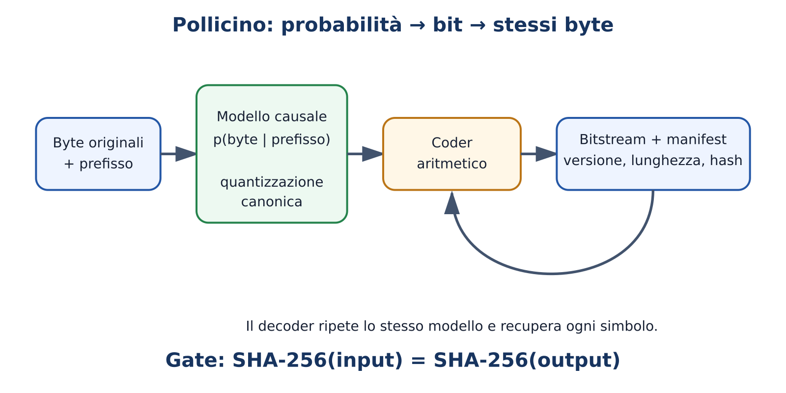

# M19 — Costruire e integrare: capstone Pollicino

**Domanda guida:** possiamo trasformare probabilità causali in una ricostruzione esatta e misurabile?
**Durata:** 3 ore più progetto Practitioner; 24 ore più progetto AI Engineer.
**Prerequisiti:** Practitioner M00–M15; AI Engineer anche M16–M18.

## Obiettivi osservabili

Il Practitioner consegna un'applicazione locale valutata con scelta motivata del modello. L'AI Engineer costruisce un piccolo modello causale da zero e collega una distribuzione deterministica a un codec aritmetico didattico. Entrambi distinguono chiaramente prototipo statistico, simulazione e futuro codec neurale Pollicino.

## Problema iniziale

Comprimere non significa generare qualcosa di simile: significa ricostruire gli stessi byte. Se un modello assegna buone probabilità ai byte successivi, un codificatore entropico può usare meno bit. Ma encoder e decoder devono produrre esattamente le stesse probabilità nello stesso ordine, senza dipendere da stato nascosto o differenze numeriche incontrollate.

## Capstone Practitioner: applicazione locale

Scegli un bisogno reale e non sensibile: assistente su documenti pubblici, estrattore strutturato, tutor offline o classificatore. Confronta almeno una baseline e due configurazioni compatibili con l'hardware. La consegna contiene:

1. problema, utenti e dati esclusi;
2. scheda di scelta di modello, formato, quantizzazione e licenza;
3. applicazione con timeout, validazione ed error handling;
4. dataset di valutazione e soglie definite prima;
5. misure di qualità, TTFT, token/s e memoria;
6. threat model e limiti;
7. guida riproducibile e demo.

Il progetto è valido anche se la conclusione è “la baseline basta” o “nessun modello testato soddisfa i vincoli”. La qualità sta nella decisione supportata da evidenze.

## Capstone AI Engineer: piccolo LLM da zero

Costruisci un decoder minuscolo su un corpus controllato. Pipeline minima: byte/tokenizer, batch causali, embedding e posizione, blocchi Transformer, language-model head, cross-entropy, optimizer, checkpoint e generazione. Testa shape, maschera causale, overfit su batch minuscolo, diminuzione della loss e ripresa da checkpoint.

Non tentare un “frontier model” in miniatura. Lo scopo è vedere tutti i contratti in una scala debuggabile. Confronta bigram baseline e Transformer a budget dichiarato. Documenta parametri, token, FLOP stimati, tempo, memoria e failure case.

## Ramo Pollicino: dalla previsione ai bit

Il repository contiene un codec aritmetico didattico esatto su un modello statistico semplice. Questo dimostra il contratto probabilità → intervalli → bit → ricostruzione, **non** dimostra ancora un Byte Transformer neurale produttivo.

Per ogni prefisso $x_{<t}$, encoder e decoder calcolano la stessa distribuzione quantizzata $q(x_t\mid x_{<t})$. Il costo ideale del simbolo è circa $-\log_2q(x_t\mid x_{<t})$. Il file compresso deve includere o identificare versione del modello, parametri del coder, lunghezza originale e checksum.

## Determinismo necessario

“Temperature zero” non basta. Il codec richiede:

- stessa architettura, pesi, tokenizer/byte mapping e precisione;
- trasformazione deterministica delle probabilità in frequenze intere;
- ordine e totale delle frequenze identici;
- stato iniziale e aggiornamento del coder identici;
- fallback se modello o manifest non coincidono;
- checksum finale dei byte ricostruiti.

Differenze floating-point fra device possono cambiare l'ordine di probabilità vicine. Una progettazione robusta definisce quantizzazione e tie-breaking canonici oppure usa un percorso di inferenza deterministico verificato.

## Esempio minimo

Per alfabeto `{A,B}`, un modello assegna frequenze intere `[3,1]`. Il coder restringe l'intervallo al quarto corretto per ogni simbolo. Il decoder, ricevendo bit e stesse frequenze, recupera la sequenza. Se usa `[2,2]`, può divergere già al primo simbolo.

## Esempio realistico

Su fixture binarie confronta: file originale, gzip/zstd, modello statistico del lab e futuro modello neurale. Misura byte totali includendo header, modello o suo trasferimento, latenza encode/decode, memoria ed errori. Su file piccoli il costo del modello può annullare il risparmio: PollicinoNet deve contabilizzare distribuzione e riuso del modello.

## Piano del futuro codec neurale

1. baseline byte-level deterministica;
2. Byte Transformer piccolo con loss e test riproducibili;
3. esportazione di un percorso di inferenza fissato;
4. mapping canonico logits → frequenze intere;
5. integrazione coder con round trip esaustivo su fixture;
6. fuzzing, corruzione, version mismatch e recovery;
7. benchmark end-to-end contro compressori tradizionali;
8. solo dopo, distribuzione tramite PollicinoNet.

## Errori frequenti

- Valutare solo la cross-entropy senza costruire il bitstream.
- Dimenticare header, modello e costi di trasferimento.
- Chiamare lossless una ricostruzione “quasi uguale”.
- Usare sampler casuale nel percorso del codec.
- Dichiarare implementato il Byte Transformer quando esiste solo il toy codec.
- Scegliere fixture facili dopo aver visto i risultati.

## Esercizi A–F

- **A:** riproduci il round trip su sequenze A/B.
- **B:** cambia frequenze e osserva lunghezza o divergenza.
- **C:** implementa un modello n-gram causale per byte.
- **D:** diagnostica un mismatch encoder/decoder.
- **E:** costruisci applicazione locale o codec statistico valutato.
- **F:** integra piccolo LM, frequenze canoniche, coder, manifest e benchmark.

## Laboratorio e verifica

Esegui `python3 labs/course_lab.py arithmetic-codec`. Il test esaustivo corrente copre tutte le 2.046 sequenze A/B di lunghezza 1–10. Estendi con empty input, tutti i byte, file casuali, truncation e bit flip. La prova finale segue `docs/course/assessments/final-practical.md`.

Rubrica: correttezza/round trip 3; riproducibilità 2; valutazione e baseline 2; architettura e sicurezza 2; limiti e comunicazione 1. Qualunque mancata uguaglianza byte-per-byte rende non superato il ramo lossless.

## Sintesi inclusiva

Il capstone unisce scelta, esecuzione, applicazione e valutazione. Pollicino aggiunge un vincolo assoluto: gli stessi byte devono tornare. Oggi il toy codec dimostra il meccanismo; il modello neurale resta una roadmap finché non supera determinismo, round trip e benchmark completi.

## Fonti e collegamenti

- [Percorso didattico Pollicino](../pollicino-learning-path.md)
- [Probabilità → bit](../../../visuals/pollicino-probabilities-to-bits.html)
- [Prova pratica finale](../assessments/final-practical.md)
- Activity: `llm-activity-m19-pollicino`
